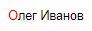
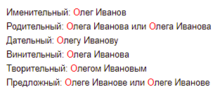
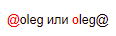

# Links to employees and current date

{{ wiki-name }} lets you add a link to an employee's profile on Staff. When you hover over this link, you'll see the user summary and photo. To add a link to an employee, [specify their username](#staff-ref).

To add a link to an authorized user's profile or the current date to your page, use [macros](#macroses).

## Links to Staff {#staff-ref}

* To add a link to an employee on Staff, append `staff:` with their username:

   `staff:{{ username-oleg }}`

   

   

   



* If you specify an employee's first and last name in Russian and want them to be displayed in a specific case, type the corresponding text in Russian before the username, such as:

   ```
    Nominative: {{ username-oleg }}
    Genitive: {{ username-oleg }} or {{ username-oleg }}
    Dative: {{ username-oleg }}
    Accusative: {{ username-oleg }}
    Instrumental: {{ username-oleg }}
    Prepositional: {{ username-oleg }} or {{ username-oleg }}
    ```

   

   

   



* To make a link look like an employee's username with the `@` symbol, write it as `@login` or `login@`:

   ```
   @{{ username-oleg }} or {{ username-oleg }}@
   ```

   

   

   

* If you use `@` together with a mailing list name (such as `tools-dev`), the link will redirect to the results of search on the intranet.

## Macros: username and date {#macroses}

A macro is an action that is performed on a page once it's saved. Unlike Wiki markup elements, the macro is substituted with its value in the source text after saving the page.

| Macro markup | Value | Markup after saving it |
--- | --- | ---
| `::::` | Authorized user's name | `staff:{{ username-oleg }}` |
| `::@::` | Authorized user's name and current date in `/DD.MM.YYYY hh:mm/` format | `staff:{{ username-oleg }} /16.12.2021 21:25/` |
| `::+::` | Current date in `/DD.MM.YYYY hh:mm/` format | `/16.12.2021 21:25/` |



Please note that you can't use macros in [dynamic tables](../create-grid.md) and comments on a page.

