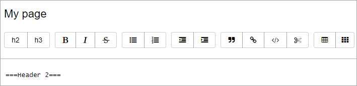
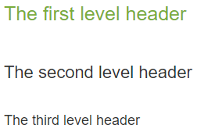
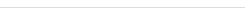
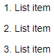
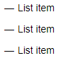
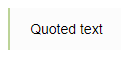
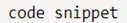
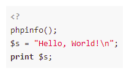

# Formatting text

To format the text of a page, special symbols called markup elements are used. Using markup, you can highlight text in bold or italics, add titles and lists to the page, insert links, images, tables, and so on.

You can add markup elements to a page using [formatting panels](#buttons) or enter [markup symbols](#markup) from the keyboard. The result can be seen on the right side of the view panel.

## Formatting panel {#buttons}

To add frequently used formatting elements to the text, use the panel at the top of the page.



There are two ways to work with the formatting panel:

- To add a markup element to the text, place the cursor in the desired position and click on the formatting panel. A markup template will appear in the text, add your text to it. If you clicked **Add link** or **Insert code**, in the window that appears, enter your text and click **Add**.

- To format text that has already been added to the page, select a text fragment and click on the formatting panel.

To cancel text formatting, delete the markup characters manually.



You may notice that the markup characters added to the text using the buttons differ from the Markdown markup. This form of markup is supported along with Markdown and is displayed correctly on the page.



## Markup elements {#markup}

{{ wiki-name }} supports [Markdown markup]({{ link-about-markdown }}) for additional formatting elements that are not present in the standard Markdown syntax.

This section contains frequently used formatting elements. For a complete list of supported elements, see [{#T}](static-markup.md).

| Element | Markup | Result |
| --- | --- | --- |
| Headings | `# The first level header`<br/>`## The second level header`<br/>`### The third level header` |  |
| New paragraph | `First line of the paragraph.`<br/>`Second line of the paragraph.`<br/><br/>`New paragraph.` |  |
| Horizontal line | `---` |  |
| Bold | `**Bold text**` |  |
| Italics | `*Italic text*` |  |
| Underline | `__Underlined text__` |  |
| Strikethrough | `~~Strikethrough text~~` |  |
| Highlighted text | `??Highlighted text??` |  |
| Red text | `!!Red text!!` |  |
| Colored text.<br/><br/>Supported colors:<br/><br/><ul><li>`red`;</li><li>`green`;</li><li>`blue`;</li><li>`grey`/`gray`;</li><li>`yellow`;</li><li>`cyan`;</li><li>`orang`;</li><li>`violet`.</li></ul> | `!!(blue)Blue text!!` |  |
| Numbered list | `1. List item`<br/>`2. List item`<br/>`3. List item` |  |
| Bulleted list | `- List item`<br/>`- List item`<br/>`- List item` |  |
| Link | `[link text](http://example.com/)` |  |
| Image | `` |  |
| Quotations | `>Quoted text` |  |
| Collapsed text | `<{Read the entire text`<br/>`you need to click the "Read the entire text" link.`<br/>`}>` |  |
| Code in the line | ``` `code snippet` ``` |  |
| Code block | ` ```php`<br/>`<?`<br/>`phpinfo();`<br/>`$s = "Hello, World!\n";`<br/>`print $s;`<br/>` ``` ` |  |

#### See also

- [{#T}](add-image.md)

- [{#T}](add-grid.md)

- [{#T}](attach-file.md)

- [{#T}](actions/toc.md)

