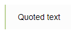

# Formatting text

To format text of a [Wiki page](pages-types.md#page) or [dynamic table](pages-types.md#grid), you can use markup elements. Using markup, you can highlight text in bold or italics, add titles and lists to your page, insert links, images, tables, and more.

You can add markup elements to a page using [formatting panels](#buttons) or enter [markup symbols](#markup) from the keyboard. You can see the result on the right of the view panel.

## Formatting panel {#buttons}

When you edit a Wiki page, use the formatting panel to add the most common markup elements to your text.


There are two ways to work with the formatting panel:

- To add a markup element to the text, place the cursor in the desired position and click on the formatting panel. A markup template appears in the text. Add your text to it. If you clicked **Add link** or **Insert code**, enter your text and click **Add** in the window that appears.

- To format text that is already added to the page, select a text fragment and click on the formatting panel.

To cancel text formatting, delete the markup characters manually.



You may notice that the markup characters added to the text using the buttons differ from the Markdown markup. This form of markup is supported along with Markdown and is displayed correctly on the page.



## Markup components {#markup}

{{ wiki-name }} supports [Markdown markup]({{ link-about-markdown }}) for additional formatting elements that are not present in the standard Markdown syntax.

This section contains frequently used formatting elements. For a complete list of supported elements, see [{#T}](static-markup.md).

| Element | Markup | Result |
--- | --- | ---
| Headers | `# First-level header`<br/>`## Second-level header`<br/>`### Third-level header` |  |
| New paragraph | `First line of the paragraph.`<br/>`Second line of the paragraph.`<br/><br/>`New paragraph.` |  |
| Horizontal line | `---` |  |
| Bold text | `**Bold text**` |  |
| Italic | `*Italic*` |  |
| Underlined text | `__Underlined text__` |  |
| Strikethrough text | `~~Strikethrough text~~` |  |
| Highlighted text | `??Highlighted text??` |  |
| Red text | `!!Red text!!` |  |
| Colored text.<br/><br/>Supported colors:<br/><br/><ul><li>`red`/`крас`/`красный`;</li><li>`green`/`зел`/`зеленый`;</li><li>`blue`/`син`/`синий`;</li><li>`grey`/`gray`/`сер`/`серый`;</li><li>`yellow`/`жел`/`желтый`;</li><li>`cyan`/`голуб`/`голубой`;</li><li>`orang`/`оранж`/`оранжевый`;</li><li>`violet`/`фиолет`/`фиолетовый`.</li></ul> | `!!(blue)Blue text!!` |  |
| Numbered list | `1. List item`<br/>`2. List item`<br/>`3. List item` |  |
| Bulleted list | `- List item`<br/>`- List item`<br/>`- List item` |  |
| Link | `[link text](http://example.com/)` |  |
| Image | `` |  |
| Quotes | `>Quote text` |  |
| Collapsed text | `<{Read the entire text`<br/>`To read this text,`<br/>`click the "Read the entire text" link.`<br/>`}>` |  |
| Code in the line | ``` `code snippet` ``` |  |
| Code block | ` ```php`<br/>`<?`<br/>`phpinfo();`<br/>`$s = "Hello, World!\n";`<br/>`print $s;`<br/>` ``` ` |  |


#### See also

- [{#T}](add-image.md)

- [{#T}](add-grid.md)

- [{#T}](attach-file.md)

- [{#T}](actions/toc.md)