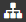

# Viewing the page and cluster hierarchy

## Table of contents of a Wiki page {#toc}

To view the table of contents for a Wiki page:

1. Open the Wiki page.

1. Click the  icon in the left-hand panel.

1. To insert a table of contents into the text body of a Wiki page, use the [not_var{{toc}}](actions/toc.md) dynamic block.

## Cluster hierarchy {#subpages}

A page and all of its subpages comprise a [cluster](structure.md). To view the cluster hierarchy:

1. Open the page.

1. To see the list of pages one level below the current page, click the  icon in the left-hand panel.

1. To see all the subpages related to the current page, click **Action** in the upper-right corner and choose **Cluster structure**.

    To view the entire hierarchy, click **Show all subpages**.

## Embed a cluster tree on a Wiki page {#action-tree}

Use the `not_var{{tree}}` dynamic block to create cluster trees and embed them on any Wiki page.

To build a tree for the current Wiki page, add the `not_var{{tree}}` block to the text body.

You can customize the appearance of the tree using additional parameters.

