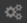
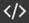

# Editing a dynamic table

To edit a [dynamic table](pages-types.md#grid), open it and click **Edit** in the bottom-right corner.

## Editing the contents of table cells {#edit-cell}

Select a cell and enter your text. Use [Markdown](basic-markup.md) for formatting text. To switch to a new row in a cell, press the **Shift** + **Enter** [hotkey](#shortcuts).

To save the changes, click **Complete**. Each time you save your changes, a new copy of the table is added to its [edit history](history.md#grid). Using the history, you can view all previous versions of the table, compare them, or roll back to any of them.

## Configuring parameters of table columns {#column-params}

1. Click **≡** in a column's first cell.

1. In the pop-up window, change the column parameters:

   * Enter the column heading in the top field.

   * Specify the column's width in pixels or as a percentage of the table's width.

   * To make the cells mandatory, enable the **Required** option.

   * For columns with the **Checkbox** data type, enable the **Mark as done** option. This will make all rows selected with the checkbox turn gray.

1. Click **Apply** to save your changes.

## Moving a column inside a table {#column-transfer}

To move a column:

1. In the upper-right corner, click .

1. Select  **Configure columns** in the table settings.

1. Select the column name in the list, click , and drag it.



You can only move one column at a time.



## Adding and deleting columns {#edit-column}

To add a column:

1. In the upper-right corner, click **+**.

1. Configure the column parameters:

   * Enter the column heading in the top field.

   * In the drop-down list, select a [data type](#data-types) for the column cells. After you save the settings, you can't edit the data type.

   * Specify the column's width in pixels or as a percentage of the table's width.

   * To make the cells mandatory, enable the **Required** option.

   * For columns with the **Checkbox** data type, enable the **Mark as done** option. This will make all rows selected with the checkbox turn gray.

1. Click **Add**.

To delete a column:

1. Click **≡** in a column's first cell.

1. Click **Delete column**.

### Data types {#data-types}

Specify the data type for a table column:

* **Text**. Any text formatted by [Markdown](basic-markup.md).

* **Number**.

* **Checkbox**. A box that can be checked or unchecked. To mark an entire row, enable the **Mark as done** option. This will make all rows selected with the checkbox turn gray.

* **Date**.

* **List**. A field where a user can select one value from a list.

* **Multiple-choice list**. A field where a user can select multiple values from the list.

* **Employee**. An employee's first and last name and a link to their profile on Staff.

* **Multiple employees**. First and last names for a list of employees and links to their profiles on Staff.

* **Issue in {{ tracker-name }}**. The key of the issue that will function as a link in {{ tracker-name }}.



The data type can only be selected when creating a column.



## Adding and deleting rows {#edit-line}

* To add a row, select **Add row** at the bottom of the page.

* To delete a row, hover over it and click  to the right of the row.

## Renaming a table {#rename-tab}



You can rename a table without switching to editing mode. For this, click the name at the top of the page and enter a new name.



1. In the panel on the left, click .

1. Enter a new table name.

1. Click **Save**.

## Sorting table rows {#sort-line}

You can quickly sort rows in a dynamic table by any column:

1. To sort rows by values in a column, click the column header.

1. To sort the rows in reverse order, click the column header again.

## Sorting tables by multiple columns at the same time {#sort-multi-column}

You can set multiple sorting parameters at the same time. Sorting parameters are set in descending order of priority.

To create a new sorting parameter:

1. In the panel on the left, click .

1. Click **Add sort**.

1. Select the column and sort order.

## Filtering a table {#filter}

You can set conditions for displaying rows or columns for tables embedded using the [dynamic block `grid`](actions/grid-reference.md).

To filter a table:

1. Get the code for the dynamic table. To do this, click  in the panel on the left.

1. Copy the code and paste it in the Wiki page.

1. Specify the filtering conditions:

   * To filter rows, use the [`filter` parameter](actions/grid-reference.md#row-filter).

   * To set up the way columns are displayed, use the [`column` parameter](actions/grid-reference.md#col-filter).

## Keyboard shortcuts in dynamic tables {#shortcuts}

Use keyboard shortcuts to manage data in dynamic tables.

| **Action** | **Windows, Linux** | **MacOS** |
--- | --- | --- |
| Add a row | **Ctrl** + **Enter** | **⌘** + **Enter** |
| Save a row | **Enter** | **Enter** |
| Exit editing mode | **Esc** | **Esc** |
| Navigate between columns | **Tab** | **Tab** |
| Move between columns in the opposite direction | **Shift** + **Tab** | **Shift** + **Tab** |
| Navigate between cells | **Ctrl** + **→** **←** **↑** **↓** | **⌘** + **→** **←** **↑** **↓** |
| Move to the beginning of the row | **Home** (press twice) | — |
| Move to the end of the row | **End** (press twice) | — |
| Go to the beginning of the cell | **↑** | **↑** |
| Go to the end of the cell | **↓** | **↓** |
| Add a new row in the cell | **Shift** + **Enter** | **Shift** + **Enter** |
| Select a **Checkbox** | **Space** | **Space** |

#### See also

* [{#T}](create-grid.md)

* [{#T}](add-grid.md)

* [{#T}](import-page.md)
