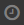

# Viewing the history of page changes

After saving a {{ wiki-name }} page, its copy is placed in the history of changes. In the history, you can always view previous versions of the page, compare them with each other, or restore any of them.

To view the history of {{ wiki-name }} page changes:

1. Open the desired {{ wiki-name }} page.

1. In the top-right corner of the {{ wiki-name }} page, click  **Actions** and select  **Change history**.

## Viewing an older version of a page {#show-old-page}

Select an entry in the page history. The main window will display the selected version with a caption that says **This is an outdated version of the page**.

## Comparing two versions of a page {#compare-pages}

Select the versions of the {{ wiki-name }} page you want to compare. Their differences will be displayed in the main window.

## Rolling back to an older version {#return-to-old}

1. Select an entry in the page history. The main window will display the selected version with the caption **This is an outdated version of the page**.

1. Select **{{ ui-key.beta-wiki.blocks_common_desktop.blocks_b-events-log.edit_version }}**.

1. You can then edit the selected version or simply save it without any changes, making it the latest version of the page.

## Viewing the change history for a dynamic table {#grid}

For [dynamic tables](pages-types.md#grid), the change history is available in editing mode:

1. Open a dynamic table and click  **Actions**.

1. Click **Change history**.

1. In the left-hand panel, click .

1. Select an entry in the page history. The selected table version will be displayed with a caption saying **This is an old version of the table**.

1. To compare two versions of the table, select them in the left-hand panel.

1. To restore the selected table version, click **{{ ui-key.beta-wiki.blocks_common_desktop.blocks_b-events-log.return_this_version }}** at the top of the page.
