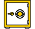

# About Yandex.Wiki

Yandex.Wiki is a user-generated hub for all your company information.

Wiki is part of the collaboration platform for organization employees. To use Wiki, you need a Yandex.Connect account. You can use an existing one. As with other Yandex.Connect services, you can use Yandex.Wiki for free.

[Yandex.Wiki](https://wiki.yandex-team.ru/) is the general Yandex knowledge base.

Yandex.Wiki consists of Wiki pages that can be edited by users. To format pages, use the [Markdown markup language](basic-markup.md). Any Wiki user can create pages, add comments, and edit them. All corrections made by users are saved in the change history, so there's no risk of losing anything important.

[![]](structure.md) | [{#T}](quick-guide.md)

## Popular tasks

 | **Pages**  [Create](create-page.md)  [Edit](edit-page.md)  [Remove](delete-page.md)  [Move](page-managment/move-page.md) |  | **Access**  [Restrict page view](page-managment/access-setup.md)  [{#T}](page-managment/edit-owner.md)
 | **Insert**  [Pictures](add-image.md)  [Tables](add-grid.md)  [Files](attach-file.md) |  | **Markup reference**  [Markdown markup](static-markup.md)  [Dynamic blocks](actions.md)

