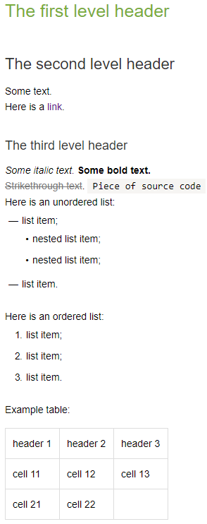

# Creating your first Wiki page

Try out {{ wiki-name }} features by creating your first Wiki page. The page will be created in your personal cluster, so don't be afraid to experiment.



To learn more about the {{ wiki-name }} basic features, you can also take a [course on Moebius](https://moe.yandex-team.ru/courses/my/course/904).



## Creating a Wiki page {#create}

To create a Wiki page in your personal cluster:

1. [Go to {{ wiki-name }}]({{ link-wiki }}) and click  **Create page** in the panel on the left.

1. Select the **Page** type.

1. In the **Name** field, enter a page header.

1. The address field is filled in automatically. Don't edit it if this is your first time creating a Wiki page.

1. Select **Personal cluster**.

1. Click **Create**.

1. Paste this sample to the entry field on the left or come up with your own text:

   ```
   # First-level header 
   ## Second-level header
   Text of the cluster.
   Sample [link]({{ link-yandex }}).
   ### Third-level header
   *Text is in italics.* **Text is in bold.**
   ~~Strikethrough~~. `Source code snippet`
   Bulleted list:
   * List item.
     * Sub-item.
     * Sub-item.
   * List item.
   
   Numbered list:
   1. List item.
   2. List item:
   3. List item.
   
   Sample table:
   
   |header 1|header 2|header 3|
   |---|---|---|
   |cell 11|cell 12|cell 13|
   |cell 21|cell 22||
   ```

   

   

   

1. Click **Save**.

A list of all your pages is available on the top {{ wiki-name }} panel in the  **Cluster structure** menu.

## Configuring access {#access}

To configure access to your page:

1. Open the page.

1. At the top of the page, click the button that specifies its access mode (by default, **Available to all employees**).

1. Specify who can view the page:

   - **Same as parent page**: The access level is inherited from the parent page.

   - **All employees**: All employees of your company.

   - **Only authors**: Only [authors](page-management/edit-owner.md) can view and edit the page.

   - **Specific employees**: Enter the usernames of employees who should be able to view and edit the page.

   

   It is not recommended to change the access settings for the [{{ wiki-name }} homepage]({{ link-homepage }}).
   By default, the author of the {{ wiki-name }} homepage is a service account. If the "Only authors" access type is selected for this page, other users can't access it. To allow others to access the page, click the link [{{ link-homepage-access }}]({{ link-homepage-access }}) and change the access parameters.

   

1. Click **Save**


