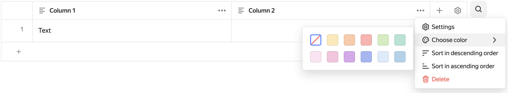

# {{ wiki-full-name }} release notes: April 2023

* [The state of the _Cluster tree_ section persists when navigating between pages](#open-content)
* [Access to former employees pages and clusters](#deleting-pages-of-former-employees)
* [Automatic settings of the width of dynamic tables](#auto-table-size)
* [Choosing the color of rows and columns](#table-coloring)

## The state of the _Cluster tree_ section persists when navigating between pages {#open-content}

If you work with the [Cluster tree](../cluster-overview.md#toc) section, the contents will not be updated when navigating between pages: collapsed and expanded subclusters will retain their status.

## Access to former employees pages and clusters {#deleting-pages-of-former-employees}

Now, [organization administrators](../../organization/security/index.md#service-roles) have access to the pages and clusters of former employees even if these are pages with restricted access. An administrator will be able to assign a new author to control access and make sure a page is up-to-date, or to [delete](../delete-page.md) the page.

## Automatic settings of the width of dynamic tables {#auto-table-size}

The width of a dynamic table automatically adapts to the user's screen size and the browser window scale.

## Choosing the color of rows and columns {#table-coloring}

Dynamic tables now allow you to choose the color of rows and columns.

