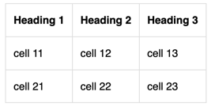

# Formatting CSV data

To display data in CSV format as a table, use the markup:

```
%%(csv delimiter=; head=1)
Title 1;Title 2;Title 3
cell 11;cell 12;cell 13
cell 21;cell 22;cell 23
%%
```







Markup parameters:

* `delimiter` — a field separator used in CSV tables.

* `head` — if set to 1, the first row of the table becomes a title.



CSV tables don't support any other [text markup](formatting.md).



#### See also

* [Embedding diagrams and flowcharts](diagram.md)

* [Embedding formulas](formulas.md)

