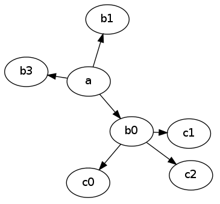
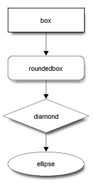
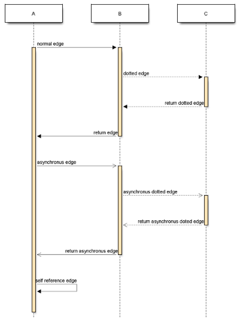
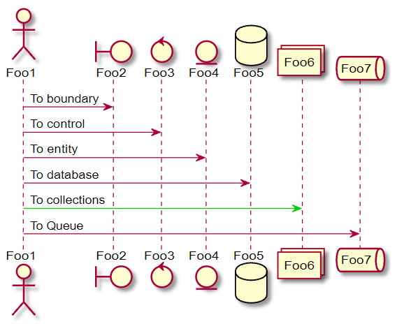

# Diagrams and flowcharts

To add a diagram, chart, or graph to a page, you can use one of the supported text markup languages.


## Graphviz (DOT) {#graphviz}

[Graphviz]({{ link-about-graphviz }}) is best suited for styling graphs and trees.

Sample markup:

```
%%(graphviz neato)
 digraph A {
 a -> b0
 a -> b3
 xb [label="hi",width=.1,style=invis]
 a -> xb [style=invis]
 a -> b1
 {rank=same b0 -> xb -> b1 [style=invis]}
 b0 -> c0
 xc [label="bye",width=.1,style=invis]
 b0 -> xc [style=invis]
 b0 -> c1
 {rank=same c0 -> xc -> c1 [style=invis]}
 b0 -> c2
 }
 %%
```







Configure the appearance of a graph using optional parameters:

* `dot`, `neato`, `circo`, `twopi`, `fdp`: Name of the utility to use for creating graphs. The default value is `dot`.

* `width`: The maximum graph width in pixels.

* `height`: The maximum graph height in pixels.

## Blockdiag {#blockdiag}

[Blockdiag](http://blockdiag.com/en/) is intended for building flowcharts.

Sample markup:

```
%%(blockdiag)
{
orientation = portrait
   box [shape = "box"];
   roundedbox [shape = "roundedbox"];
   diamond [shape = "diamond"];
   ellipse [shape = "ellipse"];
   box -> roundedbox -> diamond -> ellipse;
}
%%
```







You can configure the flowchart layout using these optional parameters:

* `width`: Maximum width of the flowchart in pixels.

* `height`: Maximum height of the flowchart in pixels.

## Seqdiag {#seqdiag}

[Seqdiag](http://blockdiag.com/en/seqdiag/) is designed for creating [sequence charts]({{ link-about-diagram }}).

Sample markup:

```
%%(seqdiag)
{
   // normal edge and doted edge
   A -> B [label = "normal edge"];
   B --> C [label = "dotted edge"];

   B <-- C [label = "return dotted edge"];
   A <- B [label = "return edge"];

   // asynchronus edge
   A ->> B [label = "asynchronus edge"];
   B -->> C [label = "asynchronus dotted edge"];

   B <<-- C [label = "return asynchronus doted edge"];
   A <<- B [label = "return asynchronus edge"];

   // self referenced edge
   A -> A [label = "self reference edge"];
}
%%
```







You can configure the appearance of your diagrams using optional parameters:
* `width`: The maximum width of the diagram in pixels.

* `height`: The maximum height of the diagram in pixels.

## PlantUML {#plantuml}

[PlantUML](https://plantuml.com/) is an open-source project that supports multiple notations and lets you quickly create complex diagrams.

Sample markup:

```
%%(plantuml)
@startuml
actor Foo1
boundary Foo2
control Foo3
entity Foo4
database Foo5
collections Foo6
queue Foo7
Foo1 -> Foo2 : To boundary
Foo1 -> Foo3 : To control
Foo1 -> Foo4 : To entity
Foo1 -> Foo5 : To database
Foo1 -[#00cc00]> Foo6 : To collections
Foo1 -> Foo7 : To Queue

@enduml
%%
```







For more information about the PlantUML diagram markup language, see the [PlantUML Language Reference Guide](http://plantuml.com/ru/guide).
