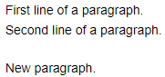
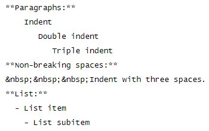
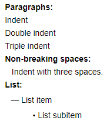

# Page structure



## Clusters and headings {#sections-and-titles}

Add headings to divide a page into clusters. To format the heading, insert 1 to 6 `#` symbols and a space before the heading text. The heading level changes based on how many `#` symbols you type.

You can use a different markup style for the first- and second-level headings:

* For the first-level heading, insert any number of `=` symbols in the line following the heading.

* For the second-level heading, insert any number of hyphens `-` in the line following the heading.

| Markup | Result |
--- | ---
| `# First-level header` |  |
| `First-level header`<br>`======` |  |
| `## Second-level header` |  |
| `Second-level header`<br>`--------------` |  |
| `### Third-level header` |  |
| `#### Fourth-level header` |  |
| `##### Fifth-level header` |  |
| `###### Sixth-level header` |  |

### Getting a link to a cluster {#section-link}

1. Hover over the cluster title and click **§** that appears to the right of the title.

1. Copy the cluster address from the browser's address bar.

For more information, see [{#T}](../actions/anchor.md).

## Paragraphs {#section_paragraphs}

To start a new paragraph, insert an empty line after the previous one:

```
First line of the paragraph.
Second line of the paragraph.

New paragraph.
```









To add multiple empty lines between text blocks, use a `\` backslash at the beginning of each empty line.



## Margins {#section_spacing}

- Indents created with spaces at the beginning of the line are used for formatting [lists](lists.md) of the second and third levels.

- If you add spaces to the beginning of a paragraph, they will be ignored. The paragraph will be displayed without indentation.

- To indent a paragraph, insert a few non-breaking spaces using the code `&nbsp;`.


| Markup | Result |
--- | ---
|  |  |


## Horizontal line {#section_rulers}

- To insert a horizontal line between parts of the text, insert three or more hyphens `-`, <q>asterisks</q>`*`, underscores `_` in a row on an empty line.

- If you use hyphens, add an empty line before the line. Otherwise the previous line will turn into a heading.

| Markup | Result |
--- | ---
| `---` |  |
| `****` |  |
| `___` |  |

## Collapsed text {#section-cut}

To make part of the page's text collapsible:

1. In the line before the text, insert the `<{` symbols and the title of the collapsible text.

1. From a new line, enter the text that will be hidden under the collapsible section.

1. After the text, insert the `}>` symbols.

| Markup | Result |
--- | ---
| `<{ Read the entire text`<br>`You can see this text`<br>`by clicking "Read the entire text".`<br>`}>` |  |