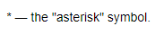

# Escaping characters

- To display markup characters, escape them by using the backward slash (`\`).

    ```
    \* — the "asterisk" symbol.
    ```

    

    

    

- To escape all characters in a certain text fragment, enclose this fragment in double quotes `""`:

    ```
    ""<tag>""
    ```

    

    

    

- If you want to display a backquote inside a source code snippet, place two backquotes at the beginning and end of the code snippet ````:

    ```
    ``SELECT `id` FROM `table` ``
    ```

    

    

    

- All markup characters placed in the source code are escaped automatically:

    ```
        Text formatting: 
    
        ```
        *Italic*
        **Bold**
        ```
    ```

    

    

    

- Any text in angle brackets `<...>` is processed as [HTML tag](html-code.md) and is not explicitly displayed on the page. If you need to display such text, escape it, format it as a code fragment, or replace the opening parenthesis `<` with code for `<`:

    ```
    &lt;tag>
    ```

    

    

    

