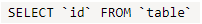
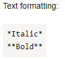
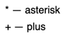

# Escaping characters



- New editor

   

   * If you want to display a backquote inside a source code fragment, enclose the code fragment in double backquotes (` `` `):

      ```
      ``SELECT `id` FROM `table` ``
      ```

      

      

      

   * All markup characters placed in the source code are escaped automatically:

      ```
          Formatting text:

          ```
          *Italics*
          **Bold**
          ```

      ```

      

      

      

   * Any text in angle brackets (`<...>`) is handled as an [HTML tag](html-code.md) and is not explicitly displayed on the page. If you need to display this text, escape it, format it as a code snippet, or replace the opening angle bracket (`<`) with the `&lt;` code:

      ```
      &lt;tag>
      ```

      

      

      

- Old editor

   * To display markup characters, escape them by using a backslash (`\`) or tilde (`~`):

      ```
      \*: Asterisk
      ~+: Plus sign
      ```

      

      

      

   * To escape all characters in a certain text fragment, enclose this fragment in double quotes (`""`):

      ```
      ""<tag>""
      ```

      

      

      

   * If you want to display a backquote inside a source code fragment, enclose the code fragment in double backquotes (` `` `):

      ```
      ``SELECT `id` FROM `table` ``
      ```

      

      

      

   * All markup characters placed in the source code are escaped automatically:

      ```
          Formatting text:

          ```
          *Italics*
          **Bold**
          ```

      ```
      

      

      

   * Any text in angle brackets (`<...>`) is handled as an [HTML tag](html-code.md) and is not explicitly displayed on the page. If you need to display this text, escape it, format it as a code snippet, or replace the opening angle bracket (`<`) with the `&lt;` code:

      ```
      &lt;tag>
      ```

      

      

      

