# Text formatting



## Highlighting text {#inline}



Highlighting only works correctly if the markup characters are adjacent to the text.



| Markup | Result |
--- | ---
| `**Bold text**` | 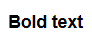 |
| `*Italic*` |  |
| `_Italic_` |  |
| `//Italic//` |  |
| `__Underlined text__` | 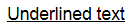 |
| `~~Strikethrough text~~` |  |
| `--Strikethrough text--` |  |
| `##Monospaced text##` | 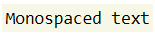 |
| `++Small font++` | 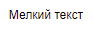 |
| Superscript: `E=mc^^2^^` | 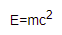 |
| Subscript: `Hvv2vvO` | 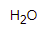 |
| `??Highlighted text??` | 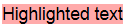 |
| `!!Red text!!` |  |
| `!!(blue)Blue text!!` Supported colors:<ul><li>`red`</li><li>`green`</li><li>`blue`</li><li>`grey`/`gray`</li><li>`yellow`</li><li>`cyan`</li><li>`orange`</li><li>`violet`</li></ul> | 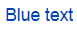 |

## Combining formatting types {#sec_combine}

You can apply several types of formatting to a single text fragment at the same time:

| Markup | Result |
--- | ---
| `_**Bold italic**_` | 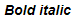 |
| `*!!Red italic!!*` |  |

Text formatting can be used together with other markup elements:

| Markup | Result |
--- | ---
| `**[Bold link](http://example.com)**` |  |
| `>Quote with *italic text*` | 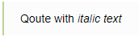 |

## Other markup {#other-formatting}

| Element | Markup | Result |
--- | --- | ---
| Line break | `first line---second line` | 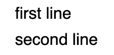 |
| Pop-up hint | `(?Term Definition of the term?)` | 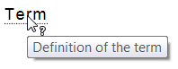 |
| Pop-up (term with spaces) | `(?Term with spaces==Term definition?)` | 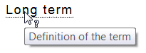 |
| Color code (long) | `#ff0000` | 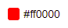 |
| Color code (short) | `#F00` | 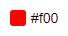 |
| Hidden comment | `%%(comments) Hidden text%% ` |