# Formulas

You can insert in {{ wiki-name }} formulas created using [TeX]({{ link-about-tex }}) markup.

- Standard formula design, suitable for inserting a separate line:
   ```
   The first line.
   %%(math outline) formula %%
   The second line.
   ```

   

   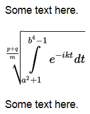

   

- Compact formula design, suitable for inserting in the same line with text:
   ```
   Start of the line %%(math inline) formula %% End of the line
   ```

   

   

   


## Examples of formulas {#examples}

| Markup | Result |
----- | -----
| `1. %%(math inline) X^{a+b}_{i-j} %%` | 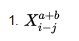 |
| `2. %%(math inline) f+f'+f''+\cdots+f^{(10)}%%` | 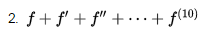 |
| `3. %%(math inline) A\ast B\times C\cdot D%%` | 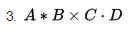 |
| `4. %%(math inline) \varphi\approx\varepsilon%%` | 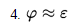 |
| `5. %%(math inline) \sqrt{x}+\sqrt[10]{y}\leq \frac{1+\|\vec{z}\|}8%%` | 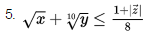 |
| `6. %%(math inline) \frac1{ \displaystyle\bar{\xi} + \displaystyle\frac{3}7 }%%` | 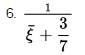 |
| `7. %%(math inline) \sqrt[6]{\log_3{h(x)}} + \dot{\rho}%%` | 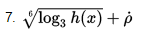 |
| `8. %%(math inline) \lim_{n \to \infty} \sum_{k=1}^n \frac{1}{k}%%` |  |
| `9. %%(math inline) \int_a^b f(x)\,dx \ne \iint \cos{z}\,dxdy%%` | 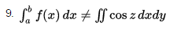 |
| `10. %%(math inline) (1+\frac{1}{n}) ^n%%` | 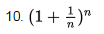 |
| `11. %%(math inline) \left( 1+\frac{1}{n}\right) ^n%%` | 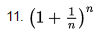 |
| `12. %%(math inline) \forall \, k\geq0 \quad \exists n \Leftrightarrow y\notin X%%` | 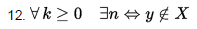 |
| `13. %%(math inline) \angle ABC = 90^{\circ} \Longleftarrow AB \perp BC%%` | 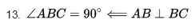 |
| `14. %%(math inline) \overbrace{\underbrace{a+b+\ldots+z}_{n}+1+2+\ldots+9}^k%%` | 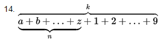 |
| `15. %%(math inline) \arctan{x}+\max_{1\le n\le m}{x_n}%%` | 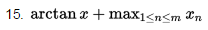 |