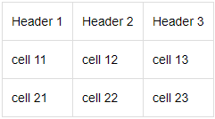
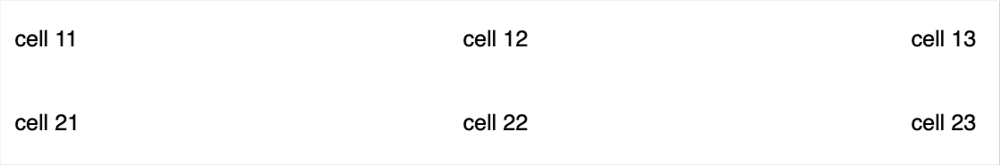

# Tables

Simple tables are static tables that are created manually using markup elements.

{{ wiki-name }} also supports table markup using standard [HTML tags](html-code.md).



- Table in {{ wiki-name }} format

    * To create a table, use the markup:

        ```
        #|
        || Heading 1 | Heading 2| Heading 3 ||
        || cell 11 | cell 12 | cell 13 ||
        || cell 21 | cell 22 | cell 23 ||
        |#
        ```

        

        

        

    * To format a table at full page width without borders, use the markup:

        ```
        #||
        || cell 11 | cell 12 | cell 13||
        || cell 21 | cell 22 | cell 23||
        ||#
        ```

        

        

        

    

    In table cells, you can use [text styling elements](formatting.md).

    

- Markdown table

    Add an empty row before the table.
To create a table, use the markup:

    ```
    | Heading 1 | Heading 2 | Heading 3 |
    | --- | --- | --- |
    | cell 11 | cell 12 | cell 13 |
    | cell 21 | cell 22 | cell 23 |
    ```

    

    

    

    

    In table cells, you can use [text styling elements](formatting.md).

    

- Table in CSV format

    To display [data in CSV format](csv.md) as a table, use the markup:

    ```
    %%(csv delimiter=; head=1)
    Heading 1; Heading 2; Heading 3
    cell 11;cell 12;cell 13
    cell 21; cell 22; cell 23
    %%
    ```

    

    

    

    Markup parameters:

    - `delimiter` — a field separator used in CSV tables.

    - `head` — if set to 1, the first row of the table becomes a title.

    

    CSV tables don't support any other text markup.

    



