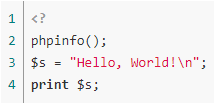
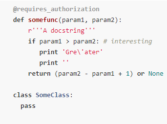
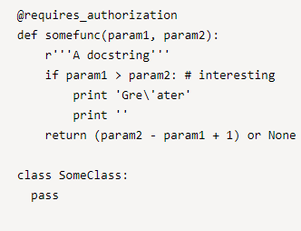
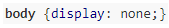
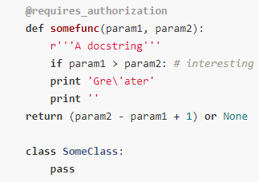
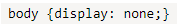

# Highlighting syntax in code

You can highlight code syntax in {{wiki-name}} pages. To do this, use the markup:

```
%%(<coding language> nomark nohighlight)
your code
%%
```

| Parameter | Description |
| ----- | ----- |
| Coding language | [The programming language](#formatters-name) for highlighting syntax |
| `nomark` | Optional parameter, disables line numbering |
| `nohighlight` | Optional parameter, disables line numbering and syntax highlighting |



The open-source [highlight.js](https://highlightjs.org/) library is used for code formatting in {{wiki-name}}.

You can select a code theme on your [personal settings page](https://wiki.yandex-team.ru/_settings/) {{wiki-name}}.



Your browser's <q>monospaced</q> font is used for code highlighting in {{wiki-name}} by default. You can change this font in your browser settings.

## Supported programming languages {#formatters-name}



| Programming language | Designation |
| ----- | ----- |
| 1C | 1c, 1c |
| ActionScript | actionscript |
| Apache | apache |
| Applescript | applescript |
| Bash | bash, sh |
| C# | c#, csharp, c-sharp |
| C++ | c, cpp, c++ |
| Closure | closure |
| CMake | cmake |
| Coffeescript | coffeescript |
| CSP | csp |
| Css | css |
| D | d |
| Delphi | delphi |
| Diff | diff |
| DOS | .bat bat, dos |
| Django | django |
| Dockerfile | dockerfile |
| Erlang | erlang |
| Erlang-repl | erlang-repl |
| Go | go |
| Haskell | haskell |
| HTTP | http |
| Ini | ini |
| json | json |
| Java | java |
| Javascript | js, javascript |
| Lisp | lisp |
| Matlab | matlab |
| Nginx | nginx |
| ObjectiveC | objc, objectivec, obj-c, objective-c |
| PHP | php |
| Perl | perl |
| Python | py, python |
| Python | profile profile, profiler, python-profile, python-profiler |
| R | r |
| Ruby | ruby |
| Rust | rust |
| Scala | scala |
| Smalltalk | smalltalk |
| SQL | mysql, sql |
| Swift | swift |
| TeX | tex |
| VBScript | vbscript |
| XML | xml |
| YAML | yaml, yml |
| YQL | yql |



## Examples of source code formatting {#examples}

#### Standard formatting {#examples-standart}

```
%%(php)
<?
phpinfo();
$s = "Hello, World!\n";
print $s;
%% 
```







#### No line numbering {#examples-without-line-numbering}

   ```
   %%(python nomark)
   @requires_authorization
   def somefunc(param1, param2):
       r'''A docstring'''
       if param1 > param2: # interesting
          print 'Gre\'ater'
          print ''
       return (param2 - param1 + 1) or None

   class SomeClass:
     pass
   %%
   ```

   

   

   

#### No syntax highlight {#examples-without-highlighting}

   ```
    %%(code nohighlight)
   @requires_authorization
   def somefunc(param1, param2):
       r'''A docstring'''
       if param1 > param2: # interesting
           print 'Gre\'ater'
           print ''
       return (param2 - param1 + 1) or None

   class SomeClass:
     pass
   %%
   ```

   

   

   

#### Single-line code {#examples-one-string}

  Single-line program code remains single-line after formatting.

   ```
   %%(css)body {display: none;}%%
   ```

   

   

   



#### Code block in Markdown style {#examples-markdown-style}

```
 ```python
        @requires_authorization
        def somefunc(param1, param2):
            r'''A docstring'''
            if param1 > param2: # interesting
            print 'Gre\'ater'
            print ''
        return (param2 - param1 + 1) or None

        class SomeClass:
            pass
    ```
```

   

   

   

#### Line of code in Markdown style {#examples-markdown-style-string}

   ``` `body {display: none;}` ```

   

   

   

#### Comments formatting{#examples-comment}

  To add comments that won't be displayed on the {{wiki-name}} page to your program code, use the syntax:

  `%%(comments) Text of comments hidden from the {{wiki-name}} page%%`



