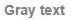
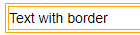

# HTML elements

You can use HTML tags to embed markup elements not supported by Markdown.

For example:

- ```
  <p style="color: gray; font-weight: bold;">Gray text</p>
  ```

    

    

    

- ```
  <p style="border-width: 4px; border-style: double; border-color: orange;">Framed text</p>
  ```

    

    

    

