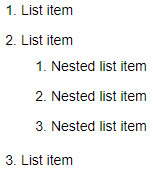
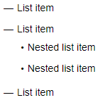
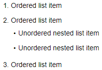

# Lists

## Numbered list {#section_numbered}

- Before each item in the list, add a number with a dot and a space.

- To create a second-level list item, add three spaces at the start of the line.

- After you're finished, add an empty line before writing the rest of the text.



The numbered list will start with the number you enter before your first item. The number order in the markup doesn't affect the number order of the final list. But it is more convenient to work with the source text if the list items are numbered in order.



Markup:

```
1. List item
2. List item
   1. Nested list item
   2. Nested list item
   3. Nested list item
3. List item
```







## Bulleted list {#section_bullet}

- Insert a marker symbol before each item in the bulleted list. You can use the following symbols as markers: `-`, `*`, or `+`.
- To create a second-level list item, add two spaces at the start of the line.
- After you're finished, add an empty line before writing the rest of the text.

Markup:

```
* List item
* List item
  * Nested list item
  * Nested list item
* List item
```







## Combined list {#section_combined}

You can include a bulleted sub-list into your numbered list and vice versa.

```
1. Ordered list item
2. Ordered list item
   * Unordered nested list item
   * Unordered nested list item
1. Ordered list item
```







## Block elements inside the list {#section_elem-incl}

For [cuts](document-strucuture.md#section-cut), [quotes](quoting.md), [code blocks](source.md), [tables](grids.md), and other elements inside the list to be displayed correctly, make a four-space indent in front of them to the left relative to the list marker:

```
1. item 1
    <[Quote with a list
    1. text
    1. text
    1. text
    ]>
1. item 2
```






## To-do lists {#section_check}

A to-do list (checklist) is a numbered or bulleted list that lets you mark the items you've completed. To create a to-do list, enter your item number or bullet and then add a space and one of the following symbols:

- `[]` for an unmarked item.

- `[x]` for a marked item.



- Numbered list

    ```
    1. [x] Checked item
    2. [] Unchecked item
    3. [] Unchecked item
    ```

    

    

    

- Bulleted list

    ```
    + List item
      - [x] Checked item
      - [] Unchecked item
    ```

    

    

    



