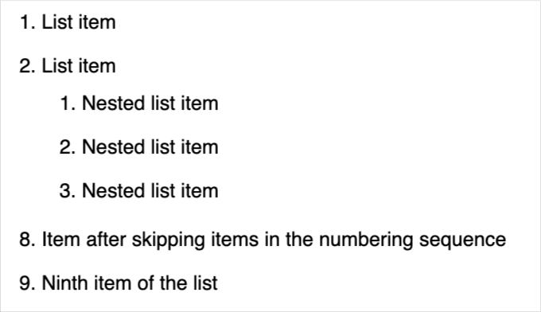
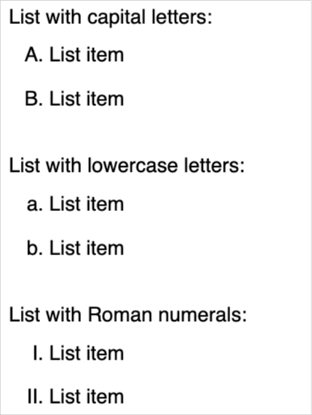
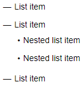
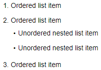
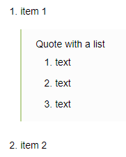
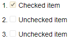
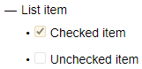

# Lists



## Numbered list {#section_numbered}

### List with numbers {#section_numbered_numbers}

- Before each item in the list, add a number with a dot and a space.

    

    The numbering of the list starts with the number that you put before the first item. The order of the numbers in the markup does not affect the numbering of the finished list. But it is more convenient to work with the source text if the list items are numbered in order.

    

- To create a second-level list item, add three spaces to the beginning of the line.

- To skip the numbering steps, put `#` after the number with a dot and the number that the numbering starts with will continue.

- Separate the list from the following text with an empty line.

Markup:

```
1. List item
2. List item
   1. Nested list item
   2. Nested list item
   3. Nested list item
3.#8 Item after skipping items in the numbering sequence
4. Ninth item of the list
```







### List with letters {#section_numbered_letters}

- A list with letters is created in the same way as a [numbered list](#section_numbered_numbers), except that it uses Latin letters instead of numbers.

- To create a list with Roman numerals, add the letter `I` or `i` before each list item with a dot and a space.

- Lists with letters do not support skipping numbering steps using the `#` symbol.

Markup:

```
List with capital letters:
A. List item
B. List item

List with lowercase letters:
a. List item
b. List item

List with Roman numerals:
I. List item
I. List item
```







## Bulleted list {#section_bullet}

- Insert a marker symbol before each item in the bulleted list. You can use `-`, `*`, or `+` as markers.
- To create a second-level list item, add two spaces to the beginning of the line.
- Separate the list from the following text with an empty line.

Markup:

```
* List item
* List item
  * Nested list item
  * Nested list item
* List item
```







## Combined list {#section_combined}

You can include a bulleted sub-list into your numbered list and vice versa:

```
1. Ordered list item
2. Ordered list item
   * Unordered nested list item
   * Unordered nested list item
1. Ordered list item
```







## Block elements inside a list {#section_elem-incl}

For [cuts](document-structure.md#section-cut), [quotes](quoting.md), [code blocks](source.md), [tables](grids.md), and other elements inside the list to be displayed correctly, make a four-space indent in front of them to the left relative to the list marker:

```
1. item 1
    <[Quote with a list
    1. text
    1. text
    1. text
    ]>
1. item 2
```






## To-do lists {#section_check}

A to-do list (checklist) is a numbered or bulleted list where you can mark completed items. To create a to-do list, add a space and the following characters after the number or bullet in each item:

- `[]` for an unmarked item.

- `[x]` for a marked item.



- Numbered list

    ```
    1. [x] Checked item
    2. [] Unchecked item
    3. [] Unchecked item
    ```

    

    

    

- B ulleted list

    ```
    + List item
      - [x] Checked item
      - [] Unchecked item
    ```

    

    

    

