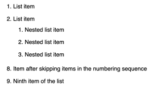

# Lists

## Numbered list {#section_numbered}

### A list with numbers {#section_numbered_numbers}

- Enter a number followed a dot and a space before each item.

    

    The numbered list will start with the number you enter before your first item. The numbering in the markup doesn't affect the numbering of the final list. However, working with the source text will be easier if the list items follow the regular numbering sequence.

    

- To create a second-level list item, add three spaces at the start of the line.

- To skip items in the numbering sequence, enter the `#` symbol followed by a dot and the number of the item you want to put next in the sequence.

- After you're finished, add an empty line before writing the rest of the text.

Markup:

```
1. List item
2. List item
   1. Nested list item
   2. Nested list item
   3. Nested list item
3.#8 Item after skipping items in the numbering sequence
4. Ninth item of the list
```







## Bulleted list {#section_bullet}

- Add a bullet symbol before each item in a bulleted list. You can use `-`, `*`, or `+` as bullet symbols.
- To create a second-level list item, add two spaces at the start of the line.
- After you're finished, add an empty line before writing the rest of the text.

Markup:

```
* List item
* List item
  * Nested list item
  * Nested list item
* List item
```






## Combined list {#section_combined}

You can include a nested list with bullet points into your numbered list and vice versa:

```
1. Ordered list item
2. Ordered list item
   * Unordered nested list item
   * Unordered nested list item
1. Ordered list item
```






## Block elements inside a list {#section_elem-incl}

In order to make [collapsable sections](document-structure.md#section-cut), [quotes](quoting.md), [code snippets](source.md), [tables](grids.md), and other elements display correctly inside a list, insert a 4-space indent to the left of each element to separate it from the list bullet:

```
1. item 1
    <[Quote with a list
    1. text
    1. text
    1. text
    ]>
1. item 2
```






## To-do list {#section_check}

A to-do list (checklist) is a numbered or bulleted list that lets you mark the items you've completed. To create a to-do list, enter your item number or bullet and then add a space and one of the following symbols:

- `[]` for an unchecked item.

- `[x]` for a checked item.



- Numbered list

    ```
    1. [x] Checked item
    2. [] Unchecked item
    3. [] Unchecked item
    ```

    

    

    

- Bulleted list

    ```
    + List item
      - [x] Checked item
      - [] Unchecked item
    ```

    

    

    



