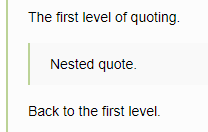
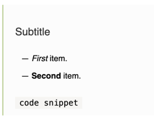

# Quotes

## Quoting a paragraph

* To quote a paragraph, add the `>` symbol at the start of that paragraph.

* To create a nested quote, insert the `>>` symbols at the start of the paragraph.

* Separate the quote from the following text with an empty line.

* You can use other kinds of formatting inside quotes, such as headings, lists, or a bold font.

Sample markups:

* ```
   >Quote text
  ```

   

   

   

* ```
     >First-level quote.
     >>Second-level quote.
     >
     >>First level again.
  ```

   

   

   

* ```
     >#### Subtitle
     >* *First* item.
     >* **Second** item.
     >
     >`code snippet`
  ```

   

   

   

## Quoting a long text

To quote a long piece of text, enclose the quote inside `<[` and `]>`.

This format also supports nested quotes and other markup elements.

* ```
    <[First-level quote. 
    >Second-level quote
   
     First level again.]>
  ```

   

   

   

* ```
     <[#### Subtitle
     * *First* item.
     * **Second** item.
   
     `code snippet`]>
  ```

   

   

   