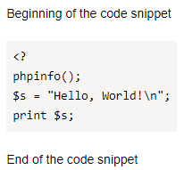

# Source code formatting



- Old editor

   * To highlight a source code snippet, such as a function name, in the text, wrap it in back quotes (` ` `).

   * To format multiple source code lines, paste three back quotes (` ``` `) in the row preceding the code block and the row following the code block.

   For example:

   * ```
     Function `exit()`
     ```

      

      

      

   * ```
      Start of a code snippet
      ```
      <?
      phpinfo();
      $s = "Hello, World!\n";
      print $s;
      ```
      End of the code snippet
     ```

      

      

      

   #### See also

   [{#T}](highlight.md)


