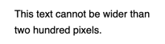
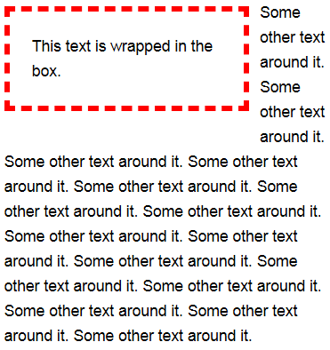
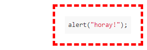
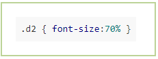

# Borders, width, and alignment of blocks

For [text blocks with special formatting](../formatter.md), you can add frames, adjust the width of a block and its position relative to the edges of the page. To do this, add additional parameters to the block markup.

## Ready-made formatting templates {#wrapper}

Use the `wrapper` parameter to apply one of the block formatting templates. The main text of the page will flow around the block.

| Parameter | Description |
---|---
| `box` | A block in a green frame located on the right edge of the page. |
| `shade` | A block in a green frame located on the left edge of the page. |
| `text` | A block without a frame with right-aligned text. You can set up text alignment using the [`align` parameter](#align). |
| `page` | A block without a frame located on the left edge of the page. |



When using the `wrapper` parameter, you can add other parameters to customize a block's [position](#align) on the page, [width](#width), color, type and thickness of [borders](#border).



Example:

```
%%(wacko wrapper=box)
Text inside the block
%%
```


## Setting up alignment {#align}

Use the `align` parameter to adjust the position of a block on the page.

Along with the `wrapper=text` parameter, the `align` parameter lets you adjust the alignment of text inside the block.

| Parameter | Description |
---|---
| `right` | Right-aligned. |
| `left` | Left-aligned. |
| `center` | Centered. This value is only valid in combination with the `wrapper=text` parameter. |

Example:

```
%%(css align=right)
.d { font-size:70% }
%%
```

## Setting up the width of a block {#width}

Use the `width` parameter to adjust the block width in pixels.

Example:

```
%%(css wrapper=box width=400)
.d { font-size:70% }
%%
```


## Setting up the border of a block {#border}

Use the `border` parameter to adjust the border around a block.

```
border="<thickness in pixels> <line type> <line color>"
```
| Parameter | Description |
---|---
| **Line types** |
| `solid` | Solid line. |
| `dashed` | Dashed line. |
| **Colors** |
| `red` | Red. |
| `green` | Green. |
| `blue` | Blue. |
| `grey` | Grey. |
| `yellow` | Yellow. |

Example:

```
%%(math wrapper=shade border="2px dashed red") X^{a+b}_{i-j} %%
```

## Examples {#example}

| Markup | Result |
--- | --- 
| ```%%(wacko wrapper=text align=center) text centered %%``` |  |
| ```%%(wacko wrapper=page width=200)```<br/>```This text can't be wider than 200 pixels.```<br/>```%%``` |  |
| ```%%(wacko wrapper=box align=left width=170 border="5px dashed red")```<br/>```Text inside the block```<br/>```%%```<br/>```This text will wrap around the block. This text will wrap around the block.``` |  |
| ```%%(javascript nomark wrapper=box border="5px dashed red")```<br/>```alert("horay!");```<br/>```%%``` |  |
| ```%%(css wrapper=shade)```<br/>```.d2 { font-size:70% }```<br/>```%%``` |  |