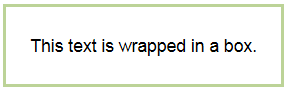

# Separating text blocks

You can separate part of the page in separate blocks:

```
%%(wacko wrapper=box)
This text is wrapped in a box.
%%
```







You can configure the block's position on the page, the width of the block, the color, type, and thickness of the frame. The main text of the page will flow around the block. By default, the block is located on the right side of the page.

## Block configuration parameters

- **align**

    Alignment of the block on the page. It can be assigned the following values:

    - `right`: On the right edge.

    - `left`: On the left edge.

    ```
    align=right
    ```

- **width**

    The width of the block in pixels.

    ```
    width=100
    ```

- **border**

    Parameters of the block's border: width in pixels, line type, line color.

    Available line types:
    - `solid`: Solid line.
    - `dashed`: Dashed line.

    Available colors:
    - `red`: Red.
    - `green`: Green.
    - `blue`: Blue.
    - `grey`: Gray.
    - `yellow`: Yellow.

    ```
    border="5px dashed red"
    ```

## Example

```
%%(wacko wrapper=box align=left width=170 border="5px dashed red")
This text is wrapped in the box.
%%
Some other text around it. Some other text around it.
```






