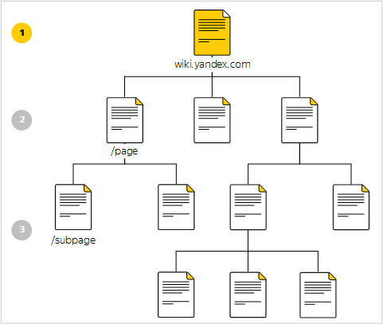
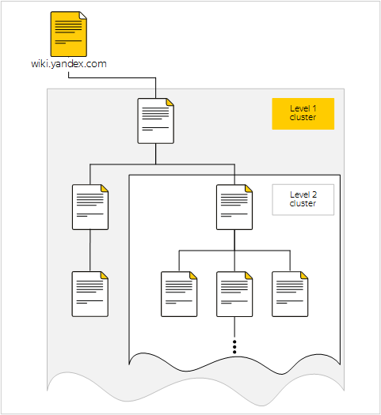

# Structure of {{ wiki-full-name }}

## Page tree {#structure}

Pages {{ wiki-name }} are organized in the form of a tree:

1. **{{ wiki-host-name }}** – home page {{ wiki-name }}. The home page usually displays links to the main clusters, important links, or news.

1. **{{ wiki-host-name }}/page** – top-level pages. These are usually pages that relate to a large general topic. For example, the pages of a department, team, or project.

    

    The home page isn't considered the parent page for top-level pages.

    

1. **{{ wiki-host-name }}/page/subpage/...** – pages of the second and following levels.

Each page has one or more _owners_, which are users who manage access to the page. Page authors are indicated under the title.

## Clusters {#clusters}

Pages {{ wiki-name }} form _clusters_:

A cluster is a page with all its subpages. Pages within a cluster are usually related to a common topic.

To [view or change the cluster structure](cluster-overview.md#subpages), in the top panel, click .

## Personal cluster {#personal_cluster}

For each user there {{ wiki-name }} is _a Personal cluster_ (`{{ wiki-username }}`). You can use your personal cluster to store your personal information, schedule, drafts, or whatever you want.

To go to your personal cluster:

1. In the {{ wiki-name }} panel on the left, click  **Created and edited**.

1. Next, at the top, click  **Go to personal page**.

The pages of a personal cluster are available to all users by default.

As with other pages for which you are the author, you can [change](page-management/access-setup.md) access settings for the pages of your personal cluster.

