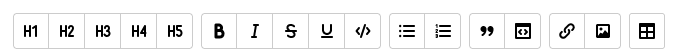

# Working in a WYSIWYG visual editor

The visual editor only works on [WYSIWYG pages](pages-types.md#wysiwyg). It's at the Beta stage, so it may be unstable.

You can't convert WYSIWYG pages into regular Wiki pages and can't use Wiki markup and [dynamic blocks](actions.md) on them.

## Editing a WYSIWYG page {#edit-page}

To edit a page [created](wysiwyg-create.md) in a WYSIWYG visual editor:

1. Open the desired WYSIWYG page and click **Edit** in the upper-right corner.

1. Make changes to the WYSIWYG page. To format text and lists, embed tables and images, use the following toolbar buttons:

   

1. To cancel or repeat an action, use the  and  buttons.

1. To format text using [{{ yfm }} markup]({{ yfm-link }}), click  and select **Markup** mode.

1. To disable the toolbar, click  and turn off the **Toolbar** option. If the toolbar is disabled, you can run commands using the `/` character in **Editor** mode.

## Formatting text {#format-wysiwyg}

To format text, use the following toolbar buttons or keyboard shortcuts:

| Formatting | Toolbar button | Windows shortcuts | Mac OS shortcuts |
--- | --- | --- | ---
| Header |   | **Ctrl** + **Alt** + **1**—**6** | **⌘** + **⌥** + **1**—**6** |
| Bold text |  | **Ctrl** + **B** | **⌘** + **B** |
| Italic |  | **Ctrl** + **I** | **⌘** + **I** |
| Underlined text |  | **Ctrl** + **U** | **⌘** + **U** |
| Strikethrough text |  | **Ctrl** + **Shift** + **S** | **⌘** + **Shift** + **S** |
| Colored text |   | — | — |

## Lists {#lists-wysiwyg}

To add a list, select one or more paragraphs and use the following toolbar buttons or keyboard shortcuts:

| List | Toolbar button | Windows shortcuts | Mac OS shortcuts |
--- | --- | --- | ---
| Bulleted list |  | **Ctrl** + **Shift** + **L** | **⌘** + **Shift** + **L** |
| Numbered list |  | **Ctrl** + **Shift** + **M** | **⌘** + **Shift** + **M** |
| Checklist (checkbox) |  | — | — |

To format a nested list item, select a paragraph and press the Tab key (**⇥**) at the beginning of the line.

## Block formatting {#block-wysiwyg}

To add a quote, note, or cut, select one or more paragraphs, and use the following toolbar buttons or keyboard shortcuts:

| Block | Toolbar button | Windows shortcuts | Mac OS shortcuts |
--- | --- | --- | ---
| Comment |  | **Ctrl** + **Alt** + **8** | **⌘** + **⌥** + **8** |
| Cut |  | **Ctrl** + **Alt** + **7** | **⌘** + **⌥** + **7** |
| Quote |  | **Ctrl** + **>** | **⌘** + **>** |

For the **Note** block, you can choose its type: <q>Note</q>, <q>Advice</q>, <q>Important</q>, or <q>Attention</q>.

## Code formatting {#src-wysiwyg}

To add a code block, select a line or paragraph and use the following toolbar buttons or keyboard shortcuts:

| Block | Toolbar button | Windows shortcuts | Mac OS shortcuts |
--- | --- | --- | ---
| Code block |  | **Ctrl** + **Alt** + **E** | **⌘** + **⌥** + **E** |
| Line of code in text |  | **Ctrl** + **E** | **⌘** + **E** |

## Links {#links-wysiwyg}

To add a link:

1. Select a text fragment or click on the area to add a link to.

1. On the toolbar, click .

1. Enter a direct or [relative](static-markup/links.md#wiki-ref) reference. If you didn't select a text fragment, enter the text to be displayed as a link.

1. Click **Save**.

To change or delete a link:

1. Click on the link.

1. Make your changes and click **Save**.

## Embedded content {#content-wysiwyg}

### Inserting an image from the clipboard {#clipboard}

1. Copy an image to the clipboard:

   - Copy a picture from an image editor or take a screenshot.

   - Copy a picture from a web page.

   - Copy an image file from the file manager on your computer.

1. Open the page and click **Edit**.

1. Paste the image from the clipboard into the page text.

The image is automatically uploaded to {{ wiki-name }} and added to a [list of attached files](attach-file.md).

### Inserting an image using a link {#image}

1. Upload an image to a [Wiki page](add-image.md) or a file hosting service.

1. Copy the image address.

1. On the toolbar, click :

   * In the **Link** field, paste the image URL.

   * Add a **Picture caption**. The caption is displayed when hovering over the image.

   * Enter **Alternative text**. The text is displayed if the image fails to load.

   * Specify the image size.

1. Click **Save**.

### Objects and media files {#iframe}

To embed an object or media file from an external source in a page, use an embedded iFrame:

1. Copy the link to the resource to be displayed in the iFrame.

1. On the toolbar, click :

   * In the **Link** field, paste the resource URL.

   * Specify the frame size.

1. Click **Save**.

## Tables {#tables-wysiwyg}

To add a table, click  on the toolbar and fill in table cells. You can format text in the table cells.

To edit a table, select a cell and use the dynamic buttons.

#### See also

* [{#T}](wysiwyg-create.md)
