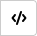
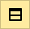
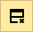
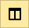
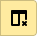

# Working in the visual editor (Wysiwyg)



You can only use the visual editor with [Wysiwyg pages](pages-types.md#wysiwyg) that are accessible from the internal Yandex {{wiki-name}}.



The visual editor is currently in the beta phase, so it may be unstable. Wysiwyg pages have certain limitations:

* They are not compatible with the Wiki markup or [dynamic blocks](actions.md).

* They can't be converted into Wiki pages with the common markup.

* They can't be found via the [intranet search](search.md).

## Editing Wysiwyg pages {#edit-page}

To edit a page [created](wysiwyg-create.md) in the visual editor (Wysiwyg):

1. Open the Wysiwyg page and click **Edit** in the upper-right corner.

1. Make edits on the Wysiwyg page. Use the toolbar buttons to format text, edit lists, or insert tables and images:

    

## Text formatting {#format-wysiwyg}

To format text, use the toolbar buttons or keyboard shortcuts:

| Formatting | Toolbar button | Keyboard shortcut |
| --- | --- | --- |
| Header |  | — |
| Bold |  | **Ctrl** + **B** |
| Italics |  | **Ctrl** + **I** |
| Strikethrough |  | **Ctrl** + **Shift** + **S** |
| Underline |  | **Ctrl** + **U** |
| Code line |  | — |

## Lists {#lists-wysiwyg}

To add a list, select one or more paragraphs and use the buttons on the toolbar:

| List | Toolbar button |
| --- | --- |
| Bulleted list |  |
| Numbered list |  |

To format a nested list item, select a paragraph and press the tab key at the beginning of the line.

## Quotes and code blocks {#src-wysiwyg}

To add a quote or a code block, select one or more paragraphs and use the buttons on the toolbar:
Block | Toolbar button
--- / ---
Quote | 
Code block | 

## Links {#links-wysiwyg}

To add a link:

1. Select a text fragment or click on the area where you want to add the link.

1. Click  on the toolbar.

1. Enter a direct or [relative](static-markup/links.md#wiki-ref) link address and click **OK**.

To change or delete a link:

1. Click the link.

1. Click  on the toolbar.

1. Make edits and click **OK**.

## Images {#pictures-wysiwyg}



You can't upload images to a page in the visual editor. To add an image, copy its address from a different Wiki page. A user will be able to view the image on your page if they have access to the Wiki page with the original file.



To insert an image:

1. Upload the image to a [Wiki page](add-image.md) or a file hosting service, such as [Jing](https://jing.yandex-team.ru/). You can't change the size of an image in the visual editor, so make sure to adjust the size beforehand.

1. Copy the page address.

1. Click  on the toolbar.

1. Paste the image address and click **OK**.

1. To delete an image, use the _Backspace_ or _Del_ keys.

## Tables {#tables-wysiwyg}

To add a table, click  on the toolbar and fill in the cells. You can format text in the table cells.

To edit a table, select a cell and use the toolbar buttons:
Action | Toolbar button --- | --- Delete table | 
Insert row | 
Delete row | 
Insert column | 
Delete column | 

#### See also

* [{#T}](wysiwyg-create.md)

