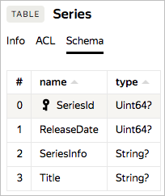

# Data model and schema

This section describes the data model, entities, and entity hierarchy that YDB uses within DBs.

In the current version, only tables and directories can be used from YDB service databases.
The YDB core lets you flexibly implement various storage primitives, so new entities may appear in the future.

## Table {#table}

A table in YDB is a [relational table](https://en.wikipedia.org/wiki/Table_(database)) that contains a set of related data consisting of rows and columns. Each row is a set of cells designed to store values of certain types according to the data schema. The data schema defines the names and types of table columns. An example of a data schema is shown below.



<small>Figure 1: Sample table schema</small>

Figure 1 shows the schema of a ```Series``` table with four columns, named ```SeriesId```, ```ReleaseDate```, ```SeriesInfo```, and ```Title```, with the ```Uint64?``` data type for the first two columns and ```String?``` for the others. The primary key is declared the column ```SeriesId```

YDB uses [YQL](datatypes.md) data types. [Simple YQL data types](../yql/reference/types/primitive.md) can be used as column types. All columns may contain a special NULL value to indicate a missing value.

YDB tables always have one or more columns that make up the key ([primary key](https://en.wikipedia.org/wiki/Unique_key)). Each table row has a unique key value, so there can be no more than one row per key value. A YDB table is always ordered by key. This means that you can efficiently make point reads by key and range-based queries by key or key prefix (actually using an index). In the example above, the key columns are highlighted in gray and marked with a special sign. Tables consisting only of key columns are supported. However, you can't create tables without a primary key.

Often, when you design a table schema, you already have a set of fields, which can naturally serve as the primary key. Be careful when selecting the key to avoid hotspots.
For example, if you insert data into a table with a monotonously incrementing key, you write to the end of the table. However, since YDB splits table data by key range, your inserts are always processed by the same server, so you lose the main benefits of a distributed database.
To distribute the load evenly across different servers and avoid hotspots when working with large tables, we recommend hashing the natural key and using the hash as the first component of the primary key, as well as changing the order of the primary key components.

### Partitioning tables {#partitioning}

A database table can be sharded by primary key value ranges. Each shard of the table is responsible for a specific range of primary keys. Key ranges served by different shards do not overlap. Different table shards can be served by different distributed database servers (including ones in different locations). They can also move independently between servers to enable rebalancing or ensure shard operability if servers or network equipment goes offline.

If there is not a lot of data, the table may consist of a single shard. As the amount of data served by the shard grows, YDB automatically splits the shard into two shards. The data is split by the median value of the primary key, depending on the amount of data: as soon as the shard exceeds the set data volume, it is split in two.

The shard split threshold and automatic splitting can be configured (enabled/disabled) individually for each database table.

In addition to automatically splitting shards, you can create an empty table with a predefined number of shards. You can manually set the exact shard key split range or evenly split into a predefined number of shards. In this case, ranges are created based on the first component of the primary key. You can set even splitting for tables that have an integer as the first component of the primary key.

### Reads in a geo-distributed cluster.

When making queries in YDB, their actual execution is performed by shards hosted on available cluster resources. In a geo-distributed cluster, these may be resources allocated in a data center, which is separate from the data center running the query. This creates an additional delay to the query execution time due to the delay in transmitting the query between data centers.

Sometimes this delay doesn't allow the user service to meet the required response time. For this case, YDB lets you declare the need to maintain a table mirror in the local data center (implemented via table shard slaves). The shard slaves are typically accessed without leaving the data center network, which lets you see response delays in milliseconds. The limitation is that only the simplest read queries can be executed. Slaves don't have their own storage and read data shared with the table shards. Updates are delivered to the slaves asynchronously, which may lead to anomalies in reading stale data (usually no more than tens of milliseconds, but possibly up to seconds in the event of connectivity problems in the cluster).

## Entity hierarchy

For convenience, the service supports creating directories like in a file system, meaning the entire database consists of a directory tree, while tables and other entities are in the leaves of this tree (similar to files in the file system). A directory can host multiple subdirectories and tables. The names of the entities they contain are unique.

