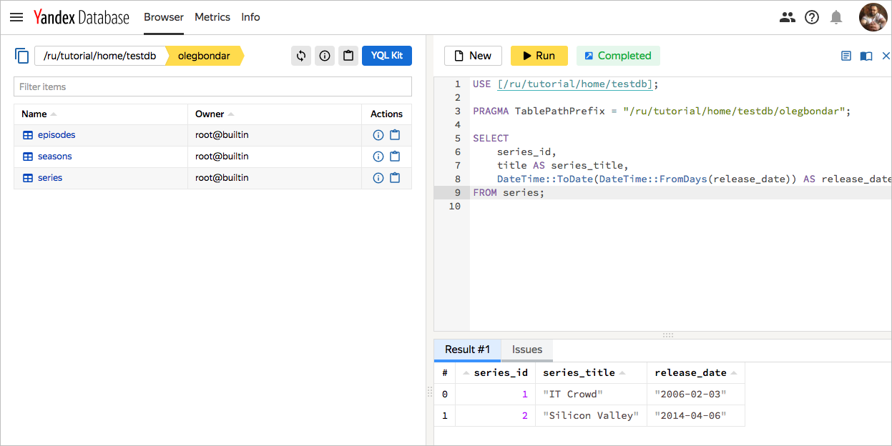

# Reading and writing data



YQL queries can be sent to YDB in the following ways:

* From an application written using the YDB SDK for [C++](start_cpp.md), [Java](start_java.md), or [Python](start_python.md)
* Using the [YQL](https://yql.yandex-team.ru/) interface.
* Using the YQL Kit integrated in the [management console](https://ydb.yandex-team.ru).

In this section, we are going to use the YQL Kit integrated in the [web interface](https://ydb.yandex-team.ru) to execute YQL instructions.




You can complete a tutorial on accessing YDB data using [YQL](https://yql.yandex-team.ru/docs/ydb/) in the [management console](https://yql.yandex-team.ru/Tutorial/ydb_01_Create_demo_tables).





YQL queries can be sent to YDB in the following ways:

* From the management console.
* From an application written using the YDB SDK for [Java](https://github.com/yandex-cloud/ydb-java-sdk), [Python](https://github.com/yandex-cloud/ydb-python-sdk), or [Go](https://github.com/yandex-cloud/ydb-go-sdk).

In this section, we are going to use the management console to execute YQL statements.



## Prerequisites {#prerequisite}

To execute queries, you need a [database](create_manage_database.md) and [schema](schema.md).

## Inserting and changing data {#change-data}

To insert data in {{ ydb-short-name }}, you can use REPLACE, UPSERT, and INSERT statements.
When executing REPLACE and UPSERT statements, a blind write is performed. With an INSERT statement, data is read before writing. This ensures that the primary key is unique.

We recommend using REPLACE and UPSERT statements to write and modify data.

A single REPLACE, UPSERT, or INSERT query can insert multiple rows into a table.



The YQL management console includes PRAGMA AutoCommit. This means that COMMIT is automatically executed after each query. For example, if you enter multiple statements (as shown in the example below) and execute the query, COMMIT is run automatically after the query.

```yql
 REPLACE INTO episodes (series_id, season_id, episode_id, title) VALUES (1, 1, 1, "Yesterday's Jam");
 REPLACE INTO episodes (series_id, season_id, episode_id, title) VALUES (1, 1, 2, "Calamity Jen");
```



### REPLACE {#replace}

Once the *series*, *season*, and *episodes* tables are created, you can insert data into a table using the REPLACE statement. Basic syntax:

```yql
REPLACE INTO, table_name, column_list, VALUES, list_of_added_values
```

Use REPLACE statements to add a new row or change an existing row based on the specified value of the primary key. If a row with the specified primary key value does not exist, it is created. If the row already exists, the column values of existing row are replaced with the new values. *The values of columns not involved in the operation are set to their default values. This is what makes it different from the UPSERT statement.*



When executing a query, a blind write is performed. For write or change operations, we recommend using REPLACE and UPSERT statements.



Data added using the following code sample will be used later in this section.

```yql
REPLACE INTO series (series_id, title, release_date, series_info)
VALUES
    (
        1,
        "IT Crowd",
        CAST(Date("2006-02-03") AS Uint64),
        "The IT Crowd is a British sitcom produced by Channel 4, written by Graham Linehan, produced by Ash Atalla and starring Chris O'Dowd, Richard Ayoade, Katherine Parkinson, and Matt Berry."),
    (
        2,
        "Silicon Valley",
        CAST(Date("2014-04-06") AS Uint64),
        "Silicon Valley is an American comedy television series created by Mike Judge, John Altschuler and Dave Krinsky. The series focuses on five young men who founded a startup company in Silicon Valley."
    )
    ;

REPLACE INTO seasons (series_id, season_id, title, first_aired, last_aired)
VALUES
    (1, 1, "Season 1", CAST(Date("2006-02-03") AS Uint64), CAST(Date("2006-03-03") AS Uint64)),
    (1, 2, "Season 2", CAST(Date("2007-08-24") AS Uint64), CAST(Date("2007-09-28") AS Uint64)),
    (2, 1, "Season 1", CAST(Date("2014-04-06") AS Uint64), CAST(Date("2014-06-01") AS Uint64)),
    (2, 2, "Season 2", CAST(Date("2015-04-12") AS Uint64), CAST(Date("2015-06-14") AS Uint64))
;

REPLACE INTO episodes (series_id, season_id, episode_id, title, air_date)
VALUES
    (1, 1, 1, "Yesterday's Jam", CAST(Date("2006-02-03") AS Uint64)),
    (1, 1, 2, "Calamity Jen", CAST(Date("2006-02-03") AS Uint64)),
    (2, 1, 1, "Minimum Viable Product", CAST(Date("2014-04-06") AS Uint64)),
    (2, 1, 2, "The Cap Table", CAST(Date("2014-04-13") AS Uint64))
;
```

### UPSERT {#upsert}

Use the UPSERT statement to add a new row or change an existing row based on the specified value of the primary key. If a row with the specified primary key value does not exist, it is created. If the row already exists, the column values of existing row are replaced with the new values. *The values of columns not involved in the operation don't change. This is what makes it different from the REPLACE statement.*



When executing a query, a blind write is performed. For write or change operations, we recommend using REPLACE and UPSERT statements.



The code below inserts one row of data into the *episodes* table.

```yql
UPSERT INTO episodes
(
    series_id,
    season_id,
    episode_id,
    title,
    air_date
)
VALUES
(
    2,
    1,
    3,
    "Test Episode",
    CAST(Date("2018-08-27") AS Uint64)
)
;
```

### INSERT {#insert}

Use the INSERT statement to insert one or more rows. If you try to insert a row into a table with an existing primary key value, {{ ydb-short-name }} returns the error message ```Transaction rolled back due to constraint violation: insert_pk.```.



When an INSERT operation is executed, the data is read before it is written. This makes it less efficient than REPLACE and UPSERT operations. For writing data, we recommend using REPLACE and UPSERT operations.



The code below inserts one row of data into the *episodes* table.

```yql
INSERT INTO episodes
(
    series_id,
    season_id,
    episode_id,
    title,
    air_date
)
VALUES
(
    2,
    5,
    21,
    "Test 21",
    CAST(Date("2018-08-27") AS Uint64)
)
;
```

### UPDATE {#update}

The UPDATE statement changes column values for table row filtered by a WHERE predicate. Basic syntax:

```yql
UPDATE table_name SET column1_name=new_column1_value, ...,column_nameN=new_columnN_value WHERE row_filtering_criteria
```

UPDATE statements can't change primary key values. Enter and execute the following UPDATE statement to change the value of the ```title``` column from "Test Episode" to "Test Episode Updated" for the episode with ```series_id = 2```, ```season_id = 1```, and ```episode_id = 3```.

```yql
UPDATE episodes
SET title="Test Episode Updated"
WHERE
    series_id = 2
    AND season_id = 1
    AND episode_id = 3
;
```

### DELETE {#delete}

The DELETE statement deletes table rows filtered by a WHERE predicate. The code below removes an episode with ```series_id = 2```, ```season_id = 1```, and ```episode_id = 3``` from the *episodes* table.

```yql
DELETE
FROM episodes
WHERE
    series_id = 2
    AND season_id = 5
    AND episode_id = 12
;
```

## Reading data using SELECT {#select}

Use the SELECT statement to read data from a table. For more information about SELECT statement syntax, see the [YQL](../yql/reference/quickstart.md) documentation.

To read data from the *series* table, execute the code shown below.

```yql
SELECT
    series_id,
    title AS series_title,
    DateTime::ToDate(DateTime::FromDays(release_date)) AS release_date
FROM series;
```



The interface will display the query results:





You can use an asterisk to select all the columns in a table. To read the values of all columns from the *series* table,
execute the code shown below.

```yql
SELECT
    *
FROM series;
```

## Parameterized queries {#param-queries}

Use parameterized queries to improve performance by reducing the frequency of compiling and recompiling your queries.

```yql
DECLARE $seriesId AS Uint64;
DECLARE $seasonId AS Uint64;

SELECT sa.title AS season_title, sr.title AS series_title
FROM seasons AS sa
INNER JOIN series AS sr
ON sa.series_id = sr.series_id
WHERE sa.series_id = $seriesId AND sa.season_id = $seasonId;
```



YDB uses the [optimistic locking](https://en.wikipedia.org/wiki/Optimistic_concurrency_control) mechanism. To reduce the odds of transaction locks being invalid with the error `Transaction locks invalid`, use short transactions.

