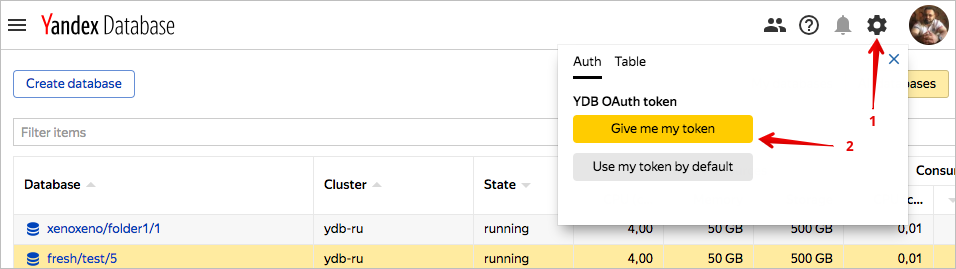

# Access management



{{ ydb-short-name }} uses token-based authentication, where users send tokens with each query.

## Authentication {#authentication}

### Management console {#web-ui}

The [web interface ](https://ydb.yandex-team.ru/) uses user cookies in the yandex-team.ru domain (validation via blackbox) for [authentication](../concepts/iam.md). The management console automatically authenticates users without any additional authentication steps.

### OAuth tokens in apps {#oath-app}

An OAuth token is required for authentication when accessing {{ ydb-short-name }} databases.

* To get a personal token, click the gear icon in the [web interface](https://ydb.yandex-team.ru/), and then click Give me my token. You can now use the personal token in your app.
* To grant a bot user database access, you need:
    * To get an OAuth token for the bot (YQL tokens are also acceptable).
    * [To notify](https://st.yandex-team.ru/createTicket?template=1918&queue=YDBREQUESTS) us of the bot's login and the name of the database, so that the system administrator can grant the bot proper database access rights.

### OAuth tokens in the management console {#oath-ui}

You can use an OAuth token instead of cookies in the [YDB web interface](https://ydb.yandex-team.ru/). To use the OAuth token for authentication by default, click the the Use my token by default button (see the image above).

## Authorization {#authorization}

The user that initiated database creation is granted *use* rights.

With *use* rights you can:

* Create and delete tables and directories in the database.
* Read and write data and schema attributes.
* Grant access rights to other users, but only within the scope of the aforementioned *use* rights.

In the current version, rights can only be management from the SDK for [C++](https://a.yandex-team.ru/arc/trunk/arcadia/kikimr/public/sdk/cpp/client/ydb_scheme.h) and [Python](https://a.yandex-team.ru/arc/trunk/arcadia/kikimr/public/sdk/python/client/scheme.py), which contain methods to grant, revoke, and change the list of rights granted, and a method to change the owner of a table, directory, and database.

Users can't change database parameters or delete a database. In the current version, only the system administrator can perform these actions.

To change database parameters, submit a [request form](https://st.yandex-team.ru/createTicket?template=1918&queue=YDBREQUESTS).

To delete a database, submit a [request form](https://st.yandex-team.ru/createTicket?template=1919&queue=YDBREQUESTS).



Yandex.Cloud users can only perform operations on resources that are allowed by the roles assigned to them. If a user doesn't have any roles assigned, almost all operations are forbidden.

To allow access to {{ ydb-short-name }} resources (databases and their users), assign users the relevant roles from the list below. For now, a role can only be assigned for a parent resource (folder or cloud), and roles are inherited by nested resources.



For more information about role inheritance, see [{#T}](../../resource-manager/concepts/resources-hierarchy.md#access-rights-inheritance) in the {{ resmgr-full-name }} documentation.



## Granting roles {#grant-roles}

To assign a role to a user:



## Roles {#roles}

The list below shows all roles that are considered when verifying access rights in the {{ ydb-short-name }} service.

### Service roles {#service-roles}

_Service roles_ are roles that allow access to the resources of a particular service.



### Primitive roles {#primitive-roles}

You can assign primitive roles to any resource in any service.

#### {{ roles-viewer }}

A user with the {{ roles-viewer }} role can view information about resources. For example, they can view a list of hosts or obtain information about a DB cluster.

#### {{ roles-editor }}

A user with the {{ roles-editor }} role can manage any resource. For example, they can create a DB cluster and create or delete a host in a cluster.

In addition, the {{ roles-editor }} role includes all permissions of the {{ roles-viewer }} role.

#### {{ roles-admin }}

A user with the {{ roles-admin }} role can manage access rights to resources. For example, they can allow other users to create DB clusters or view information about them.

In addition, the {{ roles-admin }} role includes all permissions of the role of {{ roles-editor }}.



