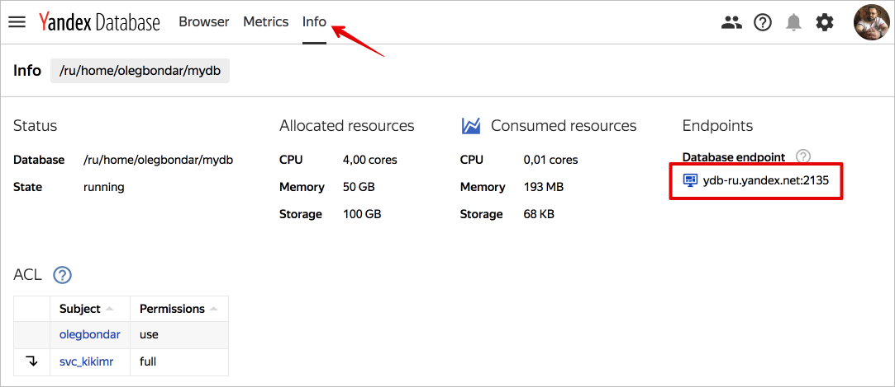
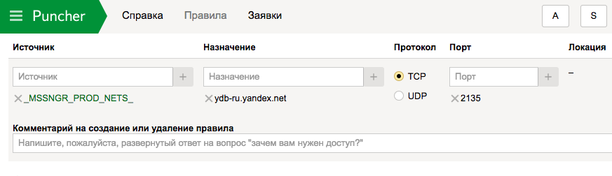
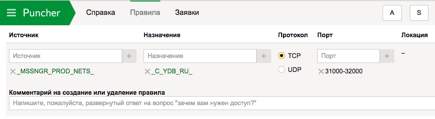
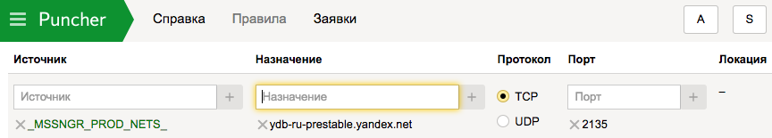
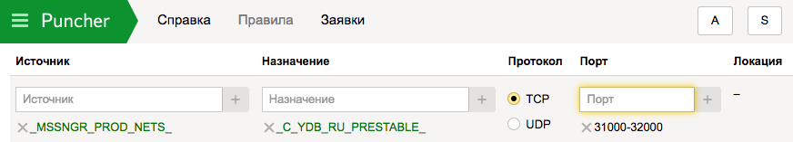

# How to connect to a database



{{ ydb-short-name }} databases are accessed via gRPC. You can find the database endpoint to connect to under [web interface](https://ydb.yandex-team.ru/) in the **Info** tab.



To access it, use [Puncher](https://puncher.yandex-team.ru) to create permission requests for accessing {{ ydb-short-name }} cluster servers and their network load balancers over TCP.

## Accessing ydb-ru clusters {#access-to-ydb-ru}

Use separate requests to specify:

* The load balancer address: ydb-ru.yandex.net, protocol TCP, port 2135.



* Macro: ```_C_YDB_RU_``` for databases in the `ydb-ru` cluster, TCP, port range 31000-32000.



## Accessing ydb-ru-prestable clusters {#access-to-ydb-ru-prestable}

Use separate requests to specify:

* Load balancer address: ydb-ru-prestable.yandex.net, TCP, port 2135.



* Macro: ```_C_YDB_RU_PRESTABLE``` for databases in the ydb-ru cluster, TCP, port range 31000-32000.





{{ ydb-short-name }} databases are accessed via gRPC over TLS.

## Prerequisites {#prerequisites}

1. Create a [service account](../../iam/concepts/users/service-accounts.md).

   

   

   Read about other ways to create a service account in the [instructions](../../iam/operations/sa/create.md).

   

1. Assign to the created service account the [roles](../../iam/concepts/access-control/roles.md) `viewer` and `editor`.

   

   

   For other ways to assign roles, see the [instructions](../../_includes/iam/grant-role-for-sa.md).

   

1. [Get the ID](../../iam/operations/sa/get-id.md) of the service account.

1. Create [authorized access keys](../../iam/concepts/authorization/key.md) to the service account and save them.

   

   1. Go to the folder that the service account belongs to.

   1. Go to the **Service accounts** tab.

   1. Choose a service account and click the line with its name.

   1. Click **Create new key** in the top panel.

   1. Click **Create access key**.

   1. Enter a description of the key so that you can easily find it in the management console.

   1. Save the ID and private key.

      

      After the dialog is closed, the private key value will be unavailable.

      

   Read about other ways to create keys in the [instructions](../../iam/operations/sa/create-access-key.md).

   

1. Get the database endpoint:
   1. Go to the {{ ydb-name }} page.
   1. Click on the name of the database.
   1. Go to the **Overview** section.
   1. Save the DB endpoint.

   

   A database in a **Serverless** configuration always has a public endpoint that is available from the internet. To be able to query a database with **dedicated** servers from the internet, set up assigning public IP addresses when [creating a database](create_manage_database.md#create-db).

   

1. (optional) If your database doesn't have a public endpoint, create a [VM](../../compute/concepts/vm.md) to access the DB in {{ yandex-cloud }}.

   

   

   Read about other ways to create a VM in the [instructions](../../compute/operations/vm-create/create-linux-vm.md).

   

   

   Further settings are done in the created VM.

   

   ```
   $ mkdir ~/.ydb
   $ wget "https://storage.yandexcloud.net/cloud-certs/CA.pem" -O ~/.ydb/CA.pem
   ```





