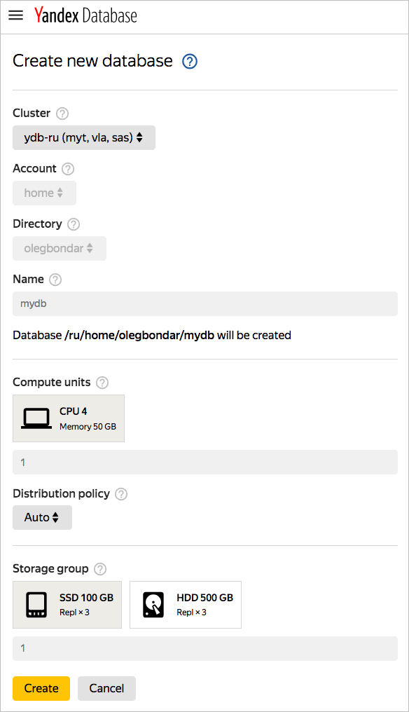
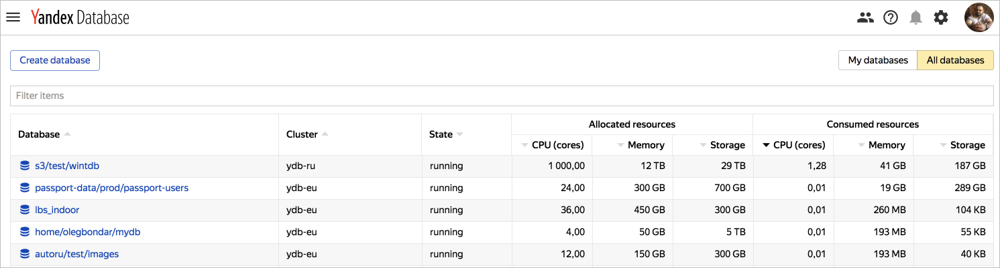

# Database management in {{ ydb-name }}

This section describes the following operations:

* [{#T}](#create-db).
* [{#T}](#db-list).
* [{#T}](#change-db-params).
* [{#T}](#delete-db).



## Creating a database {#create-db}

1. Go to the [management console](https://ydb.yandex-team.ru) and click **Create database**.

    

1. Configure database parameters in the dialog box:
    1. Cluster. You can choose a single data center cluster (`ydb-vla`, `ydb-sas`, `ydb-man`, and `ydb-myt`) or a multi-data center cluster (`ydb-ru` in VLA-SAS-MYT data centers or `ydb-eu` in VLA-SAS-MAN data centers).

    

    For the current {{ ydb-short-name }} installation, `ydb-ru` clusters are available in VLA-SAS-MYT data centers.

    

    1. **Account**. If you are just starting to use {{ ydb-short-name }} and don't have a project account, fill out the [form](https://st.yandex-team.ru/createTicket?template=1911&queue=KIKIMR) to create one. If you want to try creating a personal database for testing purposes, use your *home* account.

    1. **Directory**. Select a directory from the list of existing directories for the selected account, or create a new directory. If you selected the *home* account, a directory with your username is created automatically. The directory name is case-sensitive, it must start with a Latin letter followed by Latin letters, numbers, underscores '_', or hyphens '-'.

    1. **Name**. The database name has the same restrictions as the directory name.

    1. **Computing resources** The type and amount of computing resources (compute units).

    1. **Distribution policy**. Policy for distributing computing resources between data centers in multiple data center clusters (distribution policy). Possible options:
        * *auto* — Computing resources are located in available data centers. If a data center goes offline, computing resources are moved to the other available data centers.
        * *in one DC* — Computing resources are located in a single data center. If it goes offline, the computing resources move to another data center, and are again hosted in a single data center.
        * *uniform distribution* — Computing resources are distributed evenly among data centers. If one data center goes offline, computing resources are moved to the other data centers.

    1. **Storage groups**. Type and number of storage groups. Each storage group corresponds to a specific storage schema that affects the number of disks used, the failure model, and the redundancy factor. The ``block4-2`` schema is commonly used for single data center clusters, where the storage group is located on 8 disks in 8 racks, can withstand the failure of any two disks, and ensures a redundancy factor of 1.5. In multiple data center clusters, we use the ``mirror3dc`` schema, where storage groups are made up of 9 disks, 3 in each of the three data centers, which can survive the failure of a data center or disk, and ensures a redundancy factor of 3. A storage group can consist of any of the following types of storage devices: SATA HDD or SATA SSD.

    

    For the current {{ ydb-short-name }} installation, only SATA SSDs are available.

    

1. Click **Create** to create a database with specified parameters.

Sample form for creating a database:



## Viewing the list of databases {#db-list}

To view the list of databases, go to the [web interface](https://ydb.yandex-team.ru) homepage.
A list of created databases appears on the page. The full name of the database, its location (cluster), the resources reserved for the database, and the resources used are specified for each database.



## Creating custom databases {#create-custom-db}

Currently, only a system administrator can create custom sized databases.
To change the parameters of a created database, submit a [request form](https://st.yandex-team.ru/createTicket?template=2082&queue=YDBREQUESTS).

## Changing database parameters {#change-db-params}

Currently, only a system administrator can change database parameters.
To change database parameters, submit a [request form](https://st.yandex-team.ru/createTicket?template=1918&queue=YDBREQUESTS).

## Deleting a database {#delete-db}

Currently, only a system administrator can delete databases.
To delete a database, submit a [request form](https://st.yandex-team.ru/createTicket?template=1919&queue=YDBREQUESTS).



## Creating a database {#create-db}



## Viewing the list of databases {#db-list}



* Management console
   1. In the [management console]({{ link-console-main }}), select the folder to get the DB list for.
   1. In the list of services, select **{{ ydb-name }}**.

* CLI

   

   

   

   

   1. View a description of the CLI get DB list command:

      ```bash
      {{ yc-ydb }} database list --help
      ```

   1. To get a list of databases in the default folder, run the command:

      ```bash
      {{ yc-ydb }} database list
      ```



## Updating database settings {#change-db-params}



You can only update settings for databases running in the dedicated server configuration.





* Management console
   1. In the [management console]({{ link-console-main }}), select the folder to update the DB settings in.
   1. In the list of services, select **{{ ydb-name }}**.
   1. Click  in the line with the desired DB and select **Edit**.
   1. Configure the DB settings:
      1. Under **Computing resources**, select the type and amount of [computing resources](../concepts/databases.md#compute-units).
      1. Under **Storage groups**, select the disk type and number of [storage groups](../concepts/databases.md#storage-groups) that determines the total amount of storage.
   1. Click **Update database**.

* CLI

   

   

   

   

   To update DB settings:

   1. View a description of the CLI update DB parameter command:

      ```bash
      {{ yc-ydb }} database update --help
      ```

   1. Run a command like:

      ```bash
      {{ yc-ydb }} database update <DB name> \
                     --new-name <new DB name> \
                     --description <new DB description> \
                     --resource-preset <class ID> \
                     --storage type=<storage type ID>,groups=<number of storage groups>
                     ...
      ```



## Deleting a database {#delete-db}



* Management console
   1. In the [management console]({{ link-console-main }}), select the folder to delete the DB from.
   1. In the list of services, select **{{ ydb-name }}**.
   1. Click  in the line with the desired DB and select **Delete**.
   1. Confirm the deletion.

* CLI

   

   

   

   

   1. View a description of the CLI delete database command:

      ```bash
      {{ yc-ydb }} database delete --help
      ```

   1. To delete a database, run the command:

      ```bash
      {{ yc-ydb }} database delete <DB name>
      ```





