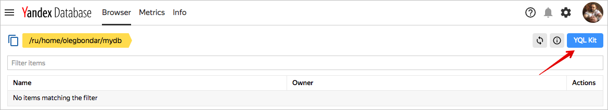
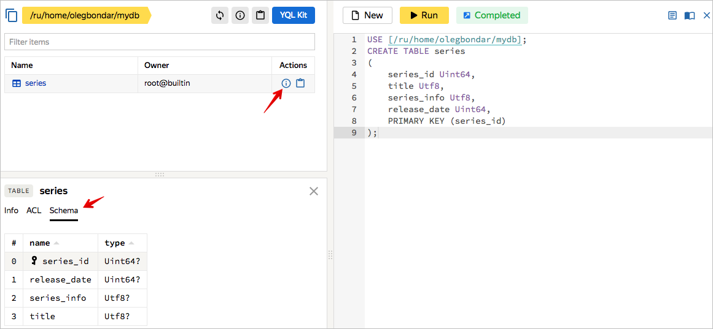

# Getting started with {{ ydb-short-name }}

*{{ ydb-short-name }} is at the Preview stage and is available on request.*

To start using {{ ydb-short-name }}, [create a database](#control-plane) in the management console. You can query a database both from the [management console](#data-plane) and [from the SDK](#sdk).

## How to gain access {#get-access}

Access to the service is granted on request. To make a request:

1. [Register](../billing/quickstart/) at Yandex.Cloud if you don't have an account yet.

1. Go to the [service page](https://cloud.yandex.ru/services/ydb) and click **Request access**.

1. Select the cloud where you are going to run the service and click **Send**. You will receive a confirmation email when your request is approved.

1. Open the email and click **Start testing**. This forwards you to the [Yandex.Cloud console](https://console.cloud.yandex.com/).

1. If you didn't link your billing account, click **Trial period** in the upper-right corner of the screen and [link it](../billing/quickstart/#create_billing_account).

## How to create a database {#control-plane}



1. To create a database, go to the [management console](https://ydb.yandex-team.ru).

    

1. Click **Create database**.

    

1. In the **Cluster** field, select the *ydb-ru* cluster.

    The other fields are filled automatically, for example, the *home* account is selected and your username directory and *mydb* database are created automatically.

    Example of creating a new database:

    

1. Click **Create**.

    This opens a page that says your database was successfullycreated.

    



To create a database, you need a folder in Yandex.Cloud that you can access. If you already have a folder in Yandex.Cloud, open the page of that folder in the management console. If you don't have a folder, create one:





To create a database:

1. Select the folder where you want to create the database.

1. Select **{{ ydb-full-name }}** in the list of services.

    

    {{ ydb-full-name }} is at the Preview stage and appears in the list of available resources only after your request is approved.

    

1. Click **Create a database**.

1. Configure database parameters in the dialog box:

    1. **Name**. The database name is case-sensitive, it must start with a Latin letter followed by Latin letters and numbers.

    1. **Computing resources** Type and number of [computing resources](../concepts/databases.md#compute_units): сombinations of CPU and RAM.

    1. **Storage groups**. Type and number of [storage groups](../concepts/databases.md#storage_groups): combinations of disk types and memory sizes.

1. In the **Network** section, add a network. If you don't have any [networks](/../vpc/concepts/network.md#network), create one. The network must have at least one [subnet](../vpc/concepts/network.md#subnet).

1. Click **Create a database**.

1. Wait until the database starts. When a database is being created, it has the *Provisioning* status. When it is ready for use, the status changes to *Running*.



## How to manage data {#data-plane}

When the database is created, you can check YQL query execution in the management console. To execute a query:

1. Select a database on the home page.

1. Click **SQL query** in the upper-right corner. The **Root folder** page opens. Queries entered in the **Query** field are sent to the database.









### Create a table {#create-table}

To start working with the database, create a new table using the [CREATE TABLE](yql/reference/syntax/create_table.md) operator:

1. Add the following statement to the **Query** field:

    ```
    CREATE TABLE series
    (
        series_id Uint64,
        title Utf8,
        series_info Utf8,
        release_date Uint64,
        PRIMARY KEY (series_id)
    );
    ```






1. Click **Run**. The new *series* table and the name of the table owner are shown in the box on the left. If you hover the cursor over a table and click the <svg viewBox="0 0 24 24" width="18" height="18" fill="#26a"><path id="icon.info" d="M11,9H13V7H11M12,20C7.59,20 4,16.41 4,12C4,7.59 7.59,4 12,4C16.41,4 20,7.59 20,12C20,16.41 16.41,20 12,20M12,2A10,10 0 0,0 2,12A10,10 0 0,0 12,22A10,10 0 0,0 22,12A10,10 0 0,0 12,2M11,17H13V11H11V17Z"></path></svg> icon to the right of the table, the database schema is shown in the lower-left corner of the screen.

    

    

    







### Save data {#replace-data}

Save new data to the table using the [REPLACE](yql/reference/syntax/replace_into.md) operator:

1. Add the following statement to the **Query** field:

    ```
    REPLACE INTO series (series_id, title, release_date, series_info)
    VALUES
        (
            1,
            "IT Crowd",
            CAST(Date("2006-02-03") AS Uint64),
            "The IT Crowd is a British sitcom."),
        (
            2,
            "Silicon Valley",
            CAST(Date("2014-04-06") AS Uint64),
            "Silicon Valley is an American comedy television series."
        ),
        (
            3,
            "Fake series",
            CAST(Date("2018-09-11") AS Uint64),
            "Fake series for testing purposes."
        )
        ;
    ```

1. Click **Run**. Changes are shown in the lower-left corner of the screen.






### Replace rows {#update-data}

Update data in the table using the [UPDATE](yql/reference/syntax/update.md) operator:

1. Add the following statement to the **Query** field:

    ```
    UPDATE series
    SET series_info="Fake series updated"
    WHERE
        series_id = 3
    ;
    ```

1. Click **Run**. Changes are shown in the lower-left corner of the screen.






### Delete rows {#delete-data}

Use the [DELETE](yql/reference/syntax/delete.md) operator to delete data from the table:

1. Add the following statement to the **Query** field:

    ```
    DELETE
    FROM series
    WHERE
        series_id = 3
    ;
    ```

1. Click **Run**. Changes are shown in the lower-left corner of the screen.






### Read data {#select-data}

Use the [SELECT](yql/reference/syntax/select.md) operator to read data from the table:

1. Add the following statement to the **Query** field:

    ```
    SELECT
        series_id,
        title AS series_title,
        DateTime::ToDate(DateTime::FromDays(release_date)) AS release_date
    FROM series;
    ```

1. Click **Run**. Changes are shown in the lower-left corner of the screen.






### Delete table {#drop-table}

Delete a table using the [DROP TABLE](yql/reference/syntax/ drop_table.md) operator:

1. Add the following statement to the **Query** field:

    ```
    DROP TABLE series;
    ```

1. Click **Run**. The table is deleted.

## How to launch a user app {#sdk}

To launch an app developed using the {{ ydb-short-name }} SDK for [Python](https://github.com/yandex-cloud/ydb-python-sdk), [Go](https://github.com/yandex-cloud/ydb-go-sdk), or [Java](https://github.com/yandex-cloud/ydb-java-sdk), get the data needed to connect to the database. You can launch test apps to explore the SDK.

### Connecting to databases {#connect-to-db}

To connect to a database:

1. [Create a virtual machine](../compute/operations/vm-create/create-linux-vm) in Yandex.Cloud.

1. Save the public IP address of the VM. To do this, go to the virtual machine properties or [use the command-line interface](../compute/operations/vm-info/get-info#outside-instance).

1. [Create a service account](../iam/operations/sa/create) for database authentication and assign it the `viewer` and `editor` roles.

1. Go to the **Service accounts** section of your folder and select a service account from the list. Save the service account ID.

1. [Create authorized access keys](../iam/operations/iam-token/create-for-sa#keys-create) for the service account and save them.

1. Go to the database properties and save the endpoint and database ID values given in the **Endpoint** field.

### Launch a test app {#run-test}

To launch an app:



- Python

  1. Install the [Yandex.Cloud Python SDK](https://github.com/yandex-cloud/python-sdk):

      ```bash
      git clone https://github.com/yandex-cloud/python-sdk.git
      sudo pip3 install -e python-sdk/
      ```

  1. Install the [YDB Python SDK](https://github.com/yandex-cloud/ydb-python-sdk):

      ```bash
      git clone https://github.com/yandex-cloud/ydb-python-sdk.git
      sudo pip3 install -e ydb-python-sdk/
      ```

  1. To authenticate, you need the service account ID and the open authorized key created [earlier](#connect-to-db).

  1. Set the environment variables required for app authentication:

      ```bash
      export SA_ENDPOINT=iam.api.cloud.yandex.net:443
      export SA_PRIVATE_KEY_FILE=/home/path/to/private.key
      export SA_ID=YOUR_SA_ID
      export SA_ACCESS_KEY_ID=YOUR_ACCESS_KEY_ID
      ```
      * SA_ENDPOINT — IAM endpoint. Enter the value `iam.api.cloud.yandex.net:443`
      * SA_PRIVATE_KEY_FILE — Path to your private key file.
      * SA_ID — Service account ID.
      * SA_ACCESS_KEY_ID — Public authorized key ID.

  1. Launch the `basic_example_v1` test app from the `ydb-python-sdk` repository, specifying the values of the endpoint and database ID obtained [earlier](#connect-to-db) as startup parameters:

      ```bash
      cd ./ydb-python-sdk/kikimr/public/sdk/python/examples/basic_example_v1
      python3 __main__.py -e endpoint -d database
      ```

  App execution result:

  ```bash
  > describe table: series
  column, name: series_id , Uint64
  column, name: title , Utf8
  column, name: series_info , Utf8
  column, name: release_date , Uint64
  column, name: comment , Utf8
  
  > select_simple_transaction:
  series, id:  1 , title:  IT Crowd , release date:  b'2006-02-03'
  
  > select_prepared_transaction:
  episode title: To Build a Better Beta , air date: b'2016-06-05'
  
  > select_prepared_transaction:
  episode title: Bachman's Earnings Over-Ride , air date: b'2016-06-12'
  
  > explicit TCL call
  
  > select_prepared_transaction:
  episode title: TBD , air date: b'2019-05-10'
  ```

- Go

  1. Install the [YDB Go SDK](https://github.com/yandex-cloud/go-sdk):

      ```bash
      export GOPATH=$HOME/go
      mkdir -p $GOPATH/src/github.com/yandex-cloud/ydb-go-sdk
      cd $GOPATH/src/github.com/yandex-cloud/ydb-go-sdk
      git clone https://github.com/yandex-cloud/ydb-go-sdk.git
      cd $GOPATH
      go get github.com/dgrijalva/jwt-go
      ```

  1. To authenticate the app you need the service account ID and open authorized access key created [earlier](#connect-to-db).

  1. Set the environment variables required for app authentication:

      ```bash
      export SA_ENDPOINT=iam.api.cloud.yandex.net:443
      export SA_PRIVATE_KEY_FILE=/home/path/to/private.key
      export SA_ID=YOUR_SA_ID
      export SA_ACCESS_KEY_ID=YOUR_ACCESS_KEY_ID
      ```
      * SA_ENDPOINT — IAM endpoint. Enter the value `iam.api.cloud.yandex.net:443`
      * SA_PRIVATE_KEY_FILE — Local path to your private authorized key file.
      * SA_ID — Service account ID.
      * SA_ACCESS_KEY_ID — Public authorized key ID.

  1. Compile the `basic_example_v1` test app:

      ```bash
      cd $GOPATH
      go build github.com/yandex-cloud/ydb-go-sdk/example/basic_example_v1/
      ```

  1. Launch the `basic_example_v1` test app, specifying the values of the endpoint and database ID obtained [earlier](#connect-to-db) as startup parameters:

      ```bash
      ./basic_example_v1 -endpoint endpoint -database database
      ```

  App execution result:

  ```bash
  inspecting Database
  
  > describe_table_options:
  
  > describe table: /global/path/todatabase/series
  column, name: Optional<Uint64>, series_id
  column, name: Optional<Utf8>, title
  column, name: Optional<Utf8>, series_info
  column, name: Optional<Uint64>, release_date
  column, name: Optional<Utf8>, comment
  
  > select_simple_transaction: 1 IT Crowd 2006-02-03
  ```

- Java

  1. Install [JDK 11](https://www.oracle.com/technetwork/java/javase/downloads/5066655), for example:

      ```bash
      sudo apt-get update
      sudo apt-get install openjdk-11-jdk
      ```

  1. Compile a test app, for example, `ydb-test-app`:

       ```bash
       cd ydb-test-app
       ./mvnw package
       ```

  1. Launch the `ydb-test-app` test app, specifying the startup parameters obtained [earlier](#connect-to-db):

      ```bash
      ./mvnw -q exec:java -Dexec.args="<accountId> <keyId> <private_key_file_path> <endpoint> <database>"
      ```
      * `accountId` — Service account ID.
      * `keyId` — Public authorized key ID.
      * `private_key_file_path` — Local path to your private authorized key file.
      * `endpoint` — Database endpoint.
      * `database` — Database name.



