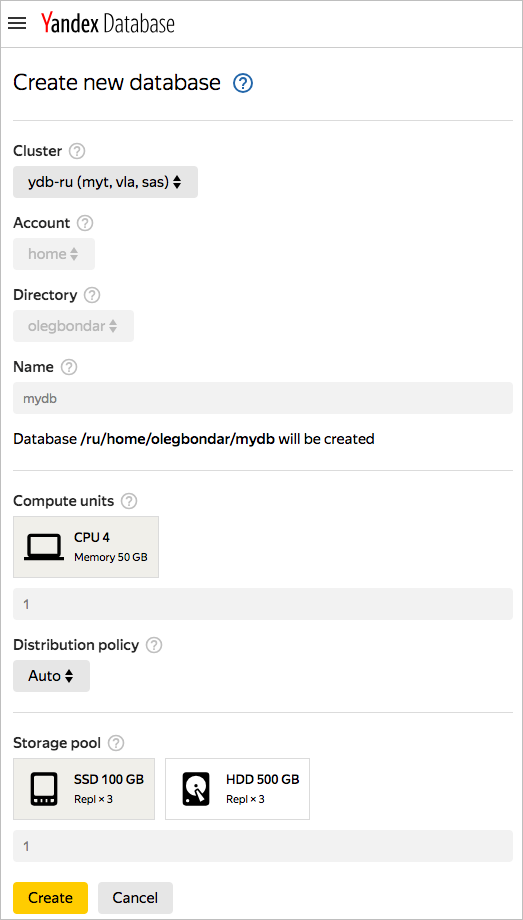
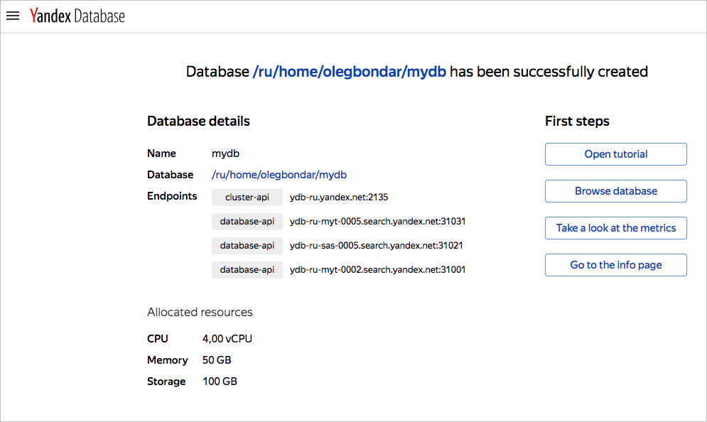

# Creating a database

Create a [database](../concepts/databases.md#database) using {{ ydb-full-name }} from the {{ yandex-cloud }} management console.

## Before you start {#before-you-begin}

To get started in {{ yandex-cloud }}:

1. Log in to the [management console]({{ link-console-main }}). If you aren't registered, go to the management console and follow the instructions.
1. [On the billing page]({{ link-console-billing }}) make sure that you enabled a [billing account](../../billing/concepts/billing-account.md)billing account and its status is `ACTIVE` or `TRIAL_ACTIVE`. If you don't have a billing account, [create one](../../billing/quickstart/index.md#create_billing_account)create one.
1. If you do not have a folder, [create one](../../resource-manager/operations/folder/create.md)create one.

## Create a database {#control-plane}



1. To create a database, go to the [management console](https://ydb.yandex-team.ru).

    

    

    

1. Click **Create database**.

    

1. In the **Cluster** field, select the *ydb-ru* cluster.

    The other fields are populated automatically, for example, the *home* account is selected and your username directory and *mydb* database are created automatically.

    Example of creating a new database:

    

1. Click **Create**.

    This opens a page that says your database was successfully created.

    



You can create a database in a Serverless configuration or with dedicated servers. For more information about differences in configurations, see [{#T}](../concepts/serverless_and_dedicated.md).



For the Amazon DynamoDB-compatible mode, use a serverless database configuration.






