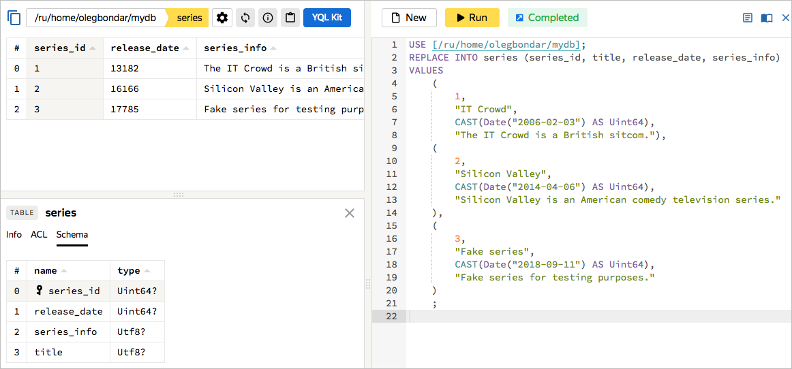
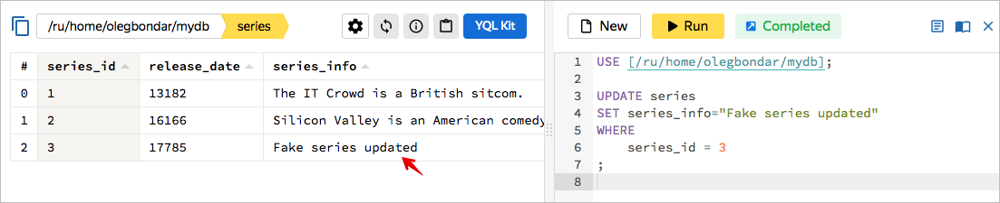

# Working with data via the management console

After [creating a database](../create-db.md), perform basic YQL queries using the {{ yandex-cloud }} management console.



For more information about the YQL syntax, see the [YQL reference](../../yql/reference/overview.md).



## Create a table {#create-table}

Create a table in the DB using the [CREATE TABLE](../../yql/reference/syntax/create_table.md) instruction:



- Management console

  



## Add data {#replace-data}

Add data to the table using the [REPLACE INTO](../../yql/reference/syntax/replace_into.md) instruction:



- Management console

  







## Update data {#update-data}

Update the existing data in the table using the [UPDATE](../../yql/reference/syntax/update.md) instruction:



- Management console

  







## Delete data {#delete-data}

Delete data from the table using the [DELETE](../../yql/reference/syntax/delete.md) instruction:



- Management console

  







## Query data {#select-data}

Query data from the table using the [SELECT](../../yql/reference/syntax/select.md) instruction:



- Management console

  







## Delete a table {#drop-table}

Delete a table using the [DROP TABLE](../../yql/reference/syntax/drop_table.md) instruction:



- Management console

  


