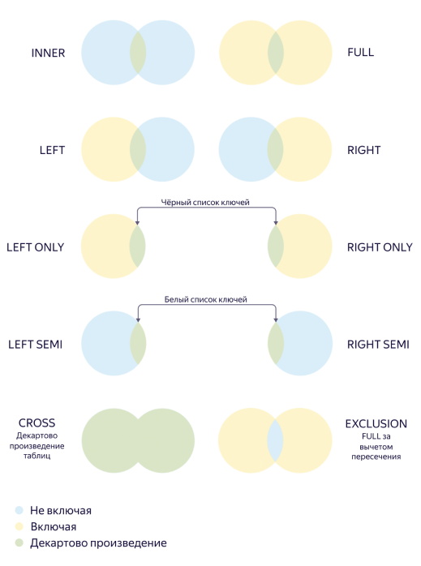

# JOIN

It combines the data from two sources (subqueries or tables) by equality of the values of the specified columns or expressions.

`CROSS JOIN` builds a Cartesian product: each element of the first data source is combined with each element of the second data source. The condition applied to the Cartesian product is set by various [`JOIN` types](#join-types). `INNER JOIN` is used by default.

**Syntax**

Columns for `JOIN` are specified using:

* `USING`: If the column name is the same in all the merged tables. Suitable for simple queries.

  **Example**

  ```sql
  SELECT
    a.value, b.value
  FROM a_table AS a
  FULL JOIN b_table AS b
  USING (key);
  ```

* `ON`: If you need to combine tables by columns with different names. Lets you build more complex queries, including the queries with the [`WHERE`](select.md#where) clause.

  **Example**

  ```sql
  SELECT
    a.value, b.value
  FROM a_table AS a
  FULL JOIN b_table AS b
  ON a.key == b.key;
  ```



If the statement filters data in addition to `JOIN`, we recommend that you wrap the criteria that would return `true` for most of the rows, inside the `LIKELY(...)` function call. If your assumption that true values prevail for the criteria is correct, the query will run faster.



## JOIN types {#join-types}

YQL provides the following logical JOIN types:

* `INNER` (default): The result contains only rows where keys matched, the other rows are discarded.
* `FULL`, `LEFT` and `RIGHT`: If the key is missing from both or one of the tables, the row is included in the result and filled by `NULL` values.
* `LEFT SEMI`/`RIGHT SEMI`: One side of the query is a whitelist of keys, its values are not available. The result includes columns from one table  only.
* `LEFT ONLY`/`RIGHT ONLY`: Subtracting the sets by keys (blacklist). It's almost equivalent to adding `IS NULL` to the key on the opposite side in the regular `LEFT`/`RIGHT` JOIN, but with no access to values, like in `SEMI` JOIN.
* `CROSS`: Cartesian product of two tables. Each row of the first table is combined with each row of the second table. `ON`/`USING` is not specified explicitly.
* `EXCLUSION`: Both sides minus the intersection.





`NULL` is a special value to denote nothing. Therefore, `NULL` values from two sources are not considered equal. This eliminates ambiguity and resource-intensive computing in some types of `JOIN`.



