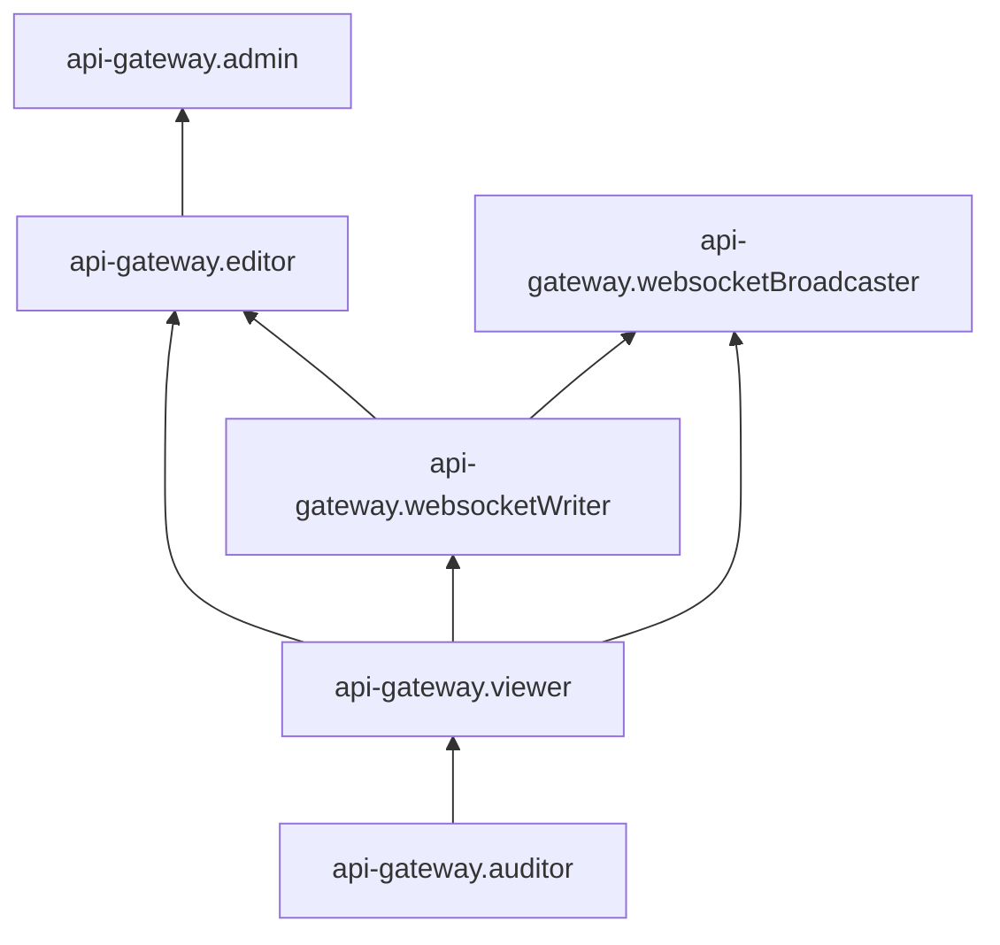

# Управление доступом в {{ api-gw-name }}

В этом разделе вы узнаете:

* [на какие ресурсы можно назначить роль](#resources);
* [какие роли действуют в сервисе](#roles-list).

## Об управлении доступом {#about-access-control}

Все операции в {{ yandex-cloud }} проверяются в сервисе [{{ iam-full-name }}](../../iam/index.md). Если у субъекта нет необходимых разрешений, сервис вернет ошибку.

Чтобы выдать разрешения к ресурсу, [назначьте роли](../../iam/operations/roles/grant.md) на этот ресурс субъекту, который будет выполнять операции. Роли можно назначить [аккаунту на Яндексе](../../iam/concepts/users/accounts.md#passport), [сервисному аккаунту](../../iam/concepts/users/service-accounts.md), [локальному пользователю](../../iam/concepts/users/accounts.md#local), [федеративному пользователю](../../iam/concepts/federations.md), [группе пользователей](../../organization/operations/manage-groups.md), [системной группе](../../iam/concepts/access-control/system-group.md) или [публичной группе](../../iam/concepts/access-control/public-group.md). Подробнее читайте в разделе [{#T}](../../iam/concepts/access-control/index.md).

Назначать роли на ресурс могут пользователи, у которых на этот ресурс есть роль `api-gateway.admin` или одна из следующих ролей:

* `admin`;
* `resource-manager.admin`;
* `organization-manager.admin`;
* `resource-manager.clouds.owner`;
* `organization-manager.organizations.owner`.



Подробнее о наследовании ролей читайте в разделе [{#T}](../../resource-manager/concepts/resources-hierarchy.md#access-rights-inheritance) документации сервиса {{ resmgr-full-name }}.



## Назначение ролей {#grant-roles}

Чтобы назначить пользователю роль на облако:

1. При необходимости [добавьте](../../organization/operations/add-account.md) нужного пользователя.
1. В [консоли управления]({{ link-console-main }}) слева [выберите](../../resource-manager/operations/cloud/switch-cloud.md) облако.
1. Перейдите на вкладку **{{ ui-key.yacloud.common.resource-acl.label_access-bindings }}**.
1. Нажмите кнопку **{{ ui-key.yacloud.common.resource-acl.button_configure-access }}**.
1. В открывшемся окне выберите раздел **{{ ui-key.yacloud_components.acl.label.user-accounts }}**.
1. Выберите пользователя из списка или воспользуйтесь поиском.
1. Нажмите кнопку  **{{ ui-key.yacloud_components.acl.button.add-role }}** и выберите роль в облаке.
1. Нажмите кнопку **{{ ui-key.yacloud.common.save }}**.

Подробнее о назначении ролей см. в документации сервиса [{{ iam-full-name }}](../../iam/operations/roles/grant.md).

## На какие ресурсы можно назначить роль {#resources}

Роль можно назначить на [организацию](../../organization/concepts/organization.md), [облако](../../resource-manager/concepts/resources-hierarchy.md#cloud) и [каталог](../../resource-manager/concepts/resources-hierarchy.md#folder). Роли, назначенные на организацию, облако или каталог, действуют и на вложенные ресурсы.

На [API-шлюз](../concepts/index.md) роль можно назначить через {{ yandex-cloud }} [CLI](../../cli/cli-ref/serverless/cli-ref/api-gateway/add-access-binding.md) или [API](../api-ref/apigateway/authentication.md).

## Какие роли действуют в сервисе {#roles-list}

Ниже перечислены все роли, которые учитываются при проверке прав доступа в сервисе {{ api-gw-name }}.

### Сервисные роли {#service-roles}

#### api-gateway.auditor {#api-gateway-auditor}

Роль `api-gateway.auditor` позволяет просматривать список [API-шлюзов](../concepts/index.md) и информацию о назначенных [правах доступа](../../iam/concepts/access-control/index.md) к ним, а также метаинформацию [каталога](../../resource-manager/concepts/resources-hierarchy.md#folder).

#### api-gateway.viewer {#api-gateway-viewer}

Роль `api-gateway.viewer` позволяет просматривать список [API-шлюзов](../concepts/index.md), информацию о них и о назначенных [правах доступа](../../iam/concepts/access-control/index.md) к ним, а также информацию о [каталоге](../../resource-manager/concepts/resources-hierarchy.md#folder).

Включает разрешения, предоставляемые ролью `api-gateway.auditor`.

#### api-gateway.editor {#api-gateway-editor}

Роль `api-gateway.editor` позволяет просматривать информацию об API-шлюзах и управлять ими, а также работать с API WebSocket.

Пользователи с этой ролью могут:
* просматривать список [API-шлюзов](../concepts/index.md), информацию о них и о назначенных [правах доступа](../../iam/concepts/access-control/index.md) к ним, а также создавать, изменять и удалять API-шлюзы;
* использовать ограничение [скорости обработки запросов](../concepts/extensions/rate-limit.md);
* просматривать информацию о соединениях [WebSocket](../concepts/index.md#websocket) и закрывать их, а также отправлять данные через такие соединения;
* просматривать информацию о [каталоге](../../resource-manager/concepts/resources-hierarchy.md#folder).

Включает разрешения, предоставляемые ролью `api-gateway.websocketWriter`.

#### api-gateway.websocketWriter {#api-gateway-websocketwriter}

Роль `api-gateway.websocketWriter` позволяет работать с API WebSocket, а также просматривать список API-шлюзов, информацию о них и о назначенных правах доступа к ним.

Пользователи с этой ролью могут:
* просматривать информацию о соединениях [WebSocket](../concepts/index.md#websocket) и закрывать их, а также отправлять данные через такие соединения;
* просматривать список [API-шлюзов](../concepts/index.md), информацию о них и о назначенных [правах доступа](../../iam/concepts/access-control/index.md) к ним;
* просматривать информацию о [каталоге](../../resource-manager/concepts/resources-hierarchy.md#folder).

Включает разрешения, предоставляемые ролью `api-gateway.viewer`.

#### api-gateway.websocketBroadcaster {#api-gateway-websocketBroadcaster}

Роль `api-gateway.websocketBroadcaster` позволяет отправлять данные через соединения WebSocket, в том числе одновременно нескольким клиентам, а также просматривать список API-шлюзов, информацию о них и о назначенных правах доступа к ним.

Пользователи с этой ролью могут:
* просматривать информацию о соединениях [WebSocket](../concepts/index.md#websocket) и закрывать их, а также отправлять данные через соединения WebSocket, в том числе одновременно нескольким клиентам;
* просматривать список [API-шлюзов](../concepts/index.md), информацию о них и о назначенных [правах доступа](../../iam/concepts/access-control/index.md) к ним;
* просматривать информацию о [каталоге](../../resource-manager/concepts/resources-hierarchy.md#folder).

Включает разрешения, предоставляемые ролью `api-gateway.websocketWriter`.

#### api-gateway.admin {#api-gateway-admin}

Роль `api-gateway.admin` позволяет управлять API-шлюзами и доступом к ним, просматривать информацию об API-шлюзах, а также работать с API WebSocket.

Пользователи с этой ролью могут:
* просматривать информацию о назначенных [правах доступа](../../iam/concepts/access-control/index.md) к API-шлюзам и изменять такие права доступа;
* просматривать список [API-шлюзов](../concepts/index.md) и информацию о них, а также создавать, изменять и удалять API-шлюзы;
* просматривать информацию о соединениях [WebSocket](../concepts/index.md#websocket) и закрывать их, а также отправлять данные через такие соединения;
* использовать ограничение [скорости обработки запросов](../concepts/extensions/rate-limit.md);
* просматривать информацию о [каталоге](../../resource-manager/concepts/resources-hierarchy.md#folder).

Включает разрешения, предоставляемые ролью `api-gateway.editor`.

### Примитивные роли {#primitive-roles}

Примитивные роли позволяют пользователям совершать действия во [всех сервисах](../../overview/concepts/services.md) {{ yandex-cloud }}.

#### {{ roles-auditor }} {#auditor}

Роль `auditor` предоставляет разрешения на чтение конфигурации и метаданных любых ресурсов Yandex Cloud без возможности доступа к данным.

Например, пользователи с этой ролью могут:
* просматривать информацию о [ресурсе]({{ link-docs }}/resource-manager/concepts/resources-hierarchy);
* просматривать метаданные ресурса;
* просматривать список операций с ресурсом.

Роль `auditor` — наиболее безопасная роль, исключающая доступ к данным [сервисов]({{ link-docs }}/overview/concepts/services). Роль подходит для пользователей, которым необходим минимальный уровень доступа к ресурсам Yandex Cloud.

#### {{ roles-viewer }} {#viewer}

Роль `viewer` предоставляет разрешения на чтение информации о любых [ресурсах]({{ link-docs }}/resource-manager/concepts/resources-hierarchy) Yandex Cloud.

Включает разрешения, предоставляемые ролью `auditor`.

В отличие от роли `auditor`, роль `viewer` предоставляет доступ к данным [сервисов]({{ link-docs }}/overview/concepts/services) в режиме чтения.

#### {{ roles-editor }} {#editor}

Роль `editor` предоставляет разрешения на управление любыми [ресурсами]({{ link-docs }}/resource-manager/concepts/resources-hierarchy) Yandex Cloud, кроме назначения ролей другим пользователям, передачи прав владения [организацией]({{ link-docs }}/organization/concepts/organization) и ее удаления, а также удаления [ключей шифрования]({{ link-docs }}/kms/concepts/) Key Management Service.

Например, пользователи с этой ролью могут создавать, изменять и удалять ресурсы.

Включает разрешения, предоставляемые ролью `viewer`.

#### {{ roles-admin }} {#admin}

Роль `admin` позволяет назначать любые роли, кроме `resource-manager.clouds.owner` и `organization-manager.organizations.owner`, а также предоставляет разрешения на управление любыми [ресурсами]({{ link-docs }}/resource-manager/concepts/resources-hierarchy) Yandex Cloud, кроме передачи прав владения [организацией]({{ link-docs }}/organization/concepts/organization) и ее удаления.

Прежде чем назначить роль `admin` на организацию, [облако]({{ link-docs }}/resource-manager/concepts/resources-hierarchy#cloud) или [платежный аккаунт]({{ link-docs }}/billing/concepts/billing-account), ознакомьтесь с информацией о защите [привилегированных аккаунтов]({{ link-docs }}/security/standard/all#privileged-users).

Включает разрешения, предоставляемые ролью `editor`.

Вместо примитивных ролей мы рекомендуем использовать роли сервисов. Такой подход позволит более гранулярно управлять доступом и обеспечить соблюдение [принципа минимальных привилегий](../../security/standard/all.md#min-privileges).

Подробнее о примитивных ролях см. в [справочнике ролей {{ yandex-cloud }}](../../iam/roles-reference.md#primitive-roles).