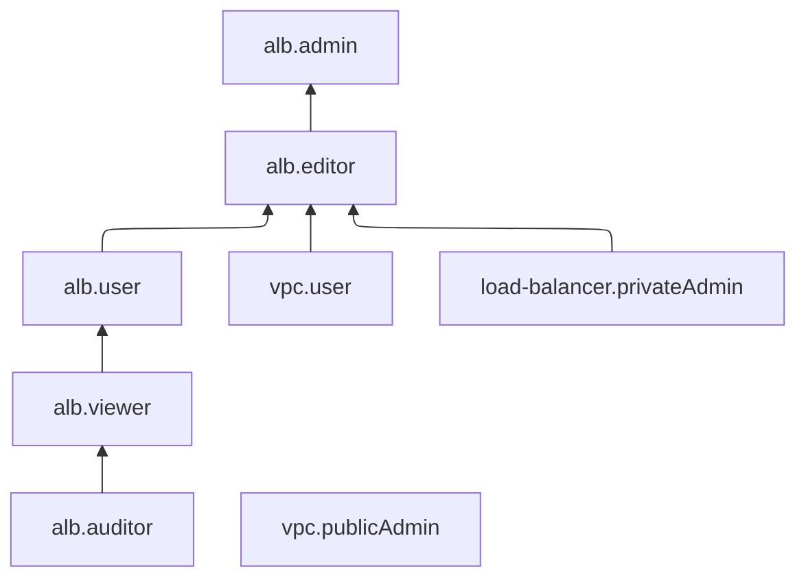

# Управление доступом в {{ alb-name }}

В этом разделе вы узнаете:
* [на какие ресурсы можно назначить роль](#resources);
* [какие роли действуют в сервисе](#roles-list);
* [какие роли необходимы](#required-roles) для того или иного действия.

## Об управлении доступом {#about-access-control}

Все операции в {{ yandex-cloud }} проверяются в сервисе [{{ iam-full-name }}](../../iam/index.md). Если у субъекта нет необходимых разрешений, сервис вернет ошибку.

Чтобы выдать разрешения к ресурсу, [назначьте роли](../../iam/operations/roles/grant.md) на этот ресурс субъекту, который будет выполнять операции. Роли можно назначить [аккаунту на Яндексе](../../iam/concepts/users/accounts.md#passport), [сервисному аккаунту](../../iam/concepts/users/service-accounts.md), [локальному пользователю](../../iam/concepts/users/accounts.md#local), [федеративному пользователю](../../iam/concepts/federations.md), [группе пользователей](../../organization/operations/manage-groups.md), [системной группе](../../iam/concepts/access-control/system-group.md) или [публичной группе](../../iam/concepts/access-control/public-group.md). Подробнее читайте в разделе [{#T}](../../iam/concepts/access-control/index.md).

Назначать роли на ресурс могут пользователи, у которых на этот ресурс есть хотя бы одна из ролей:

* `admin`;
* `resource-manager.admin`;
* `organization-manager.admin`;
* `resource-manager.clouds.owner`;
* `organization-manager.organizations.owner`.

## На какие ресурсы можно назначить роль {#resources}

Роль можно назначить на [организацию](../../organization/concepts/organization.md), [облако](../../resource-manager/concepts/resources-hierarchy.md#cloud) и [каталог](../../resource-manager/concepts/resources-hierarchy.md#folder). Роли, назначенные на организацию, облако или каталог, действуют и на вложенные ресурсы.

## Какие роли действуют в сервисе {#roles-list}

На диаграмме показано, какие роли есть в сервисе и как они наследуют разрешения друг друга. Например, в `{{ roles-editor }}` входят все разрешения `{{ roles-viewer }}`. После диаграммы дано описание каждой роли.

### Сервисные роли {#service-roles}

#### alb.auditor {#alb-auditor}

Роль `alb.auditor` позволяет просматривать информацию о ресурсах и квотах сервиса {{ alb-name }}.

Пользователи с этой ролью могут:
* просматривать список [L7-балансировщиков](../concepts/application-load-balancer.md) и информацию о них;
* просматривать список [HTTP-роутеров](../concepts/http-router.md) и информацию о них;
* просматривать список [виртуальных хостов](../concepts/http-router.md#virtual-host) и информацию о них;
* просматривать список [групп бэкендов](../concepts/backend-group.md) и информацию о них;
* просматривать список [целевых групп](../concepts/target-group.md) и информацию о них;
* просматривать информацию о [квотах](../concepts/limits.md#quotas) сервиса {{ alb-name }}.

#### alb.viewer {#alb-viewer}

Роль `alb.viewer` позволяет просматривать список ресурсов {{ alb-name }} и информацию о них и о квотах сервиса. 

Пользователи с этой ролью могут:
* просматривать список [L7-балансировщиков](../concepts/application-load-balancer.md) и информацию о них;
* просматривать список [HTTP-роутеров](../concepts/http-router.md) и информацию о них;
* просматривать список [виртуальных хостов](../concepts/http-router.md#virtual-host) и информацию о них;
* просматривать список [групп бэкендов](../concepts/backend-group.md) и информацию о них;
* просматривать список [целевых групп](../concepts/target-group.md) и информацию о них;
* просматривать информацию о [квотах](../concepts/limits.md#quotas) сервиса {{ alb-name }}.

Включает разрешения, предоставляемые ролью `alb.auditor`.

#### alb.user {#alb-user}

Роль `alb.user` позволяет использовать L7-балансировщики, HTTP-роутеры, группы бэкендов и целевые группы, а также просматривать информацию о ресурсах сервиса {{ alb-name }}. 

Пользователи с этой ролью могут:
* просматривать список [L7-балансировщиков](../concepts/application-load-balancer.md) и информацию о них, а также использовать L7-балансировщики;
* просматривать список [HTTP-роутеров](../concepts/http-router.md) и информацию о них, а также использовать HTTP-роутеры;
* просматривать список [виртуальных хостов](../concepts/http-router.md#virtual-host) и информацию о них;
* просматривать список [групп бэкендов](../concepts/backend-group.md) и информацию о них, а также использовать группы бэкендов;
* просматривать список [целевых групп](../concepts/target-group.md) и информацию о них, а также использовать целевые группы;
* просматривать информацию о [квотах](../concepts/limits.md#quotas) сервиса {{ alb-name }}.

Роль можно назначить на каталог.

#### alb.editor {#alb-editor}

Роль `alb.editor` позволяет управлять ресурсами сервиса {{ alb-name }} и внутренними сетевыми балансировщиками нагрузки, а также просматривать информацию о них и об облачных сетях, подсетях, таблицах маршрутизации, шлюзах, группах безопасности и IP-адресах.



* просматривать список [L7-балансировщиков](../concepts/application-load-balancer.md) и информацию о них, а также создавать L7-балансировщики, изменять, удалять и использовать их;
* просматривать список [HTTP-роутеров](../concepts/http-router.md) и информацию о них, а также создавать, изменять, удалять и использовать HTTP-роутеры;
* просматривать список [виртуальных хостов](../concepts/http-router.md#virtual-host) и информацию о них, а также изменять виртуальные хосты;
* просматривать список [групп бэкендов](../concepts/backend-group.md) и информацию о них, а также создавать, изменять, удалять и использовать группы бэкендов;
* просматривать список целевых групп L7-балансировщиков и [сетевых балансировщиков](../../network-load-balancer/concepts/target-resources.md) и информацию о них, а также создавать, изменять, удалять и использовать целевые группы;
* просматривать список [сетевых балансировщиков](../../network-load-balancer/concepts/index.md) и информацию о них, а также создавать внутренние сетевые балансировщики (в т.ч. с UDP-обработчиком), изменять, удалять, запускать и останавливать их;
* просматривать список [облачных сетей](../../vpc/concepts/network.md#network) и информацию о них, а также использовать облачные сети;
* просматривать список [подсетей](../../vpc/concepts/network.md#subnet) и информацию о них, а также использовать подсети;
* просматривать список [адресов облачных ресурсов](../../vpc/concepts/address.md) и информацию о них, а также использовать адреса;
* просматривать список [таблиц маршрутизации](../../vpc/concepts/routing.md#rt-vpc) и информацию о них, а также использовать таблицы маршрутизации;
* просматривать список [групп безопасности](../../vpc/concepts/security-groups.md) и информацию о них, а также использовать группы безопасности;
* просматривать информацию о [NAT-шлюзах](../../vpc/concepts/gateways.md) и подключать их к таблицам маршрутизации;
* просматривать информацию об использованных IP-адресах в подсетях, а также создавать [внутренние адреса](../../vpc/concepts/address.md#internal-addresses);
* просматривать информацию об операциях с ресурсами сервисов {{ vpc-name }} и {{ compute-name }};
* просматривать список операций с ресурсами сервиса {{ network-load-balancer-name }};
* просматривать информацию об [облаке](../../resource-manager/concepts/resources-hierarchy.md#cloud) и [каталоге](../../resource-manager/concepts/resources-hierarchy.md#folder);
* просматривать информацию о квотах сервисов [{{ alb-name }}](../concepts/limits.md#quotas), [{{ network-load-balancer-name }}](../../network-load-balancer/concepts/limits.md#load-balancer-quotas) и [{{ vpc-name }}](../../vpc/concepts/limits.md#vpc-quotas).



Включает разрешения, предоставляемые ролями `load-balancer.privateAdmin` и `vpc.user`.

Для подключения публичного IP-адреса к новому или существующему L7-балансировщику дополнительно необходима [роль](../../vpc/security/index.md#vpc-public-admin) `vpc.publicAdmin` на сеть, в которой находится балансировщик.

#### alb.admin {#alb-admin}

Роль `alb.admin` позволяет управлять ресурсами сервиса {{ alb-name }} и внутренними сетевыми балансировщиками нагрузки, а также просматривать информацию об облачных сетях, подсетях, таблицах маршрутизации, шлюзах, группах безопасности, IP-адресах и квотах.



* просматривать список [L7-балансировщиков](../concepts/application-load-balancer.md) и информацию о них, а также создавать L7-балансировщики, изменять, удалять и использовать их;
* просматривать список [HTTP-роутеров](../concepts/http-router.md) и информацию о них, а также создавать, изменять, удалять и использовать HTTP-роутеры;
* просматривать список [виртуальных хостов](../concepts/http-router.md#virtual-host) и информацию о них, а также изменять виртуальные хосты;
* просматривать список [групп бэкендов](../concepts/backend-group.md) и информацию о них, а также создавать, изменять, удалять и использовать группы бэкендов;
* просматривать список целевых групп L7-балансировщиков и [сетевых балансировщиков](../../network-load-balancer/concepts/target-resources.md) и информацию о них, а также создавать, изменять, удалять и использовать целевые группы;
* просматривать список [сетевых балансировщиков](../../network-load-balancer/concepts/index.md) и информацию о них, а также создавать внутренние сетевые балансировщики (в т.ч. с UDP-обработчиком), изменять, удалять, запускать и останавливать их;
* просматривать список [облачных сетей](../../vpc/concepts/network.md#network) и информацию о них, а также использовать облачные сети;
* просматривать список [подсетей](../../vpc/concepts/network.md#subnet) и информацию о них, а также использовать подсети;
* просматривать список [адресов облачных ресурсов](../../vpc/concepts/address.md) и информацию о них, а также использовать адреса;
* просматривать список [таблиц маршрутизации](../../vpc/concepts/routing.md#rt-vpc) и информацию о них, а также использовать таблицы маршрутизации;
* просматривать список [групп безопасности](../../vpc/concepts/security-groups.md) и информацию о них, а также использовать группы безопасности;
* просматривать информацию о [NAT-шлюзах](../../vpc/concepts/gateways.md) и подключать их к таблицам маршрутизации;
* просматривать информацию об использованных IP-адресах в подсетях, а также создавать [внутренние адреса](../../vpc/concepts/address.md#internal-addresses);
* просматривать информацию об операциях с ресурсами сервисов {{ vpc-name }} и {{ compute-name }};
* просматривать список операций с ресурсами сервиса {{ network-load-balancer-name }};
* просматривать информацию об [облаке](../../resource-manager/concepts/resources-hierarchy.md#cloud) и [каталоге](../../resource-manager/concepts/resources-hierarchy.md#folder);
* просматривать информацию о квотах сервисов [{{ alb-name }}](../concepts/limits.md#quotas), [{{ network-load-balancer-name }}](../../network-load-balancer/concepts/limits.md#load-balancer-quotas) и [{{ vpc-name }}](../../vpc/concepts/limits.md#vpc-quotas).



Включает разрешения, предоставляемые ролью `alb.editor`.

Для подключения публичного IP-адреса к новому или существующему L7-балансировщику дополнительно необходима [роль](../../vpc/security/index.md#vpc-public-admin) `vpc.publicAdmin` на сеть, в которой находится балансировщик.



Чтобы к новому или существующему L7-балансировщику можно было подключить публичный IP-адрес, помимо роли `alb.editor` или `alb.admin` также требуется роль `vpc.publicAdmin` на сеть, в которой находится балансировщик.



### Примитивные роли {#primitive-roles}

Примитивные роли позволяют пользователям совершать действия во [всех сервисах](../../overview/concepts/services.md) {{ yandex-cloud }}.

#### {{ roles-auditor }} {#auditor}

Роль `auditor` предоставляет разрешения на чтение конфигурации и метаданных любых ресурсов Yandex Cloud без возможности доступа к данным.

Например, пользователи с этой ролью могут:
* просматривать информацию о [ресурсе]({{ link-docs }}/resource-manager/concepts/resources-hierarchy);
* просматривать метаданные ресурса;
* просматривать список операций с ресурсом.

Роль `auditor` — наиболее безопасная роль, исключающая доступ к данным [сервисов]({{ link-docs }}/overview/concepts/services). Роль подходит для пользователей, которым необходим минимальный уровень доступа к ресурсам Yandex Cloud.

#### {{ roles-viewer }} {#viewer}

Роль `viewer` предоставляет разрешения на чтение информации о любых [ресурсах]({{ link-docs }}/resource-manager/concepts/resources-hierarchy) Yandex Cloud.

Включает разрешения, предоставляемые ролью `auditor`.

В отличие от роли `auditor`, роль `viewer` предоставляет доступ к данным [сервисов]({{ link-docs }}/overview/concepts/services) в режиме чтения.

#### {{ roles-editor }} {#editor}

Роль `editor` предоставляет разрешения на управление любыми [ресурсами]({{ link-docs }}/resource-manager/concepts/resources-hierarchy) Yandex Cloud, кроме назначения ролей другим пользователям, передачи прав владения [организацией]({{ link-docs }}/organization/concepts/organization) и ее удаления, а также удаления [ключей шифрования]({{ link-docs }}/kms/concepts/) Key Management Service.

Например, пользователи с этой ролью могут создавать, изменять и удалять ресурсы.

Включает разрешения, предоставляемые ролью `viewer`.

#### {{ roles-admin }} {#admin}

Роль `admin` позволяет назначать любые роли, кроме `resource-manager.clouds.owner` и `organization-manager.organizations.owner`, а также предоставляет разрешения на управление любыми [ресурсами]({{ link-docs }}/resource-manager/concepts/resources-hierarchy) Yandex Cloud, кроме передачи прав владения [организацией]({{ link-docs }}/organization/concepts/organization) и ее удаления.

Прежде чем назначить роль `admin` на организацию, [облако]({{ link-docs }}/resource-manager/concepts/resources-hierarchy#cloud) или [платежный аккаунт]({{ link-docs }}/billing/concepts/billing-account), ознакомьтесь с информацией о защите [привилегированных аккаунтов]({{ link-docs }}/security/standard/all#privileged-users).

Включает разрешения, предоставляемые ролью `editor`.

Вместо примитивных ролей мы рекомендуем использовать роли сервисов. Такой подход позволит более гранулярно управлять доступом и обеспечить соблюдение [принципа минимальных привилегий](../../security/standard/all.md#min-privileges).

Подробнее о примитивных ролях см. в [справочнике ролей {{ yandex-cloud }}](../../iam/roles-reference.md#primitive-roles).

## Какие роли мне необходимы {#required-roles}

В таблице ниже перечислено, какие роли нужны для выполнения указанного действия. Вы всегда можете назначить роль, которая дает более широкие разрешения, нежели указанная. Например, назначить `editor` вместо `viewer`.

Действие | Методы | Необходимые роли
----- | ----- | -----
**Просмотр информации** | |
Просмотр информации о любом ресурсе | `get`, `list`, `listOperations` | `alb.viewer` на этот ресурс
**Управление L7-балансировщиками** | |
[Создание](../operations/application-load-balancer-create.md) и [изменение](../operations/application-load-balancer-update.md) L7-балансировщиков с публичным IP-адресом | `create` | `alb.editor` и `vpc.publicAdmin` на сеть, в которой находится балансировщик
Создание и изменение L7-балансировщиков без публичного IP-адреса | `create` | `alb.editor`
[Удаление L7-балансировщиков](../operations/application-load-balancer-delete.md) | `update`, `delete` | `alb.editor`
Получение состояний целевых групп | `getTargetStates` | `alb.viewer`
Добавление, изменение и удаление обработчиков | `addListener`, `updateListener`, `removeListener` | `alb.editor`
Добавление, изменение и удаление SNI-обработчиков | `addSniMatch`, `updateSniMatch`, `removeSniMatch` | `alb.editor`
Получение сертификатов для обработчиков с TLS-шифрованием | `addListener`, `updateListener` | `certificate-manager.certificates.downloader`
Остановка и запуск L7-балансировщика | `stop`, `start` | `alb.editor`
**Управление HTTP-роутерами** | |
[Создание HTTP-роутера](../operations/http-router-create.md) | `create` | `alb.editor`
[Изменение HTTP-роутера](../operations/http-router-update.md) | `update` | `alb.editor`
[Удаление HTTP-роутера](../operations/http-router-delete.md) | `delete` | `alb.editor`
**Управление группами бэкендов** | |
[Создание](../operations/backend-group-create.md) и [изменение](../operations/backend-group-update.md) групп бэкендов | `create`, `update`, `updateBackend` | `alb.editor`
[Удаление групп бэкендов](../operations/backend-group-delete.md) | `delete` | `alb.editor`
Добавление ресурсов в группе бэкендов | `addBackend` | `alb.editor`
Удаление ресурсов в группе бэкендов | `removeBackend` | `alb.editor`
**Управление целевыми группами** | |
[Создание](../operations/target-group-create.md) и [изменение](../operations/target-group-update.md) целевых групп в каталоге | `create`, `update` | `alb.editor`
[Удаление целевых групп](../operations/target-group-delete.md) | `delete` | `alb.editor`
Добавление ресурсов в целевой группе | `addTargets` | `alb.editor`
Удаление ресурсов в целевой группе | `removeTargets` | `alb.editor`
**Управление доступом к ресурсам** | |
[Назначение роли](../../iam/operations/roles/grant.md), [отзыв роли](../../iam/operations/roles/revoke.md) и просмотр назначенных ролей на ресурс | `setAccessBindings`, `updateAccessBindings`, `listAccessBindings` | `admin` на этот ресурс



При [создании](../quickstart-wizard.md) балансировщика с помощью визарда на этапе создания группы бэкендов возможна ошибка обращения к бакету. Чтобы избежать этого, вам нужна роль `storage.viewer`.



#### Что дальше

* [Как назначить роль](../../iam/operations/roles/grant.md).
* [Как отозвать роль](../../iam/operations/roles/revoke.md).
* [Подробнее об управлении доступом в {{ yandex-cloud }}](../../iam/concepts/access-control/index.md).
* [Подробнее о наследовании ролей](../../resource-manager/concepts/resources-hierarchy.md#access-rights-inheritance).