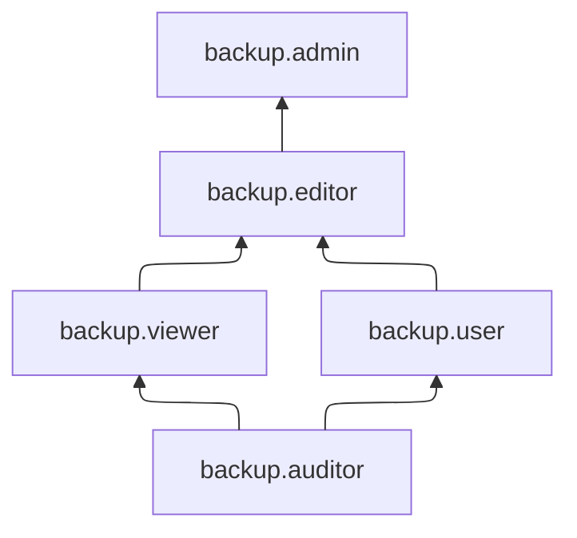

# Управление доступом в {{ backup-name }}

В этом разделе вы узнаете:

* [на какие ресурсы можно назначить роль](#resources);
* [какие роли действуют в сервисе](#roles-list);
* [какие политики авторизации действуют в сервисе](#access-policies).

## Об управлении доступом {#about-access-control}

Все операции в {{ yandex-cloud }} проверяются в сервисе [{{ iam-full-name }}](../../iam/index.md). Если у субъекта нет необходимых разрешений, сервис вернет ошибку.

Чтобы выдать разрешения к ресурсу, [назначьте роли](../../iam/operations/roles/grant.md) на этот ресурс субъекту, который будет выполнять операции. Роли можно назначить [аккаунту на Яндексе](../../iam/concepts/users/accounts.md#passport), [сервисному аккаунту](../../iam/concepts/users/service-accounts.md), [локальному пользователю](../../iam/concepts/users/accounts.md#local), [федеративному пользователю](../../iam/concepts/federations.md), [группе пользователей](../../organization/operations/manage-groups.md), [системной группе](../../iam/concepts/access-control/system-group.md) или [публичной группе](../../iam/concepts/access-control/public-group.md). Подробнее читайте в разделе [{#T}](../../iam/concepts/access-control/index.md).

Назначать роли на ресурс могут пользователи, у которых на этот ресурс есть роль `backup.admin` или одна из следующих ролей:

* `admin`;
* `resource-manager.admin`;
* `organization-manager.admin`;
* `resource-manager.clouds.owner`;
* `organization-manager.organizations.owner`.

В дополнение к ролям в {{ iam-full-name }} предусмотрен еще один механизм контроля доступа — [политики авторизации](#access-policies), которые позволяют запрещать определенные действия с ресурсами {{ yandex-cloud }} даже тогда, когда такие действия явно разрешены имеющимися у пользователей ролями.

## На какие ресурсы можно назначить роль {#resources}

В консоли {{ yandex-cloud }} или с помощью CLI вы можете назначить роль на [облако](*clouds) или [каталог](*folders). Назначенные роли будут действовать и на вложенные ресурсы.

## Какие роли действуют в сервисе {#roles-list}

### Сервисные роли {#service-roles}

#### backup.auditor {#backup-auditor}

Роль `backup.auditor` позволяет просматривать информацию о виртуальных машинах и серверах {{ baremetal-name }}, подключенных к сервису {{ backup-name }}, о политиках резервного копирования и квотах сервиса, а также об облаке и каталоге.

Пользователи с этой ролью могут:
* просматривать информацию о подключенных [провайдерах](../concepts/index.md#providers) резервного копирования;
* просматривать информацию о [политиках резервного копирования](../concepts/policy.md) и привязанных к ним виртуальных машинах и серверах {{ baremetal-name }};
* просматривать информацию о назначенных [правах доступа](../../iam/concepts/access-control/index.md) к политикам резервного копирования;
* просматривать информацию о [подключенных](../concepts/vm-connection.md) к сервису виртуальных машинах и серверах {{ baremetal-name }};
* просматривать информацию о [квотах](../concepts/limits.md#backup-quotas) сервиса {{ backup-name }};
* просматривать информацию об [облаке](../../resource-manager/concepts/resources-hierarchy.md#cloud);
* просматривать информацию о [каталоге](../../resource-manager/concepts/resources-hierarchy.md#folder) и его статистику.

Назначить роль `backup.auditor` может пользователь с ролью `admin` в облаке или `backup.admin` в каталоге.

#### backup.viewer {#backup-viewer}

Роль `backup.viewer` позволяет просматривать информацию о виртуальных машинах и серверах {{ baremetal-name }}, подключенных к сервису {{ backup-name }}, о политиках резервного копирования и резервных копиях, а также о квотах сервиса, облаке и каталоге.

Пользователи с этой ролью могут:
* просматривать информацию о подключенных [провайдерах](../concepts/index.md#providers) резервного копирования;
* просматривать информацию о назначенных [правах доступа](../../iam/concepts/access-control/index.md) к политикам резервного копирования;
* просматривать информацию о [политиках резервного копирования](../concepts/policy.md) и привязанных к ним виртуальных машинах и серверах {{ baremetal-name }};
* просматривать информацию о [подключенных](../concepts/vm-connection.md) к сервису виртуальных машинах и серверах {{ baremetal-name }};
* просматривать информацию о [резервных копиях](../concepts/backup.md);
* просматривать информацию о [квотах](../concepts/limits.md#backup-quotas) сервиса {{ backup-name }};
* просматривать информацию об [облаке](../../resource-manager/concepts/resources-hierarchy.md#cloud);
* просматривать информацию о [каталоге](../../resource-manager/concepts/resources-hierarchy.md#folder) и его статистику.

Включает разрешения, предоставляемые ролью `backup.auditor`.

Назначить роль `backup.viewer` может пользователь с ролью `admin` в облаке или `backup.admin` в каталоге.

#### backup.user {#backup-user}

Роль `backup.user` позволяет подключать провайдеров резервного копирования, подключать к сервису виртуальные машины и серверы {{ baremetal-name }}, привязывать политики резервного копирования к виртуальным машинам и серверам {{ baremetal-name }} и отвязывать их, а также просматривать информацию о ресурсах и квотах сервиса, об облаке и каталоге.

Пользователи с этой ролью могут:
* просматривать информацию о подключенных [провайдерах](../concepts/index.md#providers) резервного копирования, а также подключать провайдеров, доступных в {{ backup-name }};
* просматривать информацию о [подключенных](../concepts/vm-connection.md) к {{ backup-name }} виртуальных машинах и серверах {{ baremetal-name }}, а также подключать виртуальные машины и серверы {{ baremetal-name }} к сервису;
* просматривать информацию о [политиках резервного копирования](../concepts/policy.md) и привязанных к ним виртуальных машинах и серверах {{ baremetal-name }};
* привязывать политики резервного копирования к виртуальным машинам и серверам {{ baremetal-name }}, а также отвязывать их;
* просматривать информацию о назначенных [правах доступа](../../iam/concepts/access-control/index.md) к политикам резервного копирования;
* просматривать информацию о [квотах](../concepts/limits.md#backup-quotas) сервиса {{ backup-name }};
* просматривать информацию об [облаке](../../resource-manager/concepts/resources-hierarchy.md#cloud);
* просматривать информацию о [каталоге](../../resource-manager/concepts/resources-hierarchy.md#folder) и его статистику.

Включает разрешения, предоставляемые ролью `backup.auditor`.

Назначить роль `backup.user` может пользователь с ролью `admin` в облаке или `backup.admin` в каталоге.

#### backup.editor {#backup-editor}

Роль `backup.editor` позволяет управлять подключением виртуальных машин и серверов {{ baremetal-name }} к сервису {{ backup-name }}, управлять политиками резервного копирования, выполнять резервное копирование, восстанавливать ВМ и серверы {{ baremetal-name }} из резервных копий.

Пользователи с этой ролью могут:
* просматривать информацию о подключенных [провайдерах](../concepts/index.md#providers) резервного копирования, а также подключать провайдеров, доступных в {{ backup-name }};
* просматривать информацию о [политиках резервного копирования](../concepts/policy.md) и привязанных к ним виртуальных машинах и серверах {{ baremetal-name }};
* создавать, изменять и удалять политики резервного копирования, а также привязывать, отвязывать и запускать их на виртуальных машинах и серверах {{ baremetal-name }};
* просматривать информацию о назначенных [правах доступа](../../iam/concepts/access-control/index.md) к политикам резервного копирования;
* просматривать информацию о [подключенных](../concepts/vm-connection.md) к {{ backup-name }} виртуальных машинах и серверах {{ baremetal-name }}, а также подключать и отключать виртуальные машины и серверы {{ baremetal-name }} от сервиса;
* просматривать информацию о [резервных копиях](../concepts/backup.md), а также удалять их и восстанавливать из них виртуальные машины и серверы {{ baremetal-name }};
* просматривать информацию о [квотах](../concepts/limits.md#backup-quotas) сервиса {{ backup-name }};
* просматривать информацию об [облаке](../../resource-manager/concepts/resources-hierarchy.md#cloud);
* просматривать информацию о [каталоге](../../resource-manager/concepts/resources-hierarchy.md#folder) и его статистику.

Включает разрешения, предоставляемые ролями `backup.viewer` и `backup.user`.

Назначить роль `backup.editor` может пользователь с ролью `admin` в облаке или `backup.admin` в каталоге.

#### backup.admin {#backup-admin}

Роль `backup.admin` позволяет управлять политиками резервного копирования и доступом к ним, управлять подключением виртуальных машин и серверов {{ baremetal-name }} к сервису {{ backup-name }}, выполнять резервное копирование, восстанавливать ВМ и серверы {{ baremetal-name }} из резервных копий.

Пользователи с этой ролью могут:
* просматривать информацию о подключенных [провайдерах](../concepts/index.md#providers) резервного копирования, а также подключать провайдеров, доступных в {{ backup-name }};
* просматривать информацию о [политиках резервного копирования](../concepts/policy.md) и привязанных к ним виртуальных машинах и серверах {{ baremetal-name }};
* просматривать информацию о назначенных [правах доступа](../../iam/concepts/access-control/index.md) к политикам резервного копирования и изменять такие права доступа;
* создавать, изменять и удалять политики резервного копирования, а также привязывать, отвязывать и запускать их на виртуальных машинах и серверах {{ baremetal-name }};
* просматривать информацию о [подключенных](../concepts/vm-connection.md) к {{ backup-name }} виртуальных машинах и серверах {{ baremetal-name }}, а также подключать и отключать виртуальные машины и серверы {{ baremetal-name }} от сервиса;
* просматривать информацию о [резервных копиях](../concepts/backup.md), а также удалять их и восстанавливать из них виртуальные машины и серверы {{ baremetal-name }};
* просматривать информацию о [квотах](../concepts/limits.md#backup-quotas) сервиса {{ backup-name }};
* просматривать информацию об [облаке](../../resource-manager/concepts/resources-hierarchy.md#cloud);
* просматривать информацию о [каталоге](../../resource-manager/concepts/resources-hierarchy.md#folder) и его статистику.

Включает разрешения, предоставляемые ролью `backup.editor`.

Назначить роль `backup.admin` может пользователь с ролью `admin` в облаке.

### Примитивные роли {#primitive-roles}

Примитивные роли позволяют пользователям совершать действия во [всех сервисах](../../overview/concepts/services.md) {{ yandex-cloud }}.

#### {{ roles-auditor }} {#auditor}

Роль `auditor` предоставляет разрешения на чтение конфигурации и метаданных любых ресурсов Yandex Cloud без возможности доступа к данным.

Например, пользователи с этой ролью могут:
* просматривать информацию о [ресурсе]({{ link-docs }}/resource-manager/concepts/resources-hierarchy);
* просматривать метаданные ресурса;
* просматривать список операций с ресурсом.

Роль `auditor` — наиболее безопасная роль, исключающая доступ к данным [сервисов]({{ link-docs }}/overview/concepts/services). Роль подходит для пользователей, которым необходим минимальный уровень доступа к ресурсам Yandex Cloud.

#### {{ roles-viewer }} {#viewer}

Роль `viewer` предоставляет разрешения на чтение информации о любых [ресурсах]({{ link-docs }}/resource-manager/concepts/resources-hierarchy) Yandex Cloud.

Включает разрешения, предоставляемые ролью `auditor`.

В отличие от роли `auditor`, роль `viewer` предоставляет доступ к данным [сервисов]({{ link-docs }}/overview/concepts/services) в режиме чтения.

#### {{ roles-editor }} {#editor}

Роль `editor` предоставляет разрешения на управление любыми [ресурсами]({{ link-docs }}/resource-manager/concepts/resources-hierarchy) Yandex Cloud, кроме назначения ролей другим пользователям, передачи прав владения [организацией]({{ link-docs }}/organization/concepts/organization) и ее удаления, а также удаления [ключей шифрования]({{ link-docs }}/kms/concepts/) Key Management Service.

Например, пользователи с этой ролью могут создавать, изменять и удалять ресурсы.

Включает разрешения, предоставляемые ролью `viewer`.

#### {{ roles-admin }} {#admin}

Роль `admin` позволяет назначать любые роли, кроме `resource-manager.clouds.owner` и `organization-manager.organizations.owner`, а также предоставляет разрешения на управление любыми [ресурсами]({{ link-docs }}/resource-manager/concepts/resources-hierarchy) Yandex Cloud, кроме передачи прав владения [организацией]({{ link-docs }}/organization/concepts/organization) и ее удаления.

Прежде чем назначить роль `admin` на организацию, [облако]({{ link-docs }}/resource-manager/concepts/resources-hierarchy#cloud) или [платежный аккаунт]({{ link-docs }}/billing/concepts/billing-account), ознакомьтесь с информацией о защите [привилегированных аккаунтов]({{ link-docs }}/security/standard/all#privileged-users).

Включает разрешения, предоставляемые ролью `editor`.

Вместо примитивных ролей мы рекомендуем использовать роли сервисов. Такой подход позволит более гранулярно управлять доступом и обеспечить соблюдение [принципа минимальных привилегий](../../security/standard/all.md#min-privileges).

Подробнее о примитивных ролях см. в [справочнике ролей {{ yandex-cloud }}](../../iam/roles-reference.md#primitive-roles).

## Политики авторизации {#access-policies}

[Политики авторизации](*access_policies) дополняют систему ролей и позволяют сделать управление доступом в {{ yandex-cloud }} более гибким.

Сервис {{ backup-name }} позволяет назначать следующие политики авторизации:

#### backup.denyActivation {#backup-denyActivation}

Политика запрещает подключать [защищаемые ресурсы](../concepts/index.md) к сервису {{ backup-full-name }}, а также привязывать и отвязывать их от [политик резервного копирования](../concepts/policy.md).

#### backup.denyRemoveProtection {#backup-denyRemoveProtection}

Политика запрещает изменять и удалять [политики резервного копирования](../concepts/policy.md) {{ backup-full-name }}, отвязывать [защищаемые ресурсы](../concepts/index.md) от таких политик, а также удалять [резервные копии](../concepts/backup.md) защищаемых ресурсов.

Политики авторизации могут быть назначены на уровне [каталога](*folders), [облака](*clouds) или [организации](*organizations) и позволяют запрещать соответствующие действия в этом каталоге, облаке или организации. Такой запрет действует даже в том случае, если пользователю явным образом назначены [роли](#roles-list), разрешающие выполнение указанных операций.

Подробнее о том, как создать для ресурса политику авторизации, читайте в разделе [{#T}](../../iam/operations/access-policies/assign.md).

[*access_policies]: _Политики авторизации_ — это механизм контроля доступа {{ iam-full-name }}, который позволяет управлять разрешениями на выполнение определенных операций с [ресурсами {{ yandex-cloud }}](../../overview/roles-and-resources.md). Политики дополняют систему [ролей](../../iam/concepts/access-control/roles.md) и позволяют сделать [управление доступом](../../iam/concepts/access-control/index.md) более гибким. [Подробнее](../../iam/concepts/access-control/access-policies.md) о политиках авторизации в {{ yandex-cloud }}.

[*folders]: [Подробнее](../../resource-manager/concepts/resources-hierarchy.md#folder) о каталогах.

[*clouds]: [Подробнее](../../resource-manager/concepts/resources-hierarchy.md#cloud) об облаках.

[*organizations]: [Подробнее](../../organization/concepts/organization.md) об организациях.