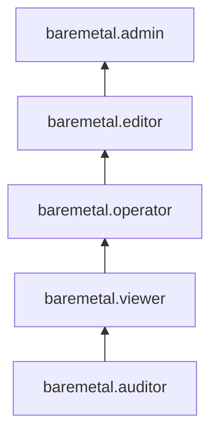

# Управление доступом в Yandex BareMetal

Пользователь Yandex Cloud может выполнять только те операции над ресурсами, которые разрешены назначенными ему [ролями](../../iam/concepts/access-control/roles.md). Пока у пользователя нет никаких ролей, почти все операции ему запрещены.

Чтобы разрешить доступ к ресурсам сервиса BareMetal, назначьте аккаунту на Яндексе, [сервисному аккаунту](../../iam/concepts/users/service-accounts.md), [федеративным](../../iam/concepts/users/accounts.md#saml-federation) или [локальным](../../iam/concepts/users/accounts.md#local) пользователям, [группе пользователей](../../organization/operations/manage-groups.md), [системной группе](../../iam/concepts/access-control/system-group.md) или [публичной группе](../../iam/concepts/access-control/public-group.md) нужные роли из приведенного ниже списка. На данный момент роль может быть назначена только на родительский ресурс (каталог или облако), роли которого наследуются вложенными ресурсами.

Подробнее о наследовании ролей читайте в разделе [Наследование прав доступа](../../resource-manager/concepts/resources-hierarchy.md#access-rights-inheritance) документации сервиса Resource Manager.

## Какие роли действуют в сервисе {#roles-list}

Для управления правами доступа в BareMetal можно использовать как сервисные, так и примитивные роли.

### Сервисные роли {#service-roles}

#### baremetal.auditor {#baremetal-auditor}

Роль `baremetal.auditor` позволяет просматривать метаданные ресурсов сервиса Yandex BareMetal.

Пользователи с этой ролью могут:
* просматривать информацию о [серверах](../concepts/servers.md) BareMetal, в том числе об их [конфигурации](../concepts/server-configurations.md);
* просматривать информацию о [приватных подсетях](../concepts/private-network.md#private-subnet) и [виртуальных сегментах сети (VRF)](../concepts/private-network.md#vrf-segment);
* просматривать информацию о загруженных образах операционных систем серверов BareMetal;
* просматривать информацию о [квотах](../concepts/limits.md#baremetal-quotas) сервиса Yandex BareMetal;
* просматривать информацию о [каталоге](../../resource-manager/concepts/resources-hierarchy.md#folder).

#### baremetal.viewer {#baremetal-viewer}

Роль `baremetal.viewer` позволяет просматривать информацию о ресурсах сервисаYandex BareMetal.

Пользователи с этой ролью могут:
* просматривать информацию о [серверах](../concepts/servers.md) BareMetal, в том числе об их [конфигурации](../concepts/server-configurations.md);
* просматривать информацию о [приватных подсетях](../concepts/private-network.md#private-subnet) и [виртуальных сегментах сети (VRF)](../concepts/private-network.md#vrf-segment);
* просматривать информацию о загруженных образах операционных систем серверов BareMetal;
* просматривать информацию о [квотах](../concepts/limits.md#baremetal-quotas) сервиса Yandex BareMetal;
* просматривать информацию о [каталоге](../../resource-manager/concepts/resources-hierarchy.md#folder).

Включает разрешения, предоставляемые ролью `baremetal.auditor`.

#### baremetal.operator {#baremetal-operator}

Роль `baremetal.operator` позволяет работать на серверах BareMetal, а также просматривать информацию о ресурсах сервиса Yandex BareMetal.

Пользователи с этой ролью могут:
* просматривать информацию о [серверах](../concepts/servers.md) BareMetal, в том числе об их [конфигурации](../concepts/server-configurations.md);
* [использовать KVM-консоль](../operations/servers/server-kvm.md) серверов;
* использовать [IPMI](https://en.wikipedia.org/wiki/Intelligent_Platform_Management_Interface) для управления питанием серверов — включать, выключать и перезагружать их;
* просматривать информацию о [приватных подсетях](../concepts/private-network.md#private-subnet) и [виртуальных сегментах сети (VRF)](../concepts/private-network.md#vrf-segment);
* просматривать информацию о загруженных образах операционных систем серверов;
* просматривать информацию о [квотах](../concepts/limits.md#baremetal-quotas) сервиса Yandex BareMetal;
* просматривать информацию о [каталоге](../../resource-manager/concepts/resources-hierarchy.md#folder).

Включает разрешения, предоставляемые ролью `baremetal.viewer`.

#### baremetal.editor {#baremetal-editor}

Роль `baremetal.editor` позволяет управлять серверами BareMetal, приватными подсетями, виртуальными сегментами сети (VRF) и образами операционных систем серверов.

Пользователи с этой ролью могут:
* просматривать информацию о [серверах](../concepts/servers.md) BareMetal, в том числе об их [конфигурации](../concepts/server-configurations.md);
* арендовать сервера BareMetal и отказываться от их аренды, а также изменять настройки серверов BareMetal;
* просматривать информацию о [приватных подсетях](../concepts/private-network.md#private-subnet), а также создавать, изменять и удалять приватные подсети;
* просматривать информацию о [виртуальных сегментах сети (VRF)](../concepts/private-network.md#vrf-segment), а также создавать, изменять и удалять VRF;
* просматривать информацию о загруженных образах операционных систем серверов BareMetal, а также загружать, изменять и удалять такие образы;
* переустанавливать операционные системы серверов BareMetal;
* [использовать KVM-консоль](../operations/servers/server-kvm.md) серверов;
* использовать [IPMI](https://en.wikipedia.org/wiki/Intelligent_Platform_Management_Interface) для управления питанием серверов — включать, выключать и перезагружать их;
* просматривать информацию о [квотах](../concepts/limits.md#baremetal-quotas) сервиса Yandex BareMetal;
* просматривать информацию о [каталоге](../../resource-manager/concepts/resources-hierarchy.md#folder).

Включает разрешения, предоставляемые ролью `baremetal.operator`.



С 1 августа 2026 года роль `baremetal.editor` получает новый набор разрешений, позволяющий подключать серверы к сервису [Yandex Cloud Backup](../../backup/index.md), а также привязывать и отвязывать их от [политик резервного копирования](../../backup/concepts/policy.md).

Если вы не планируете подключать ваши ресурсы к Cloud Backup и не хотите предоставлять вашим пользователям такие разрешения, вы можете заблаговременно отключить эти возможности с помощью [политики авторизации](../../iam/concepts/access-control/access-policies.md#backup-denyActivation) `backup.denyActivation`, назначенной на каталог, облако или организацию. Подробнее о том, как создать политику авторизации, читайте в разделе [Создание политики авторизации для ресурса](../../iam/operations/access-policies/assign.md).



#### baremetal.admin {#baremetal-admin}

Роль `baremetal.admin` позволяет управлять серверами BareMetal, приватными подсетями, виртуальными сегментами сети (VRF) и образами операционных систем серверов.

Пользователи с этой ролью могут:
* просматривать информацию о [серверах](../concepts/servers.md) BareMetal, в том числе об их [конфигурации](../concepts/server-configurations.md);
* арендовать сервера BareMetal и отказываться от их аренды, а также изменять настройки серверов BareMetal;
* просматривать информацию о [приватных подсетях](../concepts/private-network.md#private-subnet), а также создавать, изменять и удалять приватные подсети;
* просматривать информацию о [виртуальных сегментах сети (VRF)](../concepts/private-network.md#vrf-segment), а также создавать, изменять и удалять VRF;
* просматривать информацию о загруженных образах операционных систем серверов BareMetal, а также загружать, изменять и удалять такие образы;
* переустанавливать операционные системы серверов BareMetal;
* [использовать KVM-консоль](../operations/servers/server-kvm.md) серверов;
* использовать [IPMI](https://en.wikipedia.org/wiki/Intelligent_Platform_Management_Interface) для управления питанием серверов — включать, выключать и перезагружать их;
* просматривать информацию о [квотах](../concepts/limits.md#baremetal-quotas) сервиса Yandex BareMetal;
* просматривать информацию о [каталоге](../../resource-manager/concepts/resources-hierarchy.md#folder).

Включает разрешения, предоставляемые ролью `baremetal.editor`.



С 1 августа 2026 года роль `baremetal.admin` получает новый набор разрешений, позволяющий подключать серверы к сервису [Yandex Cloud Backup](../../backup/index.md), а также привязывать и отвязывать их от [политик резервного копирования](../../backup/concepts/policy.md).

Если вы не планируете подключать ваши ресурсы к Cloud Backup и не хотите предоставлять вашим пользователям такие разрешения, вы можете заблаговременно отключить эти возможности с помощью [политики авторизации](../../iam/concepts/access-control/access-policies.md#backup-denyActivation) `backup.denyActivation`, назначенной на каталог, облако или организацию. Подробнее о том, как создать политику авторизации, читайте в разделе [Создание политики авторизации для ресурса](../../iam/operations/access-policies/assign.md).



### Примитивные роли {#primitive-roles}

Примитивные роли позволяют пользователям совершать действия во [всех сервисах](../../overview/concepts/services.md) Yandex Cloud.

#### auditor {#auditor}

Роль `auditor` предоставляет разрешения на чтение конфигурации и метаданных любых ресурсов Yandex Cloud без возможности доступа к данным.

Например, пользователи с этой ролью могут:
* просматривать информацию о [ресурсе](../../resource-manager/concepts/resources-hierarchy.md);
* просматривать метаданные ресурса;
* просматривать список операций с ресурсом.

Роль `auditor` — наиболее безопасная роль, исключающая доступ к данным [сервисов](../../overview/concepts/services.md). Роль подходит для пользователей, которым необходим минимальный уровень доступа к ресурсам Yandex Cloud.

#### viewer {#viewer}

Роль `viewer` предоставляет разрешения на чтение информации о любых [ресурсах](../../resource-manager/concepts/resources-hierarchy.md) Yandex Cloud.

Включает разрешения, предоставляемые ролью `auditor`.

В отличие от роли `auditor`, роль `viewer` предоставляет доступ к данным [сервисов](../../overview/concepts/services.md) в режиме чтения.

#### editor {#editor}

Роль `editor` предоставляет разрешения на управление любыми [ресурсами](../../resource-manager/concepts/resources-hierarchy.md) Yandex Cloud, кроме назначения ролей другим пользователям, передачи прав владения [организацией](../../organization/concepts/organization.md) и ее удаления, а также удаления [ключей шифрования](../../kms/concepts/index.md) Key Management Service.

Например, пользователи с этой ролью могут создавать, изменять и удалять ресурсы.

Включает разрешения, предоставляемые ролью `viewer`.

#### admin {#admin}

Роль `admin` позволяет назначать любые роли, кроме `resource-manager.clouds.owner` и `organization-manager.organizations.owner`, а также предоставляет разрешения на управление любыми [ресурсами](../../resource-manager/concepts/resources-hierarchy.md) Yandex Cloud, кроме передачи прав владения [организацией](../../organization/concepts/organization.md) и ее удаления.

Прежде чем назначить роль `admin` на организацию, [облако](../../resource-manager/concepts/resources-hierarchy.md#cloud) или [платежный аккаунт](../../billing/concepts/billing-account.md), ознакомьтесь с информацией о защите [привилегированных аккаунтов](../../security/standard/all.md#privileged-users).

Включает разрешения, предоставляемые ролью `editor`.

Вместо примитивных ролей мы рекомендуем использовать роли сервисов. Такой подход позволит более гранулярно управлять доступом и обеспечить соблюдение [принципа минимальных привилегий](../../security/standard/all.md#min-privileges).

Подробнее о примитивных ролях в [справочнике ролей Yandex Cloud](../../iam/roles-reference.md#primitive-roles).

## См. также {#see-also}

[Структура ресурсов Yandex Cloud](../../resource-manager/concepts/resources-hierarchy.md)