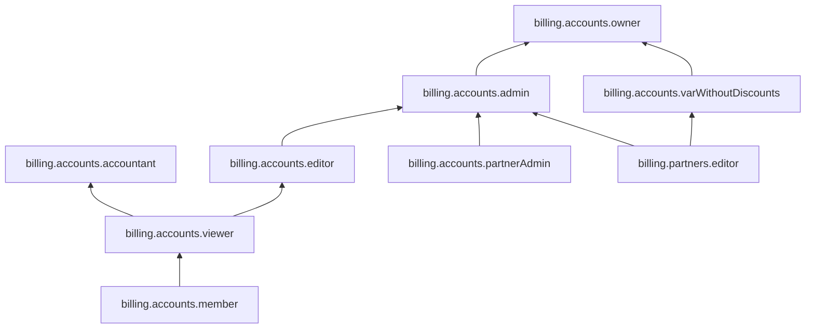

[Документация Yandex Cloud](../../index.md) > [Yandex Cloud Billing](../index.md) > Управление доступом

# Управление доступом в сервисе Yandex Cloud Billing

## Доступ к платежному аккаунту {#billing-account}

Доступ к [платежному аккаунту](../concepts/billing-account.md) можно предоставить через [интерфейс сервиса Yandex Cloud Billing](https://center.yandex.cloud/billing/accounts) или [Yandex Cloud API](../api-ref/authentication.md). Платежный аккаунт могут создавать пользователи с зарегистрированным аккаунтом на Яндексе или в Яндекс 360:

* Если у вас или вашего сотрудника еще нет аккаунта, создайте его на [Яндексе](https://passport.yandex.ru/registration) или в [Яндекс 360](https://yandex.ru/support/business/add-users.html).
* Если для авторизации на Яндексе вы используете профиль в социальной сети, [заведите логин и пароль](https://passport.yandex.ru/passport?mode=postregistration&create_login=1).

Операции, которые пользователь может выполнять над платежным аккаунтом, определяются назначенной ему ролью. Роли можно назначить аккаунту на Яндексе, [сервисному аккаунту](../../iam/concepts/users/service-accounts.md), [федеративным](../../iam/concepts/users/accounts.md#saml-federation) или [локальным](../../iam/concepts/users/accounts.md#local) пользователям, [группе пользователей](../../organization/operations/manage-groups.md), [системной группе](../../iam/concepts/access-control/system-group.md) или [публичной группе](../../iam/concepts/access-control/public-group.md).



Доступ может быть предоставлен только пользователю, к платежному аккаунту которого привязано любое облако в сервисе [Identity and Access Management](../../iam/index.md).



## Какие роли действуют в сервисе {#roles-list}

### Сервисные роли {#service-roles}

#### billing.accounts.member {#billing-accounts-member}

Роль `billing.accounts.member` автоматически выдается при добавлении пользователя в сервисе. Она необходима для показа выбранного [платежного аккаунта](../concepts/billing-account.md) в списке всех аккаунтов пользователя.

#### billing.accounts.viewer {#billing-accounts-viewer}

Роль `billing.accounts.viewer` назначается на платежный аккаунт. Позволяет просматривать данные платежного аккаунта, получать информацию о потреблении ресурсов, проверять расходы, выгружать акты сверки и отчетные документы.



* показывать [платежные аккаунты](../concepts/billing-account.md) в списке всех аккаунтов;
* просматривать данные платежных аккаунтов;
* просматривать и скачивать [отчетные (закрывающие) документы](../payment/documents.md);
* просматривать и скачивать сгенерированные акты сверки;
* получать и просматривать уведомления о потреблении;
* проверять расходы;
* [просматривать детализацию](../operations/check-charges.md).





* просматривать присвоенные [специализации](../../partner/specializations/index.md);
* просматривать историю начисления вознаграждений по [реферальной программе](../../partner/program/referral.md);
* просматривать статус расчетов с [компанией-реферером](../../partner/terms.md#referral-partner);
* просматривать список реферальных ссылок.



#### billing.accounts.accountant {#billing-accounts-accountant}

Роль `billing.accounts.accountant` назначается на платежный аккаунт. Позволяет просматривать данные платежного аккаунта, получать информацию о потреблении ресурсов, проверять расходы, выгружать акты сверки и отчетные документы, создавать новый акт сверки, пополнять лицевой счет с помощью расчетного счета.



* показывать [платежные аккаунты](../concepts/billing-account.md) в списке всех аккаунтов;
* просматривать данные платежных аккаунтов;
* просматривать и скачивать [отчетные (закрывающие) документы](../payment/documents.md);
* генерировать новые [акты сверки](../concepts/act.md#reconciliation-report);
* просматривать и скачивать сгенерированные акты сверки;
* получать и просматривать уведомления о потреблении;
* проверять расходы;
* [просматривать детализацию](../operations/check-charges.md);
* пополнять [лицевой счет](../concepts/personal-account.md) с помощью расчетного счета.





* просматривать присвоенные [специализации](../../partner/specializations/index.md);
* просматривать историю начисления вознаграждений по [реферальной программе](../../partner/program/referral.md);
* просматривать статус расчетов с [компанией-реферером](../../partner/terms.md#referral-partner);
* просматривать список реферальных ссылок;
* просматривать историю начисления [рибейта](../../partner/terms.md#rebate).



Включает разрешения, предоставляемые ролью `billing.accounts.viewer`.

#### billing.partners.editor {#billing-partners-editor}

Роль `billing.partners.editor` назначается на [платежный аккаунт](../concepts/billing-account.md) и дает право редактировать информацию о [партнере](../../partner/program/var.md) и его продуктах в [партнерском каталоге](../../partner/program/var-tools.md#catalog).

#### billing.accounts.editor {#billing-accounts-editor}

Роль `billing.accounts.editor` назначается на платежный аккаунт. Позволяет получать счета на оплату, активировать промокоды, привязывать облака и сервисы к платежному аккаунту, создавать экспорт детализации, создавать бюджеты, генерировать акты сверки и резервировать ресурсы.



* показывать [платежные аккаунты](../concepts/billing-account.md) в списке всех аккаунтов;
* просматривать данные платежных аккаунтов;
* просматривать [коммерческие предложения](../concepts/glossary.md#client-offer);
* просматривать и скачивать [отчетные (закрывающие) документы](../payment/documents.md);
* генерировать новые [акты сверки](../concepts/act.md#reconciliation-report);
* просматривать и скачивать сгенерированные акты сверки;
* получать и просматривать уведомления о потреблении;
* проверять расходы;
* [просматривать детализацию](../operations/check-charges.md);
* создавать [экспорт детализации](../operations/get-folder-report.md);
* создавать [бюджеты](../concepts/budget.md);
* [резервировать потребление ресурсов](../concepts/cvos.md);
* пополнять [лицевой счет](../concepts/personal-account.md) с помощью расчетного счета;
* привязывать [облака](../../resource-manager/concepts/resources-hierarchy.md#cloud) к платежному аккаунту;
* переименовывать платежные аккаунты;
* активировать промокоды.





* просматривать историю начисления [рибейта](../../partner/terms.md#rebate);
* просматривать присвоенные [специализации](../../partner/specializations/index.md);
* просматривать историю начисления вознаграждений по [реферальной программе](../../partner/program/referral.md);
* выводить [вознаграждение](../../partner/program/referral.md#premium) по реферальной программе;
* просматривать статус расчетов с [компанией-реферером](../../partner/terms.md#referral-partner);
* просматривать список реферальных ссылок;
* создавать реферальные ссылки;
* активировать реферальные ссылки;
* изменять реферальные ссылки;
* привязывать [облака](../../resource-manager/concepts/resources-hierarchy.md#cloud) к [сабаккаунтам](../../partner/terms.md#sub-account).



Включает разрешения, предоставляемые ролью `billing.accounts.viewer`.

#### billing.accounts.varWithoutDiscounts {#billing-accounts-var-without-discounts}

Роль `billing.accounts.varWithoutDiscounts` назначается на платежный аккаунт. Предоставляет партнерским аккаунтам все права администратора, кроме возможности получать информацию о скидках.



* показывать [платежные аккаунты](../concepts/billing-account.md) в списке всех аккаунтов;
* просматривать данные платежных аккаунтов;
* просматривать информацию о назначенных [правах доступа](../../iam/concepts/access-control/index.md) к платежным аккаунтам;
* просматривать и скачивать [отчетные (закрывающие) документы](../payment/documents.md);
* генерировать новые [акты сверки](../concepts/act.md#reconciliation-report);
* просматривать и скачивать сгенерированные акты сверки;
* получать и просматривать уведомления о потреблении;
* проверять расходы;
* [просматривать детализацию](../operations/check-charges.md);
* создавать [экспорт детализации](../operations/get-folder-report.md);
* создавать [бюджеты](../concepts/budget.md);
* [резервировать потребление ресурсов](../concepts/cvos.md);
* пополнять [лицевой счет](../concepts/personal-account.md) с помощью расчетного счета;
* привязывать [облака](../../resource-manager/concepts/resources-hierarchy.md#cloud) к платежному аккаунту;
* переименовывать платежные аккаунты;
* активировать промокоды.





* [создавать](../../partner/operations/pin-client.md#client-entry) записи о клиентах ([сабаккаунты](../../partner/terms.md#sub-account));
* просматривать список и данные сабаккаунтов;
* активировать сабаккаунты;
* приостанавливать работу сабаккаунтов;
* возобновлять работу сабаккаунтов;
* привязывать [облака](../../resource-manager/concepts/resources-hierarchy.md#cloud) к сабаккаунтам;
* [управлять](../../partner/operations/access/partners-account.md) назначенными правами доступа к сабаккаунтам;
* просматривать историю начисления [рибейта](../../partner/terms.md#rebate);
* выводить рибейт;
* просматривать историю начисления вознаграждений по [реферальной программе](../../partner/program/referral.md);
* выводить [вознаграждение](../../partner/program/referral.md#premium) по реферальной программе;
* просматривать статус расчетов с [компанией-реферером](../../partner/terms.md#referral-partner);
* создавать реферальные ссылки;
* активировать реферальные ссылки;
* изменять реферальные ссылки;
* [просматривать](../../partner/operations/get-client-stat.md) потребление сервисов клиентами.



Включает разрешения, предоставляемые ролью `billing.partners.editor`.

#### billing.accounts.admin {#billing-accounts-admin}

Роль `billing.accounts.admin` назначается на платежный аккаунт и позволяет управлять доступами к платежному аккаунту (кроме роли `billing.accounts.owner`).



* показывать [платежные аккаунты](../concepts/billing-account.md) в списке всех аккаунтов;
* просматривать данные платежных аккаунтов;
* просматривать [коммерческие предложения](../concepts/glossary.md#client-offer);
* просматривать информацию о назначенных [правах доступа](../../iam/concepts/access-control/index.md) к платежным аккаунтам и изменять такие права доступа (за исключением назначения и отзыва роли `billing.accounts.owner`);
* подключать, отключать, изменять тарифный план [технической поддержки](../../support/overview.md), а также изменять платежный аккаунт, с которого будет списываться плата по тарифу;
* просматривать и скачивать [отчетные (закрывающие) документы](../payment/documents.md);
* генерировать новые [акты сверки](../concepts/act.md#reconciliation-report);
* просматривать и скачивать сгенерированные акты сверки;
* получать и просматривать уведомления о потреблении;
* проверять расходы;
* [просматривать детализацию](../operations/check-charges.md);
* создавать [экспорт детализации](../operations/get-folder-report.md);
* создавать [бюджеты](../concepts/budget.md);
* [резервировать потребление ресурсов](../concepts/cvos.md);
* пополнять [лицевой счет](../concepts/personal-account.md) с помощью расчетного счета;
* привязывать [облака](../../resource-manager/concepts/resources-hierarchy.md#cloud) к платежному аккаунту;
* переименовывать платежные аккаунты;
* активировать промокоды.





* [создавать](../../partner/operations/pin-client.md#client-entry) записи о клиентах ([сабаккаунты](../../partner/terms.md#sub-account));
* просматривать список и данные сабаккаунтов, включая персональные данные;
* активировать сабаккаунты;
* приостанавливать работу сабаккаунтов;
* возобновлять работу сабаккаунтов;
* привязывать [облака](../../resource-manager/concepts/resources-hierarchy.md#cloud) к сабаккаунтам;
* [управлять](../../partner/operations/access/partners-account.md) назначенными правами доступа к сабаккаунтам;
* [просматривать](../../partner/operations/get-client-stat.md) потребление сервисов клиентами;
* просматривать историю начисления [рибейта](../../partner/terms.md#rebate);
* выводить рибейт;
* просматривать присвоенные [специализации](../../partner/specializations/index.md);
* просматривать историю начисления вознаграждений по [реферальной программе](../../partner/program/referral.md);
* выводить [вознаграждение](../../partner/program/referral.md#premium) по реферальной программе;
* просматривать статус расчетов с [компанией-реферером](../../partner/terms.md#referral-partner);
* просматривать список реферальных ссылок;
* создавать реферальные ссылки;
* активировать реферальные ссылки;
* изменять реферальные ссылки;
* просматривать список [партнерских премий](../../partner/portal.md#premium) и информацию о них.



Включает разрешения, предоставляемые ролями `billing.accounts.editor`, `billing.accounts.partnerAdmin` и `billing.partners.editor`.

#### billing.accounts.owner {#billing-accounts-owner}

Роль `billing.accounts.owner` автоматически выдается при создании платежного аккаунта. Любой пользователь с ролью `billing.accounts.owner` может отозвать эту роль у создателя платежного аккаунта и изменить владельца.



* показывать [платежные аккаунты](../concepts/billing-account.md) в списке всех аккаунтов;
* просматривать данные платежных аккаунтов;
* просматривать [коммерческие предложения](../concepts/glossary.md#client-offer);
* просматривать информацию о назначенных [правах доступа](../../iam/concepts/access-control/index.md) к платежным аккаунтам и изменять такие права доступа;
* подключать, отключать, изменять тарифный план [технической поддержки](../../support/overview.md), а также изменять платежный аккаунт, с которого будет списываться плата по тарифу;
* просматривать и скачивать [отчетные (закрывающие) документы](../payment/documents.md);
* генерировать новые [акты сверки](../concepts/act.md#reconciliation-report);
* просматривать и скачивать сгенерированные акты сверки;
* получать и просматривать уведомления о потреблении;
* проверять расходы;
* [просматривать детализацию](../operations/check-charges.md);
* создавать [экспорт детализации](../operations/get-folder-report.md);
* создавать [бюджеты](../concepts/budget.md);
* [резервировать потребление ресурсов](../concepts/cvos.md);
* пополнять [лицевой счет](../concepts/personal-account.md) с помощью расчетного счета;
* пополнять лицевой счет с помощью банковской карты;
* привязывать [облака](../../resource-manager/concepts/resources-hierarchy.md#cloud) к платежному аккаунту;
* переименовывать платежные аккаунты;
* изменять контакты плательщика;
* изменять платежные реквизиты;
* [изменять](../operations/pin-card.md#change_card) банковскую карту;
* [изменять](../operations/change-payment-method.md) способ оплаты;
* активировать промокоды;
* активировать [пробный период](../concepts/trial-period.md);
* активировать [платную версию](../../getting-started/free-trial/concepts/upgrade-to-paid.md);
* [удалять](../operations/delete-account.md) платежные аккаунты.





* [создавать](../../partner/operations/pin-client.md#client-entry) записи о клиентах ([сабаккаунты](../../partner/terms.md#sub-account));
* просматривать список и данные сабаккаунтов, в т.ч. персональные данные;
* обновлять данные записей о сабаккаунтах;
* активировать сабаккаунты;
* приостанавливать работу сабаккаунтов;
* возобновлять работу сабаккаунтов;
* удалять сабаккаунты (до подтверждения клиентом);
* привязывать [облака](../../resource-manager/concepts/resources-hierarchy.md#cloud) к сабаккаунтам;
* [управлять](../../partner/operations/access/partners-account.md) назначенными правами доступа к сабаккаунтам;
* [просматривать](../../partner/operations/get-client-stat.md) потребление сервисов клиентами;
* просматривать историю начисления [рибейта](../../partner/terms.md#rebate);
* выводить рибейт;
* просматривать присвоенные [специализации](../../partner/specializations/index.md);
* просматривать историю начисления вознаграждений по [реферальной программе](../../partner/program/referral.md);
* выводить [вознаграждение](../../partner/program/referral.md#premium) по реферальной программе;
* просматривать статус расчетов с [компанией-реферером](../../partner/terms.md#referral-partner);
* просматривать список реферальных ссылок;
* создавать реферальные ссылки;
* активировать реферальные ссылки;
* изменять реферальные ссылки;
* просматривать список [партнерских премий](../../partner/portal.md#premium) и информацию о них.



Включает разрешения, предоставляемые ролями `billing.accounts.admin` и `billing.accounts.varWithoutDiscounts`.

### Примитивные роли {#primitive-roles}

Примитивные роли — роли агрегаторы, определяющие разрешения пользователя для доступа к сервисам. В Yandex Cloud Billing эти роли соответствуют ролям `billing.accounts.*`:

* `auditor` — аналогична роли `billing.accounts.viewer` с ограничениями.
* `viewer` — аналогична роли `billing.accounts.viewer`.
* `editor` — аналогична роли `billing.accounts.editor`.
* `admin` — аналогична роли `billing.accounts.admin`.

Примитивные роли могут назначаться только пользователям, добавленным в список **Пользователи**.

### Доступные операции {#available-operations}

Список доступных операций для ролей каждого типа представлен в таблице ниже.

| Операции                                                | `owner`                                | `viewer`                               | `accountant`                           | `editor`                               | `admin`                                |
|---------------------------------------------------------|----------------------------------------|----------------------------------------|----------------------------------------|----------------------------------------|----------------------------------------|
| Показ платежного аккаунта в списке всех аккаунтов       |  |  |  |  |  |
| Просмотр данных платежного аккаунта                     |  |  |  |  |  |
| Просмотр и получение уведомлений о потреблении          |  |  |  |  |  |
| Просмотр и скачивание отчетных (закрывающих) документов |  |  |  |  |  |
| Просмотр и скачивание уже сгенерированных актов сверки  |  |  |  |  |  |
| Проверка расходов                                       |  |  |  |  |  |
| Доступ к детализации                                    |  |  |  |  |  |
| Пополнение лицевого счета с помощью расчетного счета    |  |   |  |  |  |
| Генерация нового акта сверки                            |  |   |  |  |  |
| Активация промокодов                                    |  |   |   |  |  |
| Привязка облачной организации и других сущностей к платежному аккаунту |  |   |   |  |  |
| Связь с облачной организацией                           |  |   |   |   |   |
| Создание экспорта детализации                           |  |   |   |  |  |
| Создание бюджета                                        |  |   |   |  |  |
| Резервирование ресурсов                                 |  |   |   |  |  |
| Переименование платежного аккаунта                      |  |   |   |  |  |
| Просматривать коммерческие предложения                  |  |   |   |  |  |
| Выдача ролей на платежный аккаунт                       |  |   |   |   |  | 
| Просмотр и редактирование ролей                         |  |   |   |   |  | 
| Управление тарифом технической поддержки                |  |   |   |   |  | 
| Изменение контактов плательщика                         |  |   |   |   |   |
| Изменение платежных реквизитов                          |  |   |   |   |   |
| Изменение банковской карты                              |  |   |   |   |   |
| Изменение способа оплаты                                |  |   |   |   |   |
| Активация платной версии                                |  |   |   |   |   |
| Пополнение лицевого счета с помощью банковской карты    |  |   |   |   |   |
| Принимать коммерческие предложения                      |  |   |   |   |   |

## Добавление пользователя {#set-member-role}

Процесс добавления новых пользователей платежного аккаунта зависит от того, привязан ли платежный аккаунт к организации.



- С организацией {#organization}

  [Назначьте](#set-role) нужную роль на платежный аккаунт любому пользователю или сервисному аккаунту в вашей организации.

- Без организации {#no-organization}

  

  Чтобы добавить нового пользователя платежного аккаунта, нужна роль `billing.accounts.owner` или `billing.accounts.admin`.

  

  1. Перейдите в сервис [**Yandex Cloud Billing**](https://center.yandex.cloud/billing/accounts).
  1. Выберите платежный аккаунт.
  1. Перейдите на страницу **Управление доступом**.
  1. Справа сверху нажмите кнопку **Добавить пользователя**.
  1. Выберите пользователя из выпадающего списка. В списке отображаются пользователи, облака которых привязаны к вашему платежному аккаунту.
  1. Нажмите кнопку **Добавить**.

  Пользователь или сервисный аккаунт получит роль `billing.accounts.member` и будет добавлен в список **Пользователи**. Чтобы разрешить доступ к платежному аккаунту, назначьте нужную роль.



## Назначение роли {#set-role}

Процесс назначения роли на платежный аккаунт зависит от того, привязан платежный аккаунт к организации или нет.



- С организацией {#organization}

  Пользователь, которому назначена роль `billing.accounts.admin`, может предоставить доступ к платежному аккаунту любому пользователю или сервисному аккаунту, относящемуся к той же организации, что и платежный аккаунт. Для этого:

  1. [Убедитесь](../../organization/operations/users-get.md), что в вашей организации есть нужный пользователь. Если нет, [добавьте](../../organization/operations/add-account.md) его.
  1. Перейдите в сервис [**Yandex Cloud Billing**](https://center.yandex.cloud/billing/accounts).
  1. Выберите платежный аккаунт.
  1. На панели слева выберите  **Управление доступом**.
  1. Справа сверху нажмите кнопку **Назначить роли**. В открывшемся окне:

     1. Выберите пользователя, сервисный аккаунт или группу пользователей. При необходимости воспользуйтесь строкой поиска.
     1. Нажмите кнопку  **Добавить роль** и выберите нужную роль.
     1. Нажмите кнопку **Сохранить**.

  

  Если назначить сервисную роль Yandex Cloud Billing на организацию, то она будет выдана и на все платежные аккаунты в этой организации.

  

- Без организации {#no-organization}

  Пользователь, которому назначена роль `billing.accounts.admin`, может предоставить доступ к платежному аккаунту любому пользователю или сервисному аккаунту, добавленному в список **Пользователи**. Для этого:
 
  1. Перейдите в сервис [**Yandex Cloud Billing**](https://center.yandex.cloud/billing/accounts).
  1. Выберите платежный аккаунт.
  1. На панели слева выберите  **Управление доступом**.
  1. В списке пользователей найдите нужного пользователя, сервисный аккаунт или группу пользователей, либо воспользуйтесь фильтром. 
  1. В строке с нужным пользователем, сервисным аккаунтом или группой нажмите значок  и выберите  **Изменить роли**. В открывшемся окне:
  
      1. Нажмите кнопку  **Добавить роль**.
      1. Выберите необходимую роль из списка.
      1. Нажмите кнопку **Сохранить**.



Назначенная роль будет предоставлена бессрочно.

## Отзыв роли {#delete-role}

Процесс отзыва роли на платежный аккаунт зависит от того, привязан ли платежный аккаунт к организации.



- С организацией {#organization}

  В любой момент пользователь, которому выдана роль `billing.accounts.admin`, может отозвать у пользователя или сервисного аккаунта в своей организации роль на платежный аккаунт. Для этого:

  1. Перейдите в сервис [**Yandex Cloud Billing**](https://center.yandex.cloud/billing/accounts).
  1. Выберите платежный аккаунт.
  1. На панели слева выберите  **Управление доступом**.
  1. В списке пользователей найдите нужного пользователя, сервисный аккаунт или группу пользователей, либо воспользуйтесь фильтром.
  1. В строке с нужным пользователем, сервисным аккаунтом или группой нажмите значок  и выберите  **Изменить роли**. В открывшемся окне:

      1. Нажмите значок  справа от роли, которую необходимо отозвать.
      1. Нажмите кнопку **Сохранить**. Роль будет отозвана.

- Без организации {#no-organization}

  В любой момент пользователь, которому выдана роль `billing.accounts.admin`, может отозвать роль на платежный аккаунт у пользователя или сервисного аккаунта из списка. Для этого:

  1. Перейдите в сервис [**Yandex Cloud Billing**](https://center.yandex.cloud/billing/accounts).
  1. Выберите платежный аккаунт.
  1. На панели слева выберите  **Управление доступом**.
  1. В списке пользователей найдите нужного пользователя, сервисный аккаунт или группу пользователей, либо воспользуйтесь фильтром. 
  1. В строке с нужным пользователем, сервисным аккаунтом или группой нажмите значок  и выберите  **Изменить роли**. В открывшемся окне:

      1. Нажмите значок  справа от роли, которую необходимо отозвать.
      1. Нажмите кнопку **Сохранить**. Роль будет отозвана.

  

  Доступ к платежному аккаунту станет невозможным, если у пользователя отозвать роль `billing.accounts.member`.

  



## Удаление пользователя платежного аккаунта {#delete-user}

Удаление пользователей возможно лишь в платежных аккаунтах, которые не привязаны к организации. Для этого:

1. Перейдите в сервис [**Yandex Cloud Billing**](https://center.yandex.cloud/billing/accounts).
1. Выберите платежный аккаунт.
1. На панели слева выберите  **Управление доступом** и в открывшемся списке найдите нужного пользователя или сервисный аккаунт.

    При необходимости воспользуйтесь фильтром в верхней части экрана.
1. В строке с нужным пользователем или сервисным аккаунтом нажмите значок  и выберите **Удалить пользователя**.
1. Пользователь будет удален из списка пользователей этого платежного аккаунта.

Если платежный аккаунт привязан к организации, просто [отзовите](#delete-role) нужную роль у пользователя или сервисного аккаунта. Также вы можете [удалить пользователя из организации](../../organization/operations/edit-account.md), чтобы закрыть для него доступ ко всем облакам и ресурсам в ней.

Кроме того, [федеративного](../../iam/concepts/users/accounts.md#saml-federation) и [локального](../../iam/concepts/users/accounts.md#local) пользователя вы можете [деактивировать](../../organization/operations/user-pools/deactivate-user.md). В результате пользователь потеряет доступ к ресурсам организации до тех пор, пока вы вновь не [активируете](../../organization/operations/user-pools/activate-user.md) его.