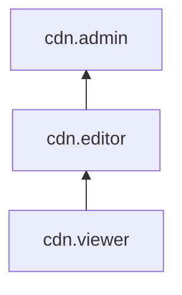

[Документация Yandex Cloud](../../index.md) > [Yandex Cloud CDN](../index.md) > Управление доступом

# Управление доступом в Cloud CDN

Для управления правами доступа в Cloud CDN используются [роли](../../iam/concepts/access-control/roles.md).

В этом разделе вы узнаете:

* [на какие ресурсы можно назначить роль](#resources);
* [какие роли действуют в сервисе](#roles-list);
* [какие роли необходимы](#required-roles) для того или иного действия.

## Об управлении доступом {#about-access-control}

Все операции в Yandex Cloud проверяются в сервисе [Yandex Identity and Access Management](../../iam/index.md). Если у субъекта нет необходимых разрешений, сервис вернет ошибку.

Чтобы выдать разрешения к ресурсу, [назначьте роли](../../iam/operations/roles/grant.md) на этот ресурс субъекту, который будет выполнять операции. Роли можно назначить [аккаунту на Яндексе](../../iam/concepts/users/accounts.md#passport), [сервисному аккаунту](../../iam/concepts/users/service-accounts.md), [локальному пользователю](../../iam/concepts/users/accounts.md#local), [федеративному пользователю](../../iam/concepts/federations.md), [группе пользователей](../../organization/operations/manage-groups.md), [системной группе](../../iam/concepts/access-control/system-group.md) или [публичной группе](../../iam/concepts/access-control/public-group.md). Подробнее читайте в разделе [Как устроено управление доступом в Yandex Cloud](../../iam/concepts/access-control/index.md).

Назначать роли на ресурс могут пользователи, у которых на этот ресурс есть хотя бы одна из ролей:

* `admin`;
* `resource-manager.admin`;
* `organization-manager.admin`;
* `resource-manager.clouds.owner`;
* `organization-manager.organizations.owner`.

## На какие ресурсы можно назначить роль {#resources}

Роль можно назначить на [организацию](../../organization/concepts/organization.md), [облако](../../resource-manager/concepts/resources-hierarchy.md#cloud) и [каталог](../../resource-manager/concepts/resources-hierarchy.md#folder). Роли, назначенные на организацию, облако или каталог, действуют и на вложенные ресурсы.

## Какие роли действуют в сервисе {#roles-list}

На диаграмме показано, какие роли есть в сервисе и как они наследуют разрешения друг друга. Например, в `editor` входят все разрешения `viewer`. После диаграммы дано описание каждой роли.

### Сервисные роли {#service-roles}

#### cdn.viewer {#cdn-viewer}

Роль `cdn.viewer` позволяет просматривать информацию о каталоге, [группах источников](../concepts/origins.md), [CDN-ресурсах](../concepts/resource.md) и [квотах](../concepts/limits.md#cdn-quotas) сервиса Cloud CDN.

#### cdn.editor {#cdn-editor}

Роль `cdn.editor` позволяет управлять ресурсами сервиса Cloud CDN, а также просматривать информацию о квотах сервиса и каталоге.

Пользователи с этой ролью могут:
* просматривать информацию о [группах источников](../concepts/origins.md), а также создавать, изменять и удалять их;
* просматривать информацию о [CDN-ресурсах](../concepts/resource.md), а также создавать, изменять и удалять их;
* управлять [выгрузкой логов](../concepts/logs.md) запросов к CDN-серверам;
* управлять [экранированием источников](../concepts/origins-shielding.md);
* просматривать информацию о [квотах](../concepts/limits.md#cdn-quotas) сервиса Cloud CDN;
* просматривать информацию о [каталоге](../../resource-manager/concepts/resources-hierarchy.md#folder).

Включает разрешения, предоставляемые ролью `cdn.viewer`.

#### cdn.admin {#cdn-admin}

Роль `cdn.admin` позволяет управлять ресурсами сервиса Cloud CDN, а также просматривать информацию о квотах сервиса и каталоге.

Пользователи с этой ролью могут:
* просматривать информацию о [группах источников](../concepts/origins.md), а также создавать, изменять и удалять их;
* просматривать информацию о [CDN-ресурсах](../concepts/resource.md), а также создавать, изменять и удалять их;
* управлять [выгрузкой логов](../concepts/logs.md) запросов к CDN-серверам;
* управлять [экранированием источников](../concepts/origins-shielding.md);
* просматривать информацию о [квотах](../concepts/limits.md#cdn-quotas) сервиса Cloud CDN;
* просматривать информацию о [каталоге](../../resource-manager/concepts/resources-hierarchy.md#folder).

Включает разрешения, предоставляемые ролью `cdn.editor`.

Позже роль получит дополнительные возможности.

### Примитивные роли {#primitive-roles}

Примитивные роли позволяют пользователям совершать действия во [всех сервисах](../../overview/concepts/services.md) Yandex Cloud.

#### auditor {#auditor}

Роль `auditor` предоставляет разрешения на чтение конфигурации и метаданных любых ресурсов Yandex Cloud без возможности доступа к данным.

Например, пользователи с этой ролью могут:
* просматривать информацию о [ресурсе](../../resource-manager/concepts/resources-hierarchy.md);
* просматривать метаданные ресурса;
* просматривать список операций с ресурсом.

Роль `auditor` — наиболее безопасная роль, исключающая доступ к данным [сервисов](../../overview/concepts/services.md). Роль подходит для пользователей, которым необходим минимальный уровень доступа к ресурсам Yandex Cloud.

#### viewer {#viewer}

Роль `viewer` предоставляет разрешения на чтение информации о любых [ресурсах](../../resource-manager/concepts/resources-hierarchy.md) Yandex Cloud.

Включает разрешения, предоставляемые ролью `auditor`.

В отличие от роли `auditor`, роль `viewer` предоставляет доступ к данным [сервисов](../../overview/concepts/services.md) в режиме чтения.

#### editor {#editor}

Роль `editor` предоставляет разрешения на управление любыми [ресурсами](../../resource-manager/concepts/resources-hierarchy.md) Yandex Cloud, кроме назначения ролей другим пользователям, передачи прав владения [организацией](../../organization/concepts/organization.md) и ее удаления, а также удаления [ключей шифрования](../../kms/concepts/index.md) Key Management Service.

Например, пользователи с этой ролью могут создавать, изменять и удалять ресурсы.

Включает разрешения, предоставляемые ролью `viewer`.

#### admin {#admin}

Роль `admin` позволяет назначать любые роли, кроме `resource-manager.clouds.owner` и `organization-manager.organizations.owner`, а также предоставляет разрешения на управление любыми [ресурсами](../../resource-manager/concepts/resources-hierarchy.md) Yandex Cloud, кроме передачи прав владения [организацией](../../organization/concepts/organization.md) и ее удаления.

Прежде чем назначить роль `admin` на организацию, [облако](../../resource-manager/concepts/resources-hierarchy.md#cloud) или [платежный аккаунт](../../billing/concepts/billing-account.md), ознакомьтесь с информацией о защите [привилегированных аккаунтов](../../security/standard/all.md#privileged-users).

Включает разрешения, предоставляемые ролью `editor`.

Вместо примитивных ролей мы рекомендуем использовать роли сервисов. Такой подход позволит более гранулярно управлять доступом и обеспечить соблюдение [принципа минимальных привилегий](../../security/standard/all.md#min-privileges).

Подробнее о примитивных ролях в [справочнике ролей Yandex Cloud](../../iam/roles-reference.md#primitive-roles).

## Какие роли мне необходимы {#required-roles}

В таблице ниже перечислено, какие роли нужны для выполнения указанного действия. Вы всегда можете назначить роль, которая дает более широкие разрешения, нежели указанная. Например, назначить `editor` вместо `viewer`.

Действие | Необходимые роли
-------- | --------
**Просмотр информации** | 
Просмотр информации о любом ресурсе | `cdn.viewer` на этот ресурс
**Управление CDN-ресурсами** | 
[Создание ресурса](../operations/resources/create-resource.md) | `cdn.editor` на каталог, где будут создаваться ресурсы
[Изменение основных настроек ресурса](../operations/resources/configure-basics.md) | `cdn.editor` на каталог с CDN-ресурсами
[Приостановить и возобновить работу ресурса](../operations/resources/disable-resource.md) | `cdn.editor` на каталог с CDN-ресурсами
[Настройка кеширования ресурса](../operations/resources/configure-caching.md) | `cdn.editor` на каталог с CDN-ресурсами
[Принудительная загрузка файлов в кеш CDN-серверов](../operations/resources/prefetch-files.md) | `cdn.editor` на каталог с CDN-ресурсами
[Очистка кеша ресурса](../operations/resources/purge-cache.md) | `cdn.editor` на каталог с CDN-ресурсами
[Настройка HTTP-заголовков запросов и ответов](../operations/resources/configure-headers.md) | `cdn.editor` на каталог с CDN-ресурсами
[Настройка CORS при ответах клиентам](../operations/resources/configure-cors.md) | `cdn.editor` на каталог с CDN-ресурсами
[Настройка HTTP-методов](../operations/resources/configure-http.md) | `cdn.editor` на каталог с CDN-ресурсами
[Включение сжатия файлов](../operations/resources/enable-compression.md) | `cdn.editor` на каталог с CDN-ресурсами
[Включение сегментации файлов](../operations/resources/enable-segmentation.md) | `cdn.editor` на каталог с CDN-ресурсами
**Управление группами источников** | 
[Создание группы источников](../operations/origin-groups/create-group.md) | `cdn.editor` на каталог с группой источников
[Изменение группы источников](../operations/origin-groups/edit-group.md) | `cdn.editor` на каталог с группой источников
[Подключение группы источников к ресурсу](../operations/origin-groups/bind-group-to-resource.md) | `cdn.editor` на каталог с CDN-ресурсом
[Удаление группы источников](../operations/origin-groups/delete-group.md) | `cdn.editor` на каталог с группой источников
**Управление платными функциями** | 
Экранирование источников | `cdn.editor` на каталог с CDN-ресурсами
Выгрузка логов | `cdn.editor` на каталог с CDN-ресурсами
**Управление доступом к ресурсам** | 
[Назначение роли](../../iam/operations/roles/grant.md), [отзыв роли](../../iam/operations/roles/revoke.md) и просмотр назначенных ролей на ресурс | `admin` на этот ресурс

#### Что дальше

* [Как назначить роль](../../iam/operations/roles/grant.md).
* [Как отозвать роль](../../iam/operations/roles/revoke.md).
* [Подробнее об управлении доступом в Yandex Cloud](../../iam/concepts/access-control/index.md).
* [Подробнее о наследовании ролей](../../resource-manager/concepts/resources-hierarchy.md#access-rights-inheritance).