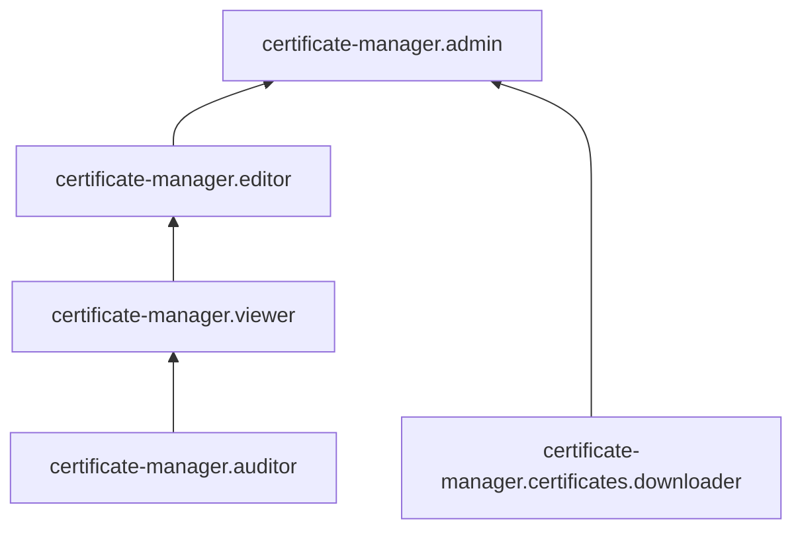

# Управление доступом в {{ certificate-manager-name }}

В этом разделе вы узнаете:
* [на какие ресурсы можно назначить роль](#resources);
* [какие роли действуют в сервисе](#roles-list);
* [какие роли необходимы](#choosing-roles) для того или иного действия.

## Об управлении доступом {#about-access-control}

Все операции в {{ yandex-cloud }} проверяются в сервисе [{{ iam-full-name }}](../../iam/index.md). Если у субъекта нет необходимых разрешений, сервис вернет ошибку.

Чтобы выдать разрешения к ресурсу, [назначьте роли](../../iam/operations/roles/grant.md) на этот ресурс субъекту, который будет выполнять операции. Роли можно назначить [аккаунту на Яндексе](../../iam/concepts/users/accounts.md#passport), [сервисному аккаунту](../../iam/concepts/users/service-accounts.md), [локальному пользователю](../../iam/concepts/users/accounts.md#local), [федеративному пользователю](../../iam/concepts/federations.md), [группе пользователей](../../organization/operations/manage-groups.md), [системной группе](../../iam/concepts/access-control/system-group.md) или [публичной группе](../../iam/concepts/access-control/public-group.md). Подробнее читайте в разделе [{#T}](../../iam/concepts/access-control/index.md).

Назначать роли на ресурс могут пользователи, у которых на этот ресурс есть роль `certificate-manager.admin` или одна из следующих ролей:

* `admin`;
* `resource-manager.admin`;
* `organization-manager.admin`;
* `resource-manager.clouds.owner`;
* `organization-manager.organizations.owner`.

## На какие ресурсы можно назначить роль {#resources}

Роль можно назначить на [организацию](../../organization/concepts/organization.md), [облако](../../resource-manager/concepts/resources-hierarchy.md#cloud) и [каталог](../../resource-manager/concepts/resources-hierarchy.md#folder). Роли, назначенные на организацию, облако или каталог, действуют и на вложенные ресурсы.

На [сертификат от Let's Encrypt](../concepts/managed-certificate.md) и [пользовательский сертификат](../concepts/imported-certificate.md) роль можно назначить через {{ yandex-cloud }} [CLI](../../cli/cli-ref/certificate-manager/cli-ref/certificate/add-access-binding.md), [{{ TF }}]({{ tf-provider-resources-link }}/cm_certificate_iam_binding) или [API](../api-ref/authentication.md).

## Какие роли действуют в сервисе {#roles-list}

На диаграмме показано, какие роли есть в сервисе и как они наследуют разрешения друг друга. Например, в `{{ roles-editor }}` входят все разрешения `{{ roles-viewer }}`. После диаграммы дано описание каждой роли.

### Сервисные роли {#service-roles}

#### certificate-manager.auditor {#certificate-manager-auditor}

Роль `certificate-manager.auditor` позволяет просматривать информацию о сертификатах и назначенных правах доступа к ним.

Пользователи с этой ролью могут:
* просматривать список [сертификатов](../concepts/index.md#types) и [зависимых](../concepts/services.md) ресурсов, а также информацию о сертификатах и о назначенных [правах доступа](../../iam/concepts/access-control/index.md) к ним;
* просматривать информацию о [квотах](../concepts/limits.md#certificate-manager-quotas) сервиса {{ certificate-manager-name }}.

#### certificate-manager.viewer {#certificate-manager-viewer}

Роль `certificate-manager.viewer` позволяет просматривать информацию о сертификатах и назначенных правах доступа к ним.

Пользователи с этой ролью могут:
* просматривать список [сертификатов](../concepts/index.md#types) и [зависимых](../concepts/services.md) ресурсов, а также информацию о сертификатах и о назначенных [правах доступа](../../iam/concepts/access-control/index.md) к ним;
* просматривать информацию о [квотах](../concepts/limits.md#certificate-manager-quotas) сервиса {{ certificate-manager-name }}.

Включает разрешения, предоставляемые ролью `certificate-manager.auditor`.

#### certificate-manager.editor {#certificate-manager-editor}

Роль `certificate-manager.editor` позволяет управлять сертификатами, просматривать информацию о них, о назначенных правах доступа к ним и о квотах сервиса {{ certificate-manager-name }}.

Пользователи с этой ролью могут:
* просматривать список [сертификатов](../concepts/index.md#types) и [зависимых](../concepts/services.md) ресурсов, а также информацию о сертификатах и назначенных [правах доступа](../../iam/concepts/access-control/index.md) к ним;
* добавлять, изменять, обновлять и удалять сертификаты;
* просматривать информацию о [квотах](../concepts/limits.md#certificate-manager-quotas) сервиса {{ certificate-manager-name }}.

Включает разрешения, предоставляемые ролью `certificate-manager.viewer`.

#### certificate-manager.admin {#certificate-manager-admin}

Роль `certificate-manager.admin` позволяет управлять сертификатами и доступом к ним, а также получать содержимое сертификатов.

Пользователи с этой ролью могут:
* просматривать список [сертификатов](../concepts/index.md#types) и [зависимых](../concepts/services.md) ресурсов, а также информацию о сертификатах;
* просматривать информацию о назначенных [правах доступа](../../iam/concepts/access-control/index.md) к сертификатам и изменять такие права доступа;
* добавлять, изменять, обновлять и удалять сертификаты;
* получать содержимое сертификатов;
* просматривать информацию о [квотах](../concepts/limits.md#certificate-manager-quotas) сервиса {{ certificate-manager-name }};
* просматривать информацию о [каталоге](../../resource-manager/concepts/resources-hierarchy.md#folder).

Включает разрешения, предоставляемые ролью `certificate-manager.editor`.

#### certificate-manager.certificates.downloader {#certificate-manager-certificates-downloader}

Роль `certificate-manager.certificates.downloader` позволяет просматривать список [сертификатов](../concepts/index.md#types) и информацию о них, а также получать содержимое сертификатов.

### Примитивные роли {#primitive-roles}

Примитивные роли позволяют пользователям совершать действия во [всех сервисах](../../overview/concepts/services.md) {{ yandex-cloud }}.

#### {{ roles-auditor }} {#auditor}

Роль `auditor` предоставляет разрешения на чтение конфигурации и метаданных любых ресурсов Yandex Cloud без возможности доступа к данным.

Например, пользователи с этой ролью могут:
* просматривать информацию о [ресурсе]({{ link-docs }}/resource-manager/concepts/resources-hierarchy);
* просматривать метаданные ресурса;
* просматривать список операций с ресурсом.

Роль `auditor` — наиболее безопасная роль, исключающая доступ к данным [сервисов]({{ link-docs }}/overview/concepts/services). Роль подходит для пользователей, которым необходим минимальный уровень доступа к ресурсам Yandex Cloud.

#### {{ roles-viewer }} {#viewer}

Роль `viewer` предоставляет разрешения на чтение информации о любых [ресурсах]({{ link-docs }}/resource-manager/concepts/resources-hierarchy) Yandex Cloud.

Включает разрешения, предоставляемые ролью `auditor`.

В отличие от роли `auditor`, роль `viewer` предоставляет доступ к данным [сервисов]({{ link-docs }}/overview/concepts/services) в режиме чтения.

#### {{ roles-editor }} {#editor}

Роль `editor` предоставляет разрешения на управление любыми [ресурсами]({{ link-docs }}/resource-manager/concepts/resources-hierarchy) Yandex Cloud, кроме назначения ролей другим пользователям, передачи прав владения [организацией]({{ link-docs }}/organization/concepts/organization) и ее удаления, а также удаления [ключей шифрования]({{ link-docs }}/kms/concepts/) Key Management Service.

Например, пользователи с этой ролью могут создавать, изменять и удалять ресурсы.

Включает разрешения, предоставляемые ролью `viewer`.

#### {{ roles-admin }} {#admin}

Роль `admin` позволяет назначать любые роли, кроме `resource-manager.clouds.owner` и `organization-manager.organizations.owner`, а также предоставляет разрешения на управление любыми [ресурсами]({{ link-docs }}/resource-manager/concepts/resources-hierarchy) Yandex Cloud, кроме передачи прав владения [организацией]({{ link-docs }}/organization/concepts/organization) и ее удаления.

Прежде чем назначить роль `admin` на организацию, [облако]({{ link-docs }}/resource-manager/concepts/resources-hierarchy#cloud) или [платежный аккаунт]({{ link-docs }}/billing/concepts/billing-account), ознакомьтесь с информацией о защите [привилегированных аккаунтов]({{ link-docs }}/security/standard/all#privileged-users).

Включает разрешения, предоставляемые ролью `editor`.

Вместо примитивных ролей мы рекомендуем использовать роли сервисов. Такой подход позволит более гранулярно управлять доступом и обеспечить соблюдение [принципа минимальных привилегий](../../security/standard/all.md#min-privileges).

Подробнее о примитивных ролях см. в [справочнике ролей {{ yandex-cloud }}](../../iam/roles-reference.md#primitive-roles).

## Какие роли мне необходимы {#choosing-roles}

В таблице ниже перечислено, какие роли нужны для выполнения указанного действия. Вы всегда можете назначить роль, которая дает более широкие разрешения, нежели указанная. Например, назначить `editor` вместо `viewer`.

Действие | Методы | Необходимые роли
----- | ----- | -----
**Certificate Manager** | | 
Получение списков сертификатов | `list` | `viewer` на каталог
Получение информации о сертификате | `get` | `viewer` на сертификат или каталог
[Добавление](../operations/managed/cert-create.md) сертификата от Let's Encrypt | `requestNew` | `editor` на каталог
[Изменение](../operations/managed/cert-modify.md), [удаление](../operations/managed/cert-delete.md) сертификата от Let's Encrypt | `update`, `delete` | `editor` на сертификат или каталог
[Добавление](../operations/import/cert-create.md) пользовательского сертификата | `create` | `editor` на каталог
[Обновление](../operations/import/cert-update.md), [изменение](../operations/import/cert-modify.md), [удаление](../operations/import/cert-delete.md) пользовательского сертификата | `update`, `delete` | `editor` на сертификат или каталог
Получение содержимого сертификата: [пользовательского](../operations/import/cert-get-content.md) или [сертификата от Let's Encrypt](../operations/managed/cert-get-content.md) | `get-content` | `certificate-manager.certificates.downloader` на сертификат или каталог
**IAM** | |
[Назначение роли](../../iam/operations/roles/grant.md), [отзыв роли](../../iam/operations/roles/revoke.md) и просмотр назначенных ролей на каталог или облако | `setAccessBinding`, `updateAccessBindings`, `listAccessBindings` | `admin` или `certificate-manager.admin` на сертификат или каталог 

#### Что дальше {what-is-next}

* [Как назначить роль](../../iam/operations/roles/grant.md).
* [Как отозвать роль](../../iam/operations/roles/revoke.md).
* [Подробнее об управлении доступом в {{ yandex-cloud }}](../../iam/concepts/access-control/index.md).
* [Подробнее о наследовании ролей](../../resource-manager/concepts/resources-hierarchy.md#access-rights-inheritance).