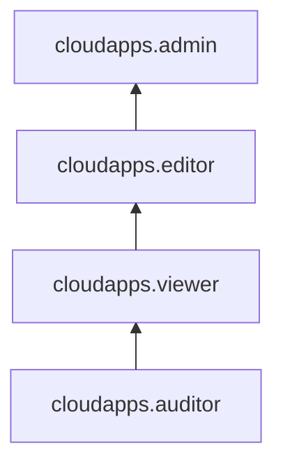

# Управление доступом в {{ cloud-apps-full-name }}

Пользователь {{ yandex-cloud }} может выполнять только те операции над ресурсами, которые разрешены назначенными ему [ролями](../../iam/concepts/access-control/roles.md). Пока у пользователя нет никаких ролей, почти все операции ему запрещены.

Чтобы разрешить доступ к ресурсам сервиса {{ cloud-apps-name }}, назначьте аккаунту на Яндексе, [сервисному аккаунту](../../iam/concepts/users/service-accounts.md), [федеративным](../../iam/concepts/users/accounts.md#saml-federation) или [локальным](../../iam/concepts/users/accounts.md#local) пользователям, [группе пользователей](../../organization/operations/manage-groups.md), [системной группе](../../iam/concepts/access-control/system-group.md) или [публичной группе](../../iam/concepts/access-control/public-group.md) нужные роли из приведенного ниже списка. На данный момент роль может быть назначена только на родительский ресурс (каталог или облако), роли которого наследуются вложенными ресурсами.

Подробнее о наследовании ролей читайте в разделе [Наследование прав доступа](../../resource-manager/concepts/resources-hierarchy.md#access-rights-inheritance) документации сервиса {{ resmgr-name }}.

## Какие роли действуют в сервисе {#roles-list}

Для управления правами доступа в {{ cloud-apps-name }} можно использовать как сервисные, так и примитивные роли.

### Сервисные роли {#service-roles}

#### cloudapps.auditor {#cloudapps-auditor}

Роль `cloudapps.auditor` позволяет просматривать метаданные установленных приложений {{ cloud-apps-name }}.

#### cloudapps.viewer {#cloudapps-viewer}

Роль `cloudapps.viewer` позволяет просматривать информацию об установленных приложениях {{ cloud-apps-name }}.

Включает разрешения, предоставляемые ролью `cloudapps.auditor`.

#### cloudapps.editor {#cloudapps-editor}

Роль `cloudapps.editor` позволяет просматривать информацию об установленных приложениях {{ cloud-apps-name }}, а также создавать, изменять и удалять такие приложения.

Включает разрешения, предоставляемые ролью `cloudapps.viewer`.

#### cloudapps.admin {#cloudapps-admin}

Роль `cloudapps.admin` позволяет просматривать информацию об установленных приложениях {{ cloud-apps-name }}, а также создавать, изменять и удалять такие приложения.

Включает разрешения, предоставляемые ролью `cloudapps.editor`.

### Примитивные роли {#primitive-roles}

Примитивные роли позволяют пользователям совершать действия во [всех сервисах](../../overview/concepts/services.md) {{ yandex-cloud }}.

#### {{ roles-auditor }} {#auditor}

Роль `auditor` предоставляет разрешения на чтение конфигурации и метаданных любых ресурсов Yandex Cloud без возможности доступа к данным.

Например, пользователи с этой ролью могут:
* просматривать информацию о [ресурсе]({{ link-docs }}/resource-manager/concepts/resources-hierarchy);
* просматривать метаданные ресурса;
* просматривать список операций с ресурсом.

Роль `auditor` — наиболее безопасная роль, исключающая доступ к данным [сервисов]({{ link-docs }}/overview/concepts/services). Роль подходит для пользователей, которым необходим минимальный уровень доступа к ресурсам Yandex Cloud.

#### {{ roles-viewer }} {#viewer}

Роль `viewer` предоставляет разрешения на чтение информации о любых [ресурсах]({{ link-docs }}/resource-manager/concepts/resources-hierarchy) Yandex Cloud.

Включает разрешения, предоставляемые ролью `auditor`.

В отличие от роли `auditor`, роль `viewer` предоставляет доступ к данным [сервисов]({{ link-docs }}/overview/concepts/services) в режиме чтения.

#### {{ roles-editor }} {#editor}

Роль `editor` предоставляет разрешения на управление любыми [ресурсами]({{ link-docs }}/resource-manager/concepts/resources-hierarchy) Yandex Cloud, кроме назначения ролей другим пользователям, передачи прав владения [организацией]({{ link-docs }}/organization/concepts/organization) и ее удаления, а также удаления [ключей шифрования]({{ link-docs }}/kms/concepts/) Key Management Service.

Например, пользователи с этой ролью могут создавать, изменять и удалять ресурсы.

Включает разрешения, предоставляемые ролью `viewer`.

#### {{ roles-admin }} {#admin}

Роль `admin` позволяет назначать любые роли, кроме `resource-manager.clouds.owner` и `organization-manager.organizations.owner`, а также предоставляет разрешения на управление любыми [ресурсами]({{ link-docs }}/resource-manager/concepts/resources-hierarchy) Yandex Cloud, кроме передачи прав владения [организацией]({{ link-docs }}/organization/concepts/organization) и ее удаления.

Прежде чем назначить роль `admin` на организацию, [облако]({{ link-docs }}/resource-manager/concepts/resources-hierarchy#cloud) или [платежный аккаунт]({{ link-docs }}/billing/concepts/billing-account), ознакомьтесь с информацией о защите [привилегированных аккаунтов]({{ link-docs }}/security/standard/all#privileged-users).

Включает разрешения, предоставляемые ролью `editor`.

Вместо примитивных ролей мы рекомендуем использовать роли сервисов. Такой подход позволит более гранулярно управлять доступом и обеспечить соблюдение [принципа минимальных привилегий](../../security/standard/all.md#min-privileges).

Подробнее о примитивных ролях см. в [справочнике ролей {{ yandex-cloud }}](../../iam/roles-reference.md#primitive-roles).

## См. также {#see-also}

[Структура ресурсов {{ yandex-cloud }}](../../resource-manager/concepts/resources-hierarchy.md)