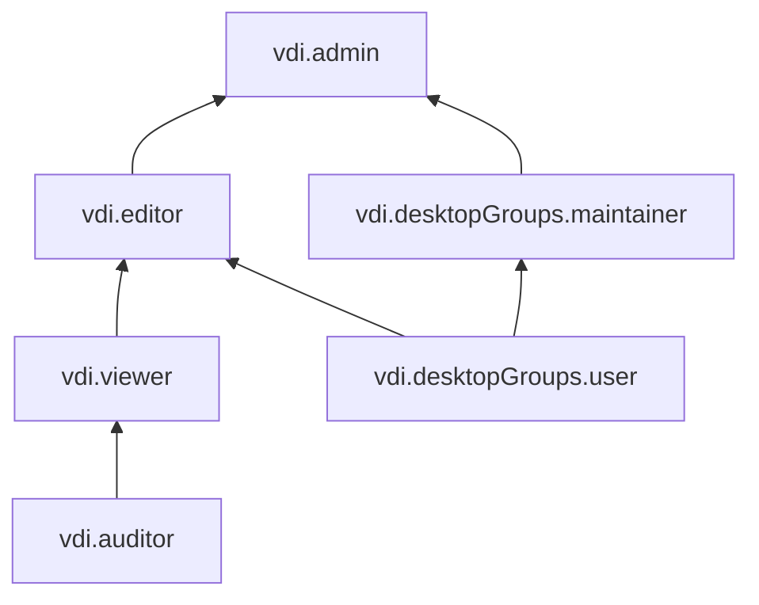

# Управление доступом в Yandex Cloud Desktop

В Cloud Desktop управление доступом реализовано с помощью разграничения ролей Yandex Identity and Access Management и [списков управления доступом (ACL)](../concepts/acl.md). [Пример использования механизмов доступа](../concepts/acl.md#example).

В этом разделе вы узнаете:
* [на какие ресурсы можно назначить роль](#resources);
* [какие роли действуют в сервисе](#roles-list).

## Об управлении доступом {#about-access-control}

Все операции в Yandex Cloud проверяются в сервисе [Yandex Identity and Access Management](../../iam/index.md). Если у субъекта нет необходимых разрешений, сервис вернет ошибку.

Чтобы выдать разрешения к ресурсу, [назначьте роли](../../iam/operations/roles/grant.md) на этот ресурс субъекту, который будет выполнять операции. Роли можно назначить [аккаунту на Яндексе](../../iam/concepts/users/accounts.md#passport), [сервисному аккаунту](../../iam/concepts/users/service-accounts.md), [локальному пользователю](../../iam/concepts/users/accounts.md#local), [федеративному пользователю](../../iam/concepts/federations.md), [группе пользователей](../../organization/operations/manage-groups.md), [системной группе](../../iam/concepts/access-control/system-group.md) или [публичной группе](../../iam/concepts/access-control/public-group.md). Подробнее читайте в разделе [Как устроено управление доступом в Yandex Cloud](../../iam/concepts/access-control/index.md).

## На какие ресурсы можно назначить роль {#resources}

Роль можно назначить на [организацию](../../organization/concepts/organization.md), [облако](../../resource-manager/concepts/resources-hierarchy.md#cloud) и [каталог](../../resource-manager/concepts/resources-hierarchy.md#folder). Роли, назначенные на организацию, облако или каталог, действуют и на вложенные ресурсы.

На [группу рабочих столов](../concepts/desktops-and-groups.md) роль можно назначить через [консоль управления](https://console.yandex.cloud), Yandex Cloud [CLI](../../cli/cli-ref/desktops/cli-ref/group/add-access-bindings.md) или [API](../api-ref/authentication.md).

## Какие роли действуют в сервисе {#roles-list}

### Сервисные роли {#service-roles}

#### vdi.viewer {#vdi-viewer}

Роль `vdi.viewer` позволяет просматривать информацию о рабочих столах и группах рабочих столов.

Пользователи с этой ролью могут:
* просматривать информацию о группах рабочих столов и назначенных [правах доступа](../../iam/concepts/access-control/index.md) к таким группам;
* просматривать информацию о [рабочих столах](../concepts/desktops-and-groups.md);
* просматривать информацию о [квотах](../concepts/limits.md#quotas) сервиса Cloud Desktop.

Включает разрешения, предоставляемые ролью `vdi.auditor`.

#### vdi.desktopGroups.maintainer {#vdi-desktopGroups-maintainer}

Роль `vdi.desktopGroups.maintainer` позволяет использовать любые рабочие столы в группе рабочих столов.

Пользователи с этой ролью могут:
* закрепить за собой один [рабочий стол](../concepts/desktops-and-groups.md) в каждой группе рабочих столов;
* подключаться к своим рабочим столам;
* запускать, перезапускать и останавливать любые рабочие столы в группе;
* сбрасывать пароль на любых рабочих столах в группе.

Включает разрешения, предоставляемые ролью `vdi.desktopGroups.user`.

#### vdi.desktopGroups.user {#vdi-desktopGroups-user}

Роль `vdi.desktopGroups.user` позволяет использовать свои рабочие столы.

Пользователи с этой ролью могут:
* закрепить за собой один [рабочий стол](../concepts/desktops-and-groups.md) в каждой группе рабочих столов;
* подключаться к своим рабочим столам;
* запускать, перезапускать и останавливать свои рабочие столы;
* сбрасывать пароль на своих рабочих столах.

#### vdi.editor {#vdi-editor}

Роль `vdi.editor` позволяет управлять группами рабочих столов и рабочими столами, а также использовать свои рабочие столы.

Пользователи с этой ролью могут:
* просматривать информацию о [группах рабочих столов](../concepts/desktops-and-groups.md), а также создавать, изменять и удалять такие группы; при этом в число пользователей группы рабочих столов пользователь с этой ролью может либо добавить только себя, либо оставить это поле пустым;
* просматривать информацию о назначенных [правах доступа](../../iam/concepts/access-control/index.md) к группам рабочих столов;
* просматривать информацию о [рабочих столах](../concepts/desktops-and-groups.md), а также создавать, изменять и удалять их;
* закреплять за собой любое количество рабочих столов в группе;
* подключаться к своим рабочим столам;
* запускать, перезапускать и останавливать свои рабочие столы;
* сбрасывать пароль на своих рабочих столах;
* просматривать информацию о [квотах](../concepts/limits.md#quotas) сервиса Cloud Desktop.

Включает разрешения, предоставляемые ролями `vdi.viewer` и `vdi.desktopGroups.user`.

#### vdi.admin {#vdi-admin}

Роль `vdi.admin` позволяет управлять группами рабочих столов и доступом к ним, а также управлять рабочими столами и использовать их.

Пользователи с этой ролью могут:
* просматривать информацию о [группах рабочих столов](../concepts/desktops-and-groups.md), а также создавать, изменять и удалять такие группы;
* просматривать информацию о назначенных [правах доступа](../../iam/concepts/access-control/index.md) к группам рабочих столов, а также изменять такие права доступа;
* просматривать информацию о [рабочих столах](../concepts/desktops-and-groups.md), а также создавать, изменять и удалять их;
* закреплять как за собой, так и за любым пользователем любое количество рабочих столов в группе рабочих столов;
* подключаться к своим рабочим столам;
* запускать, перезапускать и останавливать любые рабочие столы в группе;
* сбрасывать пароль на любых рабочих столах в группе;
* просматривать информацию о [квотах](../concepts/limits.md#quotas) сервиса Cloud Desktop;
* просматривать информацию о [каталоге](../../resource-manager/concepts/resources-hierarchy.md#folder).

Включает разрешения, предоставляемые ролями `vdi.editor` и `vdi.desktopGroups.maintainer`.

Более подробную информацию о сервисных ролях читайте на странице [Роли](../../iam/concepts/access-control/roles.md) в документации сервиса Yandex Identity and Access Management.

### Примитивные роли {#primitive-roles}

Примитивные роли позволяют пользователям совершать действия во [всех сервисах](../../overview/concepts/services.md) Yandex Cloud.

#### auditor {#auditor}

Роль `auditor` предоставляет разрешения на чтение конфигурации и метаданных любых ресурсов Yandex Cloud без возможности доступа к данным.

Например, пользователи с этой ролью могут:
* просматривать информацию о [ресурсе](../../resource-manager/concepts/resources-hierarchy.md);
* просматривать метаданные ресурса;
* просматривать список операций с ресурсом.

Роль `auditor` — наиболее безопасная роль, исключающая доступ к данным [сервисов](../../overview/concepts/services.md). Роль подходит для пользователей, которым необходим минимальный уровень доступа к ресурсам Yandex Cloud.

#### viewer {#viewer}

Роль `viewer` предоставляет разрешения на чтение информации о любых [ресурсах](../../resource-manager/concepts/resources-hierarchy.md) Yandex Cloud.

Включает разрешения, предоставляемые ролью `auditor`.

В отличие от роли `auditor`, роль `viewer` предоставляет доступ к данным [сервисов](../../overview/concepts/services.md) в режиме чтения.

#### editor {#editor}

Роль `editor` предоставляет разрешения на управление любыми [ресурсами](../../resource-manager/concepts/resources-hierarchy.md) Yandex Cloud, кроме назначения ролей другим пользователям, передачи прав владения [организацией](../../organization/concepts/organization.md) и ее удаления, а также удаления [ключей шифрования](../../kms/concepts/index.md) Key Management Service.

Например, пользователи с этой ролью могут создавать, изменять и удалять ресурсы.

Включает разрешения, предоставляемые ролью `viewer`.

#### admin {#admin}

Роль `admin` позволяет назначать любые роли, кроме `resource-manager.clouds.owner` и `organization-manager.organizations.owner`, а также предоставляет разрешения на управление любыми [ресурсами](../../resource-manager/concepts/resources-hierarchy.md) Yandex Cloud, кроме передачи прав владения [организацией](../../organization/concepts/organization.md) и ее удаления.

Прежде чем назначить роль `admin` на организацию, [облако](../../resource-manager/concepts/resources-hierarchy.md#cloud) или [платежный аккаунт](../../billing/concepts/billing-account.md), ознакомьтесь с информацией о защите [привилегированных аккаунтов](../../security/standard/all.md#privileged-users).

Включает разрешения, предоставляемые ролью `editor`.

Вместо примитивных ролей мы рекомендуем использовать роли сервисов. Такой подход позволит более гранулярно управлять доступом и обеспечить соблюдение [принципа минимальных привилегий](../../security/standard/all.md#min-privileges).

Подробнее о примитивных ролях в [справочнике ролей Yandex Cloud](../../iam/roles-reference.md#primitive-roles).

#### Что дальше {#what-is-next}

* [Как назначить роль](../../iam/operations/roles/grant.md).
* [Как отозвать роль](../../iam/operations/roles/revoke.md).
* [Подробнее об управлении доступом в Yandex Cloud](../../iam/concepts/access-control/index.md).
* [Подробнее о наследовании ролей](../../resource-manager/concepts/resources-hierarchy.md#access-rights-inheritance).