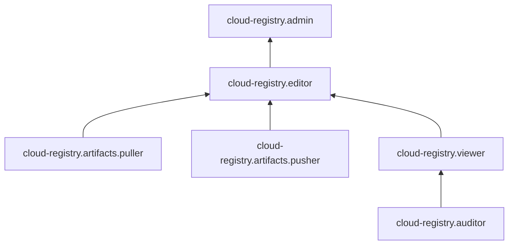

[Документация Yandex Cloud](../../index.md) > [Yandex Cloud Registry](../index.md) > Управление доступом

# Управление доступом в Yandex Cloud Registry

Для управления правами доступа в Cloud Registry используются [роли](../../iam/concepts/access-control/roles.md).

В этом разделе вы узнаете:

* [на какие ресурсы можно назначить роль](#resources);
* [какие роли действуют в сервисе](#roles-list).

## Об управлении доступом {#about-access-control}

Все операции в Yandex Cloud проверяются в сервисе [Yandex Identity and Access Management](../../iam/index.md). Если у субъекта нет необходимых разрешений, сервис вернет ошибку.

Чтобы выдать разрешения к ресурсу, [назначьте роли](../../iam/operations/roles/grant.md) на этот ресурс субъекту, который будет выполнять операции. Роли можно назначить [аккаунту на Яндексе](../../iam/concepts/users/accounts.md#passport), [сервисному аккаунту](../../iam/concepts/users/service-accounts.md), [локальному пользователю](../../iam/concepts/users/accounts.md#local), [федеративному пользователю](../../iam/concepts/federations.md), [группе пользователей](../../organization/operations/manage-groups.md), [системной группе](../../iam/concepts/access-control/system-group.md) или [публичной группе](../../iam/concepts/access-control/public-group.md). Подробнее читайте в разделе [Как устроено управление доступом в Yandex Cloud](../../iam/concepts/access-control/index.md).

Назначать роли на ресурс могут пользователи, у которых на этот ресурс есть роль `cloud-registry.admin` или одна из следующих ролей:

* `admin`;
* `resource-manager.admin`;
* `organization-manager.admin`;
* `resource-manager.clouds.owner`;
* `organization-manager.organizations.owner`.

## На какие ресурсы можно назначить роль {#resources}

Роль можно назначить на [организацию](../../organization/concepts/organization.md), [облако](../../resource-manager/concepts/resources-hierarchy.md#cloud) и [каталог](../../resource-manager/concepts/resources-hierarchy.md#folder). Роли, назначенные на организацию, облако или каталог, действуют и на вложенные ресурсы.



Подробнее о наследовании ролей читайте в разделе [Наследование прав доступа](../../resource-manager/concepts/resources-hierarchy.md#access-rights-inheritance) документации сервиса Resource Manager.



Кроме этого, роль можно назначить на [реестры Cloud Registry](../concepts/registry.md), а также на папки внутри реестров.

## Какие роли действуют в сервисе {#roles-list}

Для управления правами доступа в Cloud Registry можно использовать как сервисные, так и примитивные роли.

### Сервисные роли {#service-roles}

#### cloud-registry.auditor {#cloud-registry-auditor}

Роль `cloud-registry.auditor` позволяет просматривать метаданные артефактов, информацию о реестрах и назначенных правах доступа к ним, а также о квотах сервиса Cloud Registry.

Пользователи с этой ролью могут:
* просматривать метаданные [артефактов](../concepts/artifacts/index.md);
* просматривать информацию о [реестрах](../concepts/registry.md);
* просматривать список IP-разрешений реестров;
* просматривать информацию о назначенных [правах доступа](../../iam/concepts/access-control/index.md) к реестрам и папкам внутри реестров;
* просматривать информацию о квотах сервиса Cloud Registry;
* просматривать информацию об [облаке](../../resource-manager/concepts/resources-hierarchy.md#cloud) и [каталоге](../../resource-manager/concepts/resources-hierarchy.md#folder).

#### cloud-registry.viewer {#cloud-registry-viewer}

Роль `cloud-registry.viewer` позволяет скачивать артефакты, просматривать информацию об артефактах и реестрах, о назначенных правах доступа к реестрам, а также о квотах сервиса Cloud Registry.

Пользователи с этой ролью могут:
* просматривать информацию об [артефактах](../concepts/artifacts/index.md) и скачивать их;
* просматривать информацию о [реестрах](../concepts/registry.md);
* просматривать список IP-разрешений реестров;
* просматривать информацию о назначенных [правах доступа](../../iam/concepts/access-control/index.md) к реестрам и папкам внутри реестров;
* просматривать информацию о квотах сервиса Cloud Registry;
* просматривать информацию об [облаке](../../resource-manager/concepts/resources-hierarchy.md#cloud) и [каталоге](../../resource-manager/concepts/resources-hierarchy.md#folder).

Включает разрешения, предоставляемые ролью `cloud-registry.auditor`.

#### cloud-registry.editor {#cloud-registry-editor}

Роль `cloud-registry.editor` позволяет управлять артефактами и реестрами, а также просматривать информацию о назначенных правах доступа к реестрам и квотах сервиса Cloud Registry.

Пользователи с этой ролью могут:
* просматривать информацию об [артефактах](../concepts/artifacts/index.md), а также создавать, изменять, скачивать и удалять их;
* просматривать информацию о [реестрах](../concepts/registry.md), а также создавать, изменять и удалять их;
* создавать и удалять папки внутри реестров;
* просматривать список IP-разрешений реестров;
* просматривать информацию о назначенных [правах доступа](../../iam/concepts/access-control/index.md) к реестрам и папкам внутри реестров;
* просматривать информацию о квотах сервиса Cloud Registry;
* просматривать информацию об [облаке](../../resource-manager/concepts/resources-hierarchy.md#cloud) и [каталоге](../../resource-manager/concepts/resources-hierarchy.md#folder).

Включает разрешения, предоставляемые ролями `cloud-registry.viewer` и `cloud-registry.artifacts.pusher`.

#### cloud-registry.admin {#cloud-registry-admin}

Роль `cloud-registry.admin` позволяет управлять артефактами, реестрами и доступом к реестрам, а также просматривать информацию о квотах сервиса Cloud Registry.

Пользователи с этой ролью могут:
* просматривать информацию об [артефактах](../concepts/artifacts/index.md), а также создавать, изменять, скачивать и удалять их;
* просматривать информацию о [реестрах](../concepts/registry.md), а также создавать, изменять и удалять их;
* просматривать информацию о назначенных [правах доступа](../../iam/concepts/access-control/index.md) к реестрам и папкам внутри реестров, а также изменять такие права доступа;
* создавать и удалять папки внутри реестров;
* просматривать и изменять список IP-разрешений реестров;
* просматривать информацию о квотах сервиса Cloud Registry;
* просматривать информацию об [облаке](../../resource-manager/concepts/resources-hierarchy.md#cloud) и [каталоге](../../resource-manager/concepts/resources-hierarchy.md#folder).

Включает разрешения, предоставляемые ролью `cloud-registry.editor`.

#### cloud-registry.artifacts.puller {#cloud-registry-artifacts-puller}

Роль `cloud-registry.artifacts.puller` позволяет скачивать [артефакты](../concepts/artifacts/index.md), а также получать информацию об артефактах и [реестрах](../concepts/registry.md).

#### cloud-registry.artifacts.pusher {#cloud-registry-artifacts-pusher}

Роль `cloud-registry.artifacts.pusher` позволяет управлять артефактами, а также просматривать информацию о реестрах и управлять папками в них.

Пользователи с этой ролью могут:
* просматривать информацию об [артефактах](../concepts/artifacts/index.md), а также создавать, изменять, скачивать и удалять их;
* просматривать информацию о [реестрах](../concepts/registry.md);
* создавать и удалять папки внутри реестров.

### Примитивные роли {#primitive-roles}

Примитивные роли позволяют пользователям совершать действия во [всех сервисах](../../overview/concepts/services.md) Yandex Cloud.

#### auditor {#auditor}

Роль `auditor` предоставляет разрешения на чтение конфигурации и метаданных любых ресурсов Yandex Cloud без возможности доступа к данным.

Например, пользователи с этой ролью могут:
* просматривать информацию о [ресурсе](../../resource-manager/concepts/resources-hierarchy.md);
* просматривать метаданные ресурса;
* просматривать список операций с ресурсом.

Роль `auditor` — наиболее безопасная роль, исключающая доступ к данным [сервисов](../../overview/concepts/services.md). Роль подходит для пользователей, которым необходим минимальный уровень доступа к ресурсам Yandex Cloud.

#### viewer {#viewer}

Роль `viewer` предоставляет разрешения на чтение информации о любых [ресурсах](../../resource-manager/concepts/resources-hierarchy.md) Yandex Cloud.

Включает разрешения, предоставляемые ролью `auditor`.

В отличие от роли `auditor`, роль `viewer` предоставляет доступ к данным [сервисов](../../overview/concepts/services.md) в режиме чтения.

#### editor {#editor}

Роль `editor` предоставляет разрешения на управление любыми [ресурсами](../../resource-manager/concepts/resources-hierarchy.md) Yandex Cloud, кроме назначения ролей другим пользователям, передачи прав владения [организацией](../../organization/concepts/organization.md) и ее удаления, а также удаления [ключей шифрования](../../kms/concepts/index.md) Key Management Service.

Например, пользователи с этой ролью могут создавать, изменять и удалять ресурсы.

Включает разрешения, предоставляемые ролью `viewer`.

#### admin {#admin}

Роль `admin` позволяет назначать любые роли, кроме `resource-manager.clouds.owner` и `organization-manager.organizations.owner`, а также предоставляет разрешения на управление любыми [ресурсами](../../resource-manager/concepts/resources-hierarchy.md) Yandex Cloud, кроме передачи прав владения [организацией](../../organization/concepts/organization.md) и ее удаления.

Прежде чем назначить роль `admin` на организацию, [облако](../../resource-manager/concepts/resources-hierarchy.md#cloud) или [платежный аккаунт](../../billing/concepts/billing-account.md), ознакомьтесь с информацией о защите [привилегированных аккаунтов](../../security/standard/all.md#privileged-users).

Включает разрешения, предоставляемые ролью `editor`.

Вместо примитивных ролей мы рекомендуем использовать роли сервисов. Такой подход позволит более гранулярно управлять доступом и обеспечить соблюдение [принципа минимальных привилегий](../../security/standard/all.md#min-privileges).

Подробнее о примитивных ролях в [справочнике ролей Yandex Cloud](../../iam/roles-reference.md#primitive-roles).

## Полезные ссылки {#see-also}

[Структура ресурсов Yandex Cloud](../../resource-manager/concepts/resources-hierarchy.md)