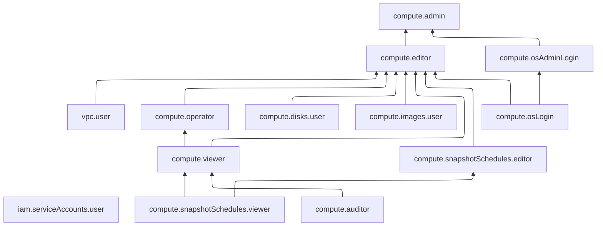

# Управление доступом в {{ compute-name }}

В этом разделе вы узнаете:

* [об управлении доступом в {{ yandex-cloud }}](#about-access-control);
* [на какие ресурсы можно назначить роль](#resources);
* [какие роли действуют в сервисе](#roles-list);
* [какие роли нужны для выполнения определенных действий](#choosing-roles).

## Об управлении доступом {#about-access-control}

Все операции в {{ yandex-cloud }} проверяются в сервисе [{{ iam-full-name }}](../../iam/index.md). Если у субъекта нет необходимых разрешений, сервис вернет ошибку.

Чтобы выдать разрешения к ресурсу, [назначьте роли](../../iam/operations/roles/grant.md) на этот ресурс субъекту, который будет выполнять операции. Роли можно назначить [аккаунту на Яндексе](../../iam/concepts/users/accounts.md#passport), [сервисному аккаунту](../../iam/concepts/users/service-accounts.md), [локальному пользователю](../../iam/concepts/users/accounts.md#local), [федеративному пользователю](../../iam/concepts/federations.md), [группе пользователей](../../organization/operations/manage-groups.md), [системной группе](../../iam/concepts/access-control/system-group.md) или [публичной группе](../../iam/concepts/access-control/public-group.md). Подробнее читайте в разделе [{#T}](../../iam/concepts/access-control/index.md).

Назначать роли на ресурс могут пользователи, у которых на этот ресурс есть роль `compute.admin` или одна из следующих ролей:

* `admin`;
* `resource-manager.admin`;
* `organization-manager.admin`;
* `resource-manager.clouds.owner`;
* `organization-manager.organizations.owner`.



Чтобы создавать, изменять и редактировать [ВМ](../concepts/vm.md), необходима _минимальная_ [роль](index.md#compute-editor) `compute.editor` на [каталоге](../../resource-manager/concepts/resources-hierarchy.md#folder). Для создания ВМ с лицензируемым образом дополнительно потребуется [роль](../../marketplace/security/index.md#license-manager-viewer) `license-manager.viewer`.

Для создания ВМ с [публичным IP-адресом](../../vpc/concepts/address.md#public-addresses) дополнительно потребуется [роль](../../vpc/security/index.md#vpc-public-admin) `vpc.publicAdmin`.



## На какие ресурсы можно назначать роли {#resources}

Роль можно назначить на [организацию](../../organization/concepts/organization.md), [облако](../../resource-manager/concepts/resources-hierarchy.md#cloud) и [каталог](../../resource-manager/concepts/resources-hierarchy.md#folder). Роли, назначенные на организацию, облако или каталог, действуют и на вложенные ресурсы.

Вы также можете назначать роли на отдельные ресурсы сервиса:



- Консоль управления {#console}

  Через [консоль управления]({{ link-console-main }}) вы можете назначить роли на следующие ресурсы:

  # Ресурсы в {{ compute-name }}, на которые можно назначать роли
  
  * [Виртуальная машина](../operations/vm-control/vm-access.md)
  * [Группа виртуальных машин](../operations/instance-groups/access.md)
  * [Группа выделенных хостов](../operations/dedicated-host/access.md)
  * [Группа размещения виртуальных машин](../operations/placement-groups/access.md)
  * [Группа размещения нереплицируемых дисков](../operations/disk-placement-groups/access.md)
  * [Диск виртуальной машины](../operations/disk-control/disk-access.md)
  * [Кластер GPU](../operations/gpu-cluster/access.md)
  * [Образ](../operations/image-control/access.md)
  * [Расписание снимков](../operations/snapshot-control/snapshot-schedule-access.md)
  * [Снимок диска](../operations/snapshot-control/snapshot-access.md)
  * [Файловое хранилище](../operations/filesystem/filesystem-access.md)

- CLI {#cli}

  Через [{{ yandex-cloud }} CLI](../../cli/cli-ref/compute/cli-ref/index.md) вы можете назначить роли на следующие ресурсы:

  # Ресурсы в {{ compute-name }}, на которые можно назначать роли
  
  * [Виртуальная машина](../operations/vm-control/vm-access.md)
  * [Группа виртуальных машин](../operations/instance-groups/access.md)
  * [Группа выделенных хостов](../operations/dedicated-host/access.md)
  * [Группа размещения виртуальных машин](../operations/placement-groups/access.md)
  * [Группа размещения нереплицируемых дисков](../operations/disk-placement-groups/access.md)
  * [Диск виртуальной машины](../operations/disk-control/disk-access.md)
  * [Кластер GPU](../operations/gpu-cluster/access.md)
  * [Образ](../operations/image-control/access.md)
  * [Расписание снимков](../operations/snapshot-control/snapshot-schedule-access.md)
  * [Снимок диска](../operations/snapshot-control/snapshot-access.md)
  * [Файловое хранилище](../operations/filesystem/filesystem-access.md)

- {{ TF }} {#tf}

  Через [{{ TF }}]({{ tf-provider-link }}) вы можете назначить роли на следующие ресурсы:

  # Ресурсы в {{ compute-name }}, на которые можно назначать роли с помощью {{ TF }}
  
  * [Виртуальная машина](../operations/vm-control/vm-access.md)
  * [Группа размещения виртуальных машин](../operations/placement-groups/access.md)
  * [Группа размещения нереплицируемых дисков](../operations/disk-placement-groups/access.md)
  * [Диск виртуальной машины](../operations/disk-control/disk-access.md)
  * [Кластер GPU](../operations/gpu-cluster/access.md)
  * [Образ](../operations/image-control/access.md)
  * [Расписание снимков](../operations/snapshot-control/snapshot-schedule-access.md)
  * [Снимок диска](../operations/snapshot-control/snapshot-access.md)
  * [Файловое хранилище](../operations/filesystem/filesystem-access.md)

- API {#api}

  Через [API {{ yandex-cloud }}](../api-ref/authentication.md) вы можете назначить роли на следующие ресурсы:

  # Ресурсы в {{ compute-name }}, на которые можно назначать роли
  
  * [Виртуальная машина](../operations/vm-control/vm-access.md)
  * [Группа виртуальных машин](../operations/instance-groups/access.md)
  * [Группа выделенных хостов](../operations/dedicated-host/access.md)
  * [Группа размещения виртуальных машин](../operations/placement-groups/access.md)
  * [Группа размещения нереплицируемых дисков](../operations/disk-placement-groups/access.md)
  * [Диск виртуальной машины](../operations/disk-control/disk-access.md)
  * [Кластер GPU](../operations/gpu-cluster/access.md)
  * [Образ](../operations/image-control/access.md)
  * [Расписание снимков](../operations/snapshot-control/snapshot-schedule-access.md)
  * [Снимок диска](../operations/snapshot-control/snapshot-access.md)
  * [Файловое хранилище](../operations/filesystem/filesystem-access.md)



## Какие роли действуют в сервисе {#roles-list}

На диаграмме показано, какие роли есть в сервисе и как они наследуют разрешения друг друга. Например, в `{{ roles-editor }}` входят все разрешения `{{ roles-viewer }}`. После диаграммы дано описание каждой роли.

### Сервисные роли {#service-roles}

#### compute.auditor {#compute-auditor}

Роль `compute.auditor` позволяет просматривать информацию о ресурсах сервиса {{ compute-name }} и операциях с ними, а также об объеме использованных ресурсов и квот. Не позволяет получать доступ к последовательному порту или серийной консоли виртуальных машин.



* просматривать список [виртуальных машин](../concepts/vm.md) и информацию о них;
* просматривать список [групп виртуальных машин](../concepts/instance-groups/index.md) и информацию о них;
* просматривать список [групп размещения виртуальных машин](../concepts/placement-groups.md) и информацию о них;
* просматривать списки ВМ, входящих в группы размещения;
* просматривать список [групп выделенных хостов](../concepts/dedicated-host.md#host-group-size) и информацию о них;
* просматривать списки [хостов](../concepts/dedicated-host.md) и виртуальных машин, входящих в группы выделенных хостов;
* просматривать информацию о [кластерах GPU](../concepts/gpus.md#gpu-clusters) и виртуальных машинах, входящих в такие кластеры;
* просматривать список [дисков](../concepts/disk.md) и информацию о них;
* просматривать список [файловых хранилищ](../concepts/filesystem.md) и информацию о них;
* просматривать список [групп размещения нереплицируемых дисков](../concepts/disk-placement-group.md) и информацию о них;
* просматривать списки дисков, входящих в группы размещения;
* просматривать информацию о [пулах резервов ВМ](../concepts/reserved-pools.md);
* просматривать список [образов](../concepts/image.md) и информацию о них;
* просматривать информацию о [семействах образов](../concepts/image.md#family), о входящих в семейства образах, о наиболее актуальном образе в семействе, а также о назначенных [правах доступа](../../iam/concepts/access-control/index.md) к семействам образов;
* просматривать список [снимков дисков](../concepts/snapshot.md) и информацию о них;
* просматривать информацию о [расписаниях](../concepts/snapshot-schedule.md) создания снимков дисков;
* просматривать в консоли управления информацию об объеме потребления ресурсов и [квот](../concepts/limits.md#compute-quotas) сервиса {{ compute-name }}, о [лимитах дисков](../concepts/limits.md#compute-limits-disks);
* просматривать списки операций с ресурсами сервиса {{ compute-name }}, а также информацию об этих операциях;
* просматривать информацию о статусе настройки доступа по [{{ oslogin }}](../../organization/concepts/os-login.md) на виртуальных машинах;
* просматривать информацию о доступных [платформах](../concepts/vm-platforms.md);
* просматривать список [зон доступности](../../overview/concepts/geo-scope.md) и информацию о них.



#### compute.viewer {#compute-viewer}

Роль `compute.viewer` позволяет просматривать информацию о ресурсах сервиса {{ compute-name }} и операциях с ними, а также о назначенных правах доступа к ресурсам сервиса и об объеме использованных ресурсов и квот. Роль также предоставляет доступ к метаданным и выводу последовательного порта виртуальных машин.



* просматривать [вывод последовательного порта](../operations/vm-info/get-serial-port-output.md) виртуальной машины;
* просматривать [метаданные](../concepts/vm-metadata.md) виртуальной машины;
* просматривать список [виртуальных машин](../concepts/vm.md), информацию о них и о назначенных [правах доступа](../../iam/concepts/access-control/index.md) к ним;
* просматривать список [групп виртуальных машин](../concepts/instance-groups/index.md) и информацию о них;
* просматривать список [групп размещения виртуальных машин](../concepts/placement-groups.md), информацию о них и о назначенных правах доступа к ним;
* просматривать списки ВМ, входящих в группы размещения;
* просматривать список [групп выделенных хостов](../concepts/dedicated-host.md#host-group-size), информацию о них и о назначенных правах доступа к ним;
* просматривать списки [хостов](../concepts/dedicated-host.md) и виртуальных машин, входящих в группы выделенных хостов;
* просматривать информацию о [кластерах GPU](../concepts/gpus.md#gpu-clusters) и виртуальных машинах, входящих в кластеры GPU, а также о назначенных правах доступа к таким кластерам;
* просматривать список [дисков](../concepts/disk.md), информацию о них и о назначенных правах доступа к ним;
* просматривать список [файловых хранилищ](../concepts/filesystem.md), информацию о них и о назначенных правах доступа к ним;
* просматривать список [групп размещения нереплицируемых дисков](../concepts/disk-placement-group.md), информацию о них и о назначенных правах доступа к ним;
* просматривать списки дисков, входящих в группы размещения;
* просматривать информацию о [пулах резервов ВМ](../concepts/reserved-pools.md);
* просматривать список [образов](../concepts/image.md), информацию о них и о назначенных правах доступа к ним;
* просматривать информацию о [семействах образов](../concepts/image.md#family), о входящих в семейства образах, о наиболее актуальном образе в семействе, а также о назначенных правах доступа к семействам образов;
* просматривать список [снимков дисков](../concepts/snapshot.md), информацию о них и о назначенных правах доступа к ним;
* просматривать информацию о [расписаниях](../concepts/snapshot-schedule.md) создания снимков дисков и о назначенных правах доступа к расписаниям;
* просматривать в консоли управления информацию об объеме потребления ресурсов и [квот](../concepts/limits.md#compute-quotas) сервиса {{ compute-name }}, о [лимитах дисков](../concepts/limits.md#compute-limits-disks);
* просматривать списки операций с ресурсами сервиса {{ compute-name }}, а также информацию об этих операциях;
* просматривать информацию о статусе настройки доступа по [{{ oslogin }}](../../organization/concepts/os-login.md) на виртуальных машинах;
* просматривать информацию о доступных [платформах](../concepts/vm-platforms.md);
* просматривать список [зон доступности](../../overview/concepts/geo-scope.md), информацию о них и о назначенных правах доступа к ним.



Включает разрешения, предоставляемые ролями `compute.auditor` и `compute.snapshotSchedules.viewer`.

#### compute.editor {#compute-editor}

Роль `compute.editor` позволяет управлять виртуальными машинами, группами виртуальных машин, дисками, образами, кластерами GPU и другими ресурсами сервиса {{ compute-name }}.



* создавать, изменять, запускать, перезапускать, останавливать, переносить и удалять [виртуальные машины](../concepts/vm.md);
* просматривать список виртуальных машин, информацию о них и о назначенных [правах доступа](../../iam/concepts/access-control/index.md) к ним;
* подключать к виртуальным машинам и отключать от них диски, файловые хранилища и сетевые интерфейсы, привязывать [группы безопасности](../../vpc/concepts/security-groups.md) к сетевым интерфейсам виртуальных машин;
* создавать виртуальные машины с пользовательскими [FQDN](../../vpc/concepts/address.md#fqdn), создавать мультиинтерфейсные виртуальные машины;
* привязывать [сервисные аккаунты](../../iam/concepts/users/service-accounts.md) к виртуальным машинам, активировать на виртуальных машинах токен AWS v1;
* использовать [последовательный порт](../operations/vm-info/get-serial-port-output.md) виртуальной машины в режиме чтения и записи;
* имитировать события обслуживания виртуальной машины;
* просматривать [метаданные](../concepts/vm-metadata.md) виртуальной машины;
* просматривать информацию о статусе настройки доступа по [{{ oslogin }}](../../organization/concepts/os-login.md) на виртуальных машинах и подключаться к виртуальным машинам через {{ oslogin }} с помощью SSH-сертификатов или SSH-ключей;
* просматривать список [групп виртуальных машин](../concepts/instance-groups/index.md), информацию о них и о назначенных правах доступа к ним, а также использовать, создавать, изменять, запускать, останавливать и удалять группы виртуальных машин;
* просматривать список [групп размещения виртуальных машин](../concepts/placement-groups.md), информацию о них и о назначенных правах доступа к ним, а также использовать, создавать, изменять и удалять группы размещения виртуальных машин;
* просматривать списки ВМ, входящих в группы размещения;
* просматривать список [групп выделенных хостов](../concepts/dedicated-host.md#host-group-size), информацию о них и о назначенных правах доступа к ним, а также использовать, создавать, изменять и удалять группы выделенных хостов;
* просматривать списки [хостов](../concepts/dedicated-host.md) и виртуальных машин, входящих в группы выделенных хостов;
* изменять запланированное время обслуживания хостов, входящих в группы выделенных хостов;
* использовать [кластеры GPU](../concepts/gpus.md#gpu-clusters), а также создавать, изменять и удалять их;
* просматривать информацию о кластерах GPU и виртуальных машинах, входящих в кластеры GPU, а также о назначенных правах доступа к таким кластерам;
* просматривать информацию о [пулах резервов ВМ](../concepts/reserved-pools.md), а также создавать, использовать, изменять и удалять их;
* просматривать список [дисков](../concepts/disk.md), информацию о них и о назначенных правах доступа к ним, а также использовать, создавать, изменять, переносить и удалять диски;
* создавать [зашифрованные диски](../concepts/disk.md#encryption);
* просматривать и обновлять ссылки на диски;
* просматривать список [файловых хранилищ](../concepts/filesystem.md), информацию о них и о назначенных правах доступа к ним, а также использовать файловые хранилища и создавать, изменять и удалять их;
* просматривать список [групп размещения нереплицируемых дисков](../concepts/disk-placement-group.md), информацию о них и о назначенных правах доступа к ним, а также использовать, создавать, изменять и удалять группы размещения нереплицируемых дисков;
* просматривать списки дисков, входящих в группы размещения;
* просматривать список [образов](../concepts/image.md), информацию о них и о назначенных правах доступа к ним, а также использовать, создавать, изменять и удалять образы;
* создавать, изменять и удалять [семейства образов](../concepts/image.md#family), обновлять образы в них;
* просматривать информацию о семействах образов, о входящих в семейства образах, о наиболее актуальном образе в семействе, а также о назначенных правах доступа к семействам образов;
* просматривать список [снимков дисков](../concepts/snapshot.md), информацию о них и о назначенных правах доступа к ним, а также использовать, создавать, изменять и удалять снимки дисков;
* просматривать информацию о [расписаниях](../concepts/snapshot-schedule.md) создания снимков дисков и о назначенных правах доступа к расписаниям, а также создавать, изменять и удалять их;
* просматривать информацию об [облачных сетях](../../vpc/concepts/network.md#network) и использовать их;
* просматривать информацию о [подсетях](../../vpc/concepts/network.md#subnet) и использовать их;
* просматривать информацию об [адресах облачных ресурсов](../../vpc/concepts/address.md) и использовать их;
* просматривать информацию о [таблицах маршрутизации](../../vpc/concepts/routing.md#rt-vpc) и использовать их;
* просматривать информацию о группах безопасности и использовать их;
* просматривать информацию о [NAT-шлюзах](../../vpc/concepts/gateways.md) и подключать их к таблицам маршрутизации;
* просматривать информацию об использованных IP-адресах в подсетях;
* просматривать информацию об операциях с ресурсами сервиса {{ vpc-name }};
* просматривать информацию о [квотах](../../vpc/concepts/limits.md#vpc-quotas) сервиса {{ vpc-name }};
* просматривать в консоли управления информацию об объеме потребления ресурсов и [квот](../concepts/limits.md#compute-quotas) {{ compute-name }}, о [лимитах дисков](../concepts/limits.md#compute-limits-disks);
* просматривать списки операций с ресурсами сервиса {{ compute-name }} и информацию об операциях, а также отменять выполнение этих операций;
* просматривать информацию о доступных [платформах](../concepts/vm-platforms.md) и использовать их;
* просматривать список [зон доступности](../../overview/concepts/geo-scope.md), информацию о них и о назначенных правах доступа к ним;
* просматривать информацию об [облаке](../../resource-manager/concepts/resources-hierarchy.md#cloud);
* просматривать информацию о [каталоге](../../resource-manager/concepts/resources-hierarchy.md#folder).



Включает разрешения, предоставляемые ролями `compute.operator`, `compute.osLogin`, `compute.snapshotSchedules.editor`, `compute.disks.user` и `vpc.user`.



С 1 августа 2026 года роль `compute.editor` получает новый набор разрешений, позволяющий подключать виртуальные машины к сервису [{{ backup-full-name }}](../../backup/index.md), а также привязывать и отвязывать их от [политик резервного копирования](../../backup/concepts/policy.md).

Если вы не планируете подключать ваши ресурсы к {{ backup-name }} и не хотите предоставлять вашим пользователям такие разрешения, вы можете заблаговременно отключить эти возможности с помощью [политики авторизации](../../iam/concepts/access-control/access-policies.md#backup-denyActivation) `backup.denyActivation`, назначенной на каталог, облако или организацию. Подробнее о том, как создать политику авторизации, читайте в разделе [{#T}](../../iam/operations/access-policies/assign.md).



#### compute.admin {#compute-admin}

Роль `compute.admin` позволяет управлять виртуальными машинами, группами виртуальных машин, дисками, образами, кластерами GPU и другими ресурсами сервиса {{ compute-name }}, а также доступом к ним.



* создавать, изменять, запускать, перезапускать, останавливать, переносить и удалять [виртуальные машины](../concepts/vm.md), а также управлять доступом к ним;
* просматривать список виртуальных машин, информацию о них и о назначенных [правах доступа](../../iam/concepts/access-control/index.md) к ним;
* подключать к виртуальным машинам и отключать от них диски, файловые хранилища и сетевые интерфейсы, привязывать [группы безопасности](../../vpc/concepts/security-groups.md) к сетевым интерфейсам виртуальных машин;
* создавать виртуальные машины с пользовательскими [FQDN](../../vpc/concepts/address.md#fqdn), создавать мультиинтерфейсные виртуальные машины;
* привязывать [сервисные аккаунты](../../iam/concepts/users/service-accounts.md) к виртуальным машинам, активировать на виртуальных машинах токен AWS v1;
* использовать [последовательный порт](../operations/vm-info/get-serial-port-output.md) виртуальной машины в режиме чтения и записи;
* имитировать события обслуживания виртуальной машины;
* просматривать [метаданные](../concepts/vm-metadata.md) виртуальной машины;
* просматривать информацию о статусе настройки доступа по [{{ oslogin }}](../../organization/concepts/os-login.md) на виртуальных машинах и подключаться к виртуальным машинам через {{ oslogin }} при помощи SSH-сертификатов или SSH-ключей с возможностью выполнять команды от имени суперпользователя (`sudo`);
* использовать, создавать, изменять, запускать, останавливать и удалять [группы виртуальных машин](../concepts/instance-groups/index.md), а также управлять доступом к группам виртуальных машин;
* просматривать список групп виртуальных машин, информацию о них и о назначенных правах доступа к ним;
* использовать, создавать, изменять и удалять [группы размещения виртуальных машин](../concepts/placement-groups.md), а также управлять доступом к группам размещения виртуальных машин;
* просматривать список групп размещения виртуальных машин, информацию о них и о назначенных правах доступа к ним;
* просматривать списки виртуальных машин, входящих в группы размещения;
* использовать, создавать, изменять и удалять [группы выделенных хостов](../concepts/dedicated-host.md#host-group-size), а также управлять доступом к группам выделенных хостов;
* просматривать список групп выделенных хостов, информацию о них и о назначенных правах доступа к ним;
* просматривать списки [хостов](../concepts/dedicated-host.md) и виртуальных машин, входящих в группы выделенных хостов;
* изменять запланированное время обслуживания хостов, входящих в группы выделенных хостов;
* использовать, создавать, изменять и удалять [кластеры GPU](../concepts/gpus.md#gpu-clusters), а также управлять доступом к ним;
* просматривать информацию о кластерах GPU и виртуальных машинах, входящих в кластеры GPU, а также о назначенных правах доступа к таким кластерам;
* просматривать информацию о [пулах резервов ВМ](../concepts/reserved-pools.md), а также создавать, использовать, изменять и удалять их;
* использовать, создавать, изменять, переносить и удалять [диски](../concepts/disk.md), а также управлять доступом к ним;
* создавать [зашифрованные диски](../concepts/disk.md#encryption);
* просматривать список дисков, информацию о них и о назначенных правах доступа к ним;
* просматривать и обновлять ссылки на диски;
* использовать, создавать, изменять и удалять [файловые хранилища](../concepts/filesystem.md), а также управлять доступом к ним;
* просматривать список файловых хранилищ, информацию о них и о назначенных правах доступа к ним;
* использовать, создавать, изменять и удалять [группы размещения нереплицируемых дисков](../concepts/disk-placement-group.md), а также управлять доступом к группам размещения нереплицируемых дисков;
* просматривать список групп размещения нереплицируемых дисков, информацию о них и о назначенных правах доступа к ним;
* просматривать списки дисков, входящих в группы размещения;
* использовать, создавать, изменять и удалять [образы](../concepts/image.md), а также управлять доступом к ним;
* просматривать список образов, информацию о них и о назначенных правах доступа к ним;
* создавать, изменять, удалять [семейства образов](../concepts/image.md#family) и обновлять образы в них, а также управлять доступом к семействам образов;
* просматривать информацию о семействах образов, о входящих в семейства образах, о наиболее актуальном образе в семействе, а также о назначенных правах доступа к семействам образов;
* использовать, создавать, изменять и удалять [снимки дисков](../concepts/snapshot.md), а также управлять доступом к снимкам дисков;
* просматривать список снимков дисков, информацию о них и о назначенных правах доступа к ним;
* создавать, изменять и удалять [расписания создания снимков дисков](../concepts/snapshot-schedule.md), а также управлять доступом к расписаниям;
* просматривать информацию о расписаниях создания снимков дисков и о назначенных правах доступа к расписаниям;
* просматривать информацию об [облачных сетях](../../vpc/concepts/network.md#network) и использовать их;
* просматривать информацию о [подсетях](../../vpc/concepts/network.md#subnet) и использовать их;
* просматривать информацию об [адресах облачных ресурсов](../../vpc/concepts/address.md) и использовать их;
* просматривать информацию о [таблицах маршрутизации](../../vpc/concepts/routing.md#rt-vpc) и использовать их;
* просматривать информацию о группах безопасности и использовать их;
* просматривать информацию о [NAT-шлюзах](../../vpc/concepts/gateways.md) и подключать их к таблицам маршрутизации;
* просматривать информацию об использованных IP-адресах в подсетях;
* просматривать информацию об операциях с ресурсами сервиса {{ vpc-name }};
* просматривать информацию о [квотах](../../vpc/concepts/limits.md#vpc-quotas) сервиса {{ vpc-name }};
* просматривать в консоли управления информацию об объеме потребления ресурсов и [квот](../concepts/limits.md#compute-quotas) {{ compute-name }}, о [лимитах дисков](../concepts/limits.md#compute-limits-disks);
* просматривать списки операций с ресурсами сервиса {{ compute-name }} и информацию об операциях, а также отменять выполнение этих операций;
* просматривать информацию о доступных [платформах](../concepts/vm-platforms.md) и использовать их;
* просматривать список [зон доступности](../../overview/concepts/geo-scope.md), информацию о них и о назначенных правах доступа к ним;
* просматривать информацию об [облаке](../../resource-manager/concepts/resources-hierarchy.md#cloud);
* просматривать информацию о [каталоге](../../resource-manager/concepts/resources-hierarchy.md#folder).



Включает разрешения, предоставляемые ролями `compute.editor` и `compute.osAdminLogin`.



С 1 августа 2026 года роль `compute.admin` получает новый набор разрешений, позволяющий подключать виртуальные машины к сервису [{{ backup-full-name }}](../../backup/index.md), а также привязывать и отвязывать их от [политик резервного копирования](../../backup/concepts/policy.md).

Если вы не планируете подключать ваши ресурсы к {{ backup-name }} и не хотите предоставлять вашим пользователям такие разрешения, вы можете заблаговременно отключить эти возможности с помощью [политики авторизации](../../iam/concepts/access-control/access-policies.md#backup-denyActivation) `backup.denyActivation`, назначенной на каталог, облако или организацию. Подробнее о том, как создать политику авторизации, читайте в разделе [{#T}](../../iam/operations/access-policies/assign.md).



#### compute.osLogin {#compute-oslogin}

Роль `compute.osLogin` позволяет подключаться к [виртуальным машинам](../concepts/vm.md) через [{{ oslogin }}](../../organization/concepts/os-login.md) с помощью SSH-сертификатов или SSH-ключей.

#### compute.osAdminLogin {#compute-osadminlogin}

Роль `compute.osAdminLogin` позволяет подключаться к [виртуальным машинам](../concepts/vm.md) при помощи SSH-сертификатов или SSH-ключей через [{{ oslogin }}](../../organization/concepts/os-login.md) с возможностью выполнять команды от имени суперпользователя (`sudo`).



Если у пользователя есть права [суперпользователя](https://ru.wikipedia.org/wiki/Root) на ВМ, то он может сохранить доступ к ней даже при [отзыве ролей](../../organization/security/index.md#revoke). Чтобы пользователь не смог зайти на ВМ с прежними правами, [создайте](../operations/images-with-pre-installed-software/create.md) новую ВМ из чистого образа.



#### compute.disks.user {#compute-disks-user}

Роль `compute.disks.user` позволяет просматривать список [дисков](../concepts/disk.md) и информацию о них, а также использовать диски для создания новых ресурсов, например [виртуальных машин](../concepts/vm.md).

#### compute.images.user {#compute-images-user}

Роль `compute.images.user` позволяет просматривать список [образов](../concepts/image.md) и информацию о них, получать информацию о наиболее актуальном образе в [семействе образов](../concepts/image.md#family), а также использовать образы для создания новых ресурсов, например [виртуальных машин](../concepts/vm.md).

#### compute.operator {#compute-operator}

Роль `compute.operator` позволяет запускать и останавливать виртуальные машины и группы виртуальных машин, а также просматривать информацию о ресурсах сервиса {{ compute-name }} и операциях с ними, а также о назначенных правах доступа к ресурсам сервиса и об объеме использованных ресурсов и квот.



* запускать, перезапускать и останавливать [виртуальные машины](../concepts/vm.md);
* просматривать список виртуальных машин, информацию о них и о назначенных [правах доступа](../../iam/concepts/access-control/index.md) к ним;
* запускать и останавливать [группы виртуальных машин](../concepts/instance-groups/index.md);
* просматривать список групп виртуальных машин и информацию о них;
* просматривать [вывод последовательного порта](../operations/vm-info/get-serial-port-output.md) виртуальной машины;
* просматривать [метаданные](../concepts/vm-metadata.md) виртуальной машины;
* просматривать список [групп размещения виртуальных машин](../concepts/placement-groups.md), информацию о них и о назначенных правах доступа к ним;
* просматривать списки ВМ, входящих в группы размещения;
* просматривать список [групп выделенных хостов](../concepts/dedicated-host.md#host-group-size), информацию о них и о назначенных правах доступа к ним;
* просматривать списки [хостов](../concepts/dedicated-host.md) и виртуальных машин, входящих в группы выделенных хостов;
* просматривать информацию о [кластерах GPU](../concepts/gpus.md#gpu-clusters) и виртуальных машинах, входящих в кластеры GPU, а также о назначенных правах доступа к таким кластерам;
* просматривать список [дисков](../concepts/disk.md), информацию о них и о назначенных правах доступа к ним;
* просматривать список [файловых хранилищ](../concepts/filesystem.md), информацию о них и о назначенных правах доступа к ним;
* просматривать список [групп размещения нереплицируемых дисков](../concepts/disk-placement-group.md), информацию о них и о назначенных правах доступа к ним;
* просматривать списки дисков, входящих в группы размещения;
* просматривать информацию о [пулах резервов ВМ](../concepts/reserved-pools.md);
* просматривать список [образов](../concepts/image.md), информацию о них и о назначенных правах доступа к ним;
* просматривать информацию о [семействах образов](../concepts/image.md#family), о входящих в семейства образах, о наиболее актуальном образе в семействе, а также о назначенных правах доступа к семействам образов;
* просматривать список [снимков дисков](../concepts/snapshot.md), информацию о них и о назначенных правах доступа к ним;
* просматривать информацию о [расписаниях](../concepts/snapshot-schedule.md) создания снимков дисков и о назначенных правах доступа к расписаниям;
* просматривать в консоли управления информацию об объеме потребления ресурсов и [квот](../concepts/limits.md#compute-quotas) сервиса {{ compute-name }}, о [лимитах дисков](../concepts/limits.md#compute-limits-disks);
* просматривать списки операций с ресурсами сервиса {{ compute-name }}, а также информацию об этих операциях;
* просматривать информацию о статусе настройки доступа по [{{ oslogin }}](../../organization/concepts/os-login.md) на виртуальных машинах;
* просматривать информацию о доступных [платформах](../concepts/vm-platforms.md);
* просматривать список [зон доступности](../../overview/concepts/geo-scope.md), информацию о них и о назначенных правах доступа к ним.



Включает разрешения, предоставляемые ролью `compute.viewer`.

#### compute.snapshotSchedules.viewer {#compute-snapshotSchedules-viewer}

Роль `compute.snapshotSchedules.viewer` позволяет просматривать информацию о создании снимков дисков по расписаниям.

Пользователи с этой ролью могут:
* просматривать информацию о [расписаниях](../concepts/snapshot-schedule.md) создания снимков дисков и о назначенных [правах доступа](../../iam/concepts/access-control/index.md) к расписаниям;
* просматривать списки [дисков](../concepts/disk.md);
* просматривать списки [снимков дисков](../concepts/snapshot.md);
* просматривать список операций со снимками дисков.

#### compute.snapshotSchedules.editor {#compute-snapshotSchedules-editor}

Роль `compute.snapshotSchedules.editor` позволяет создавать, изменять и удалять расписания создания снимков дисков, создавать и удалять снимки дисков, а также просматривать информацию об операциях со снимками дисков.

Пользователи с этой ролью могут:
* просматривать информацию о [расписаниях](../concepts/snapshot-schedule.md) создания снимков дисков и о назначенных [правах доступа](../../iam/concepts/access-control/index.md) к расписаниям, а также создавать, изменять и удалять расписания;
* просматривать списки [дисков](../concepts/disk.md) и использовать диски для создания снимков;
* просматривать списки [снимков дисков](../concepts/snapshot.md), создавать и удалять снимки;
* просматривать список операций со снимками дисков и информацию об этих операциях.

Включает разрешения, предоставляемые ролью `compute.snapshotSchedules.viewer`.

#### iam.serviceAccounts.user {#iam-serviceAccounts-user}

Роль `iam.serviceAccounts.user` позволяет пользователю просматривать список сервисных аккаунтов и информацию о них, а также выполнять операции от имени сервисного аккаунта.

Например, если при создании группы виртуальных машин пользователь укажет [сервисный аккаунт](../../iam/concepts/users/accounts.md#sa), сервис IAM проверяет, что у этого пользователя есть права на использование этого сервисного аккаунта.

Более подробную информацию о сервисных ролях читайте на странице [{#T}](../../iam/concepts/access-control/roles.md) в документации сервиса {{ iam-full-name }}.

### Примитивные роли {#primitive-roles}

Примитивные роли позволяют пользователям совершать действия во [всех сервисах](../../overview/concepts/services.md) {{ yandex-cloud }}.

#### {{ roles-auditor }} {#auditor}

Роль `auditor` предоставляет разрешения на чтение конфигурации и метаданных любых ресурсов Yandex Cloud без возможности доступа к данным.

Например, пользователи с этой ролью могут:
* просматривать информацию о [ресурсе]({{ link-docs }}/resource-manager/concepts/resources-hierarchy);
* просматривать метаданные ресурса;
* просматривать список операций с ресурсом.

Роль `auditor` — наиболее безопасная роль, исключающая доступ к данным [сервисов]({{ link-docs }}/overview/concepts/services). Роль подходит для пользователей, которым необходим минимальный уровень доступа к ресурсам Yandex Cloud.

#### {{ roles-viewer }} {#viewer}

Роль `viewer` предоставляет разрешения на чтение информации о любых [ресурсах]({{ link-docs }}/resource-manager/concepts/resources-hierarchy) Yandex Cloud.

Включает разрешения, предоставляемые ролью `auditor`.

В отличие от роли `auditor`, роль `viewer` предоставляет доступ к данным [сервисов]({{ link-docs }}/overview/concepts/services) в режиме чтения.

#### {{ roles-editor }} {#editor}

Роль `editor` предоставляет разрешения на управление любыми [ресурсами]({{ link-docs }}/resource-manager/concepts/resources-hierarchy) Yandex Cloud, кроме назначения ролей другим пользователям, передачи прав владения [организацией]({{ link-docs }}/organization/concepts/organization) и ее удаления, а также удаления [ключей шифрования]({{ link-docs }}/kms/concepts/) Key Management Service.

Например, пользователи с этой ролью могут создавать, изменять и удалять ресурсы.

Включает разрешения, предоставляемые ролью `viewer`.

#### {{ roles-admin }} {#admin}

Роль `admin` позволяет назначать любые роли, кроме `resource-manager.clouds.owner` и `organization-manager.organizations.owner`, а также предоставляет разрешения на управление любыми [ресурсами]({{ link-docs }}/resource-manager/concepts/resources-hierarchy) Yandex Cloud, кроме передачи прав владения [организацией]({{ link-docs }}/organization/concepts/organization) и ее удаления.

Прежде чем назначить роль `admin` на организацию, [облако]({{ link-docs }}/resource-manager/concepts/resources-hierarchy#cloud) или [платежный аккаунт]({{ link-docs }}/billing/concepts/billing-account), ознакомьтесь с информацией о защите [привилегированных аккаунтов]({{ link-docs }}/security/standard/all#privileged-users).

Включает разрешения, предоставляемые ролью `editor`.

Вместо примитивных ролей мы рекомендуем использовать роли сервисов. Такой подход позволит более гранулярно управлять доступом и обеспечить соблюдение [принципа минимальных привилегий](../../security/standard/all.md#min-privileges).

Подробнее о примитивных ролях см. в [справочнике ролей {{ yandex-cloud }}](../../iam/roles-reference.md#primitive-roles).

## Какие роли мне необходимы {#choosing-roles}

В таблице ниже перечислено, какие роли нужны для выполнения указанного действия. Вы всегда можете назначить роль, которая дает более широкие права, чем указанная. Например, можно назначить `editor` вместо `compute.editor` или назначить роль `compute.viewer` на [каталог](../../resource-manager/concepts/resources-hierarchy.md#folder) вместо отдельной виртуальной машины или диска.

Действие | Минимально необходимые роли
----- | -----
**Просмотр информации** |
Просмотр информации о любом ресурсе и о [правах доступа](../../iam/concepts/access-control/index.md), назначенных к любому ресурсу | `compute.viewer` на этот ресурс
Просмотр списка [виртуальных машин](../concepts/vm.md), входящих в [группу виртуальных машин](../concepts/instance-groups/index.md), просмотр журнала логов группы виртуальных машин | `compute.viewer` на группу ВМ
Просмотр списка [дисков](../concepts/disk.md), входящих в [группу размещения дисков](../concepts/disk-placement-group.md) | `compute.viewer` на группу размещения дисков
Просмотр списка виртуальных машин, входящих в [кластер GPU](../concepts/gpus.md#gpu-clusters) | `compute.viewer` на кластер GPU
Просмотр списка виртуальных машин на [выделенном хосте](../concepts/dedicated-host.md), просмотр списка выделенных хостов в группе выделенных хостов | `compute.viewer` на группу выделенных хостов
Просмотр списка виртуальных машин в [группе размещения](../concepts/placement-groups.md) | `compute.viewer` на группу размещения
[Получение вывода последовательного порта](../operations/vm-info/get-serial-port-output.md) виртуальной машины | `compute.viewer` на ВМ
Получение информации о наиболее актуальном [образе](../concepts/image.md) в [семействе образов](../concepts/image.md#family) | `compute.viewer` или `compute.images.user` на образ
Просмотр информации о [расписаниях](../concepts/snapshot-schedule.md), по которым создаются [снимки](../concepts/snapshot.md) дисков, просмотр списка дисков, подключенных к определенному расписанию создания снимков дисков, и списка снимков дисков, созданных по этому расписанию | `compute.snapshotSchedules.viewer` или `compute.viewer` на расписание
**Использование ресурсов** |
Использование любого ресурса | `compute.editor` на этот ресурс
Использование [дисков](../concepts/disk.md) | `compute.disks.user`, `compute.snapshotSchedules.editor` или `compute.editor` на диск
Использование [образов](../concepts/image.md) | `compute.images.user` или `compute.editor` на образ
**Управление ресурсами** |
[Создание](../operations/vm-create/create-linux-vm.md) виртуальной машины | `compute.editor` на каталог
Создание виртуальной машины с [публичным IP-адресом](../../vpc/concepts/address.md#public-addresses) | `compute.editor` и `vpc.publicAdmin` на каталог
[Запуск](../operations/vm-control/vm-stop-and-start.md#start), [остановка](../operations/vm-control/vm-stop-and-start.md#stop) и [перезапуск](../operations/vm-control/vm-stop-and-start.md#restart) виртуальных машин | `compute.operator` на ВМ
[Изменение](../operations/vm-control/vm-update.md) и [удаление](../operations/vm-control/vm-delete.md) виртуальной машины | `compute.editor` на ВМ
[Привязка](../operations/vm-control/vm-connect-sa.md) сервисного аккаунта к ВМ | `compute.editor` на ВМ
[Изменение метаданных](../operations/vm-metadata/update-vm-metadata.md) виртуальной машины | `compute.editor` на ВМ
[Подключение](../operations/vm-control/vm-attach-disk.md) к ВМ и [отключение](../operations/vm-control/vm-detach-disk.md) от ВМ диска | `compute.editor` на ВМ
[Подключение](../operations/filesystem/attach-to-vm.md) к ВМ и [отключение](../operations/filesystem/detach-from-vm.md) от ВМ [файлового хранилища](../concepts/filesystem.md) | `compute.editor` на ВМ
[Добавление](../operations/vm-control/attach-network-interface.md) на ВМ и [удаление](../operations/vm-control/detach-network-interface.md) из ВМ [сетевого интерфейса](../concepts/network.md), [изменение](../operations/vm-control/internal-ip-update.md) сетевого интерфейса ВМ | `compute.editor` на ВМ
[Привязка](../operations/vm-control/vm-attach-public-ip.md) к ВМ и [отвязка](../operations/vm-control/vm-detach-public-ip.md) от ВМ [публичного IP-адреса](../../vpc/concepts/address.md#public-addresses) | `compute.editor` на ВМ
[Назначение](../operations/vm-control/vm-change-security-groups-set.md) виртуальной машине [групп безопасности](../../vpc/concepts/security-groups.md) | `compute.editor` на ВМ
Перенос виртуальной машины [в другой каталог](../operations/vm-control/vm-change-folder.md) облака | `compute.editor` на ВМ
[Имитирование](../operations/vm-control/vm-update-policies.md#simulate) события обслуживания виртуальной машины | `compute.editor` на ВМ
[Создание](../operations/instance-groups/create-fixed-group.md) группы виртуальных машин | `compute.editor` на каталог
[Запуск](../operations/instance-groups/start.md) и [остановка](../operations/instance-groups/stop.md) групп виртуальных машин | `compute.operator` на группу ВМ
[Изменение](../operations/instance-groups/update.md) и [удаление](../operations/instance-groups/delete.md) группы виртуальных машин | `compute.editor` на группу ВМ
Поочередный [перезапуск](../operations/instance-groups/rolling-restart.md) и поочередное [пересоздание](../operations/instance-groups/rolling-recreate.md) ВМ в группе ВМ | `compute.operator` на группу ВМ
[Приостановка](../operations/instance-groups/pause-processes.md) и [возобновление](../operations/instance-groups/resume-processes.md) процессов в группе виртуальных машин | `compute.editor` на группу ВМ
[Создание](../operations/gpu-cluster/gpu-cluster-create.md) кластера GPU | `compute.editor` на каталог
[Изменение](../operations/gpu-cluster/gpu-cluster-update.md) и [удаление](../operations/gpu-cluster/gpu-cluster-delete.md) кластера GPU | `compute.editor` на кластер GPU
[Создание](../operations/dedicated-host/create-host-group.md) группы выделенных хостов | `compute.editor` на каталог
Изменение и удаление группы выделенных хостов, изменение хоста в группе выделенных хостов | `compute.editor` на группу выделенных хостов
[Создание](../operations/reserved-pools/create-reserved-pool.md) пула резервов ВМ | `compute.editor` на каталог
[Изменение](../operations/reserved-pools/update-reserved-pool.md) и [удаление](../operations/reserved-pools/delete-reserved-pool.md) пула резервов ВМ | `compute.editor` на каталог
[Создание](../operations/placement-groups/create.md) группы размещения | `compute.editor` на каталог
Изменение и [удаление](../operations/placement-groups/delete.md) группы размещения | `compute.editor` на группу размещения
[Создание](../operations/disk-placement-groups/create.md) группы размещения дисков | `compute.editor` на каталог
Изменение и удаление группы размещения дисков | `compute.editor` на группу размещения дисков
[Создание](../operations/disk-create/empty.md) диска | `compute.editor` на каталог
[Изменение](../operations/disk-control/update.md) и [удаление](../operations/disk-control/delete.md) диска | `compute.editor` на диск
Перенос диска [в другой каталог](../operations/disk-control/disk-change-folder.md) облака | `compute.editor` на диск
[Создание](../operations/filesystem/create.md) файлового хранилища | `compute.editor` на каталог
[Изменение](../operations/filesystem/update.md) и [удаление](../operations/filesystem/delete.md) файлового хранилища | `compute.editor` на файловое хранилище
[Создание](../operations/image-create/create-from-disk.md) образа | `compute.editor` на каталог
Изменение и [удаление](../operations/image-control/delete.md) образа | `compute.editor` на образ
[Создание](../operations/disk-control/create-snapshot.md) снимка диска | `compute.snapshotSchedules.editor` или `compute.editor` на каталог
[Удаление](../operations/snapshot-control/delete.md) снимка диска | `compute.snapshotSchedules.editor` или `compute.editor` на снимок диска
[Создание](../operations/snapshot-control/create-schedule.md) расписания, по которому будут создаваться снимки дисков | `compute.snapshotSchedules.editor` или `compute.editor` на каталог
[Запуск](../operations/snapshot-control/stop-and-start-schedule.md#start-schedule), [остановка](../operations/snapshot-control/stop-and-start-schedule.md#stop-schedule), [изменение](../operations/snapshot-control/update-schedule.md) и [удаление](../operations/snapshot-control/delete-schedule.md) расписания, по которому создаются снимки дисков | `compute.snapshotSchedules.editor` или `compute.editor` на расписание
**Управление доступом к ресурсам** |
[Назначение](../../iam/operations/roles/grant.md) и [отзыв](../../iam/operations/roles/revoke.md) прав доступа к любому ресурсу | `compute.admin` на этот ресурс

#### Что дальше {#what-is-next}

* [Как назначить роль](../../iam/operations/roles/grant.md).
* [Как отозвать роль](../../iam/operations/roles/revoke.md).
* [Подробнее об управлении доступом в {{ yandex-cloud }}](../../iam/concepts/access-control/index.md).
* [Подробнее о наследовании ролей](../../resource-manager/concepts/resources-hierarchy.md#access-rights-inheritance).