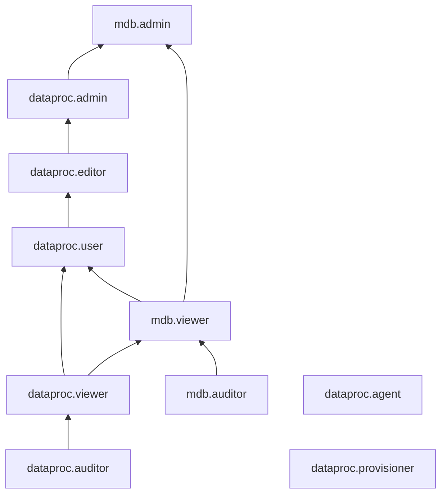

# Управление доступом в {{ dataproc-name }}

Пользователь {{ yandex-cloud }} может выполнять только те операции над ресурсами, которые разрешены назначенными ему [ролями](../../iam/concepts/access-control/roles.md). Пока у пользователя нет никаких ролей, почти все операции ему запрещены.

Чтобы разрешить доступ к ресурсам сервиса {{ dataproc-name }} (кластерам или подкластерам), назначьте аккаунту на Яндексе, [сервисному аккаунту](../../iam/concepts/users/service-accounts.md), [федеративным](../../iam/concepts/users/accounts.md#saml-federation) или [локальным](../../iam/concepts/users/accounts.md#local) пользователям, [группе пользователей](../../organization/operations/manage-groups.md), [системной группе](../../iam/concepts/access-control/system-group.md) или [публичной группе](../../iam/concepts/access-control/public-group.md) нужные роли из приведенного ниже списка. На данный момент роль может быть назначена только на родительский ресурс (каталог или облако), роли которого наследуются вложенными ресурсами.

Подробнее о наследовании ролей читайте в разделе [{#T}](../../resource-manager/concepts/resources-hierarchy.md#access-rights-inheritance) документации сервиса {{ resmgr-full-name }}.

Назначать роли на ресурс могут пользователи, у которых на этот ресурс есть роль `mdb.admin`, `dataproc.admin` или одна из следующих ролей:

* `admin`;
* `resource-manager.admin`;
* `organization-manager.admin`;
* `resource-manager.clouds.owner`;
* `organization-manager.organizations.owner`.

## Назначение ролей {#grant-role}

Чтобы назначить пользователю роль:

1. При необходимости [добавьте](../../organization/operations/add-account.md) нужного пользователя.
1. В [консоли управления]({{ link-console-main }}) слева [выберите](../../resource-manager/operations/cloud/switch-cloud.md) облако.
1. Перейдите на вкладку **{{ ui-key.yacloud.common.resource-acl.label_access-bindings }}**.
1. Нажмите кнопку **{{ ui-key.yacloud.common.resource-acl.button_configure-access }}**.
1. В открывшемся окне выберите раздел **{{ ui-key.yacloud_components.acl.label.user-accounts }}**.
1. Выберите пользователя из списка или воспользуйтесь поиском.
1. Нажмите кнопку  **{{ ui-key.yacloud_components.acl.button.add-role }}** и выберите роль в облаке.
1. Нажмите кнопку **{{ ui-key.yacloud.common.save }}**.

## Какие роли действуют в сервисе {#roles-list}

Ниже перечислены все роли, которые учитываются при проверке прав доступа в сервисе {{ dataproc-name }}.

### Сервисные роли {#service-roles}

#### dataproc.agent {#dataproc-agent}

Роль `dataproc.agent` позволяет [сервисному аккаунту](../../iam/concepts/users/service-accounts.md), привязанному к кластеру {{ dataproc-name }}, сообщать сервису о состоянии хостов кластера. Роль назначается сервисному аккаунту, привязанному к кластеру {{ dataproc-name }}.

Сервисные аккаунты с этой ролью могут:
* сообщать сервису {{ dataproc-name }} о состоянии хостов [кластера](../concepts/index.md#resources);
* получать информацию о [заданиях](../concepts/jobs.md) и статусах их выполнения;
* получать информацию о [лог-группах](../../logging/concepts/log-group.md) и добавлять в них записи.

Сейчас эту роль можно назначить только на каталог или облако.

#### dataproc.auditor {#dataproc-auditor}

Роль `dataproc.auditor` позволяет просматривать информацию о [кластерах](../concepts/index.md#resources) {{ dataproc-name }}.

#### dataproc.viewer {#dataproc-viewer}

Роль `dataproc.viewer` позволяет просматривать информацию о [кластерах](../concepts/index.md#resources) {{ dataproc-name }} и [заданиях](../concepts/jobs.md).

#### dataproc.user {#dataproc-user}

Роль `dataproc.user` предоставляет доступ к веб-интерфейсам компонентов {{ dataproc-name }} и позволяет создавать задания, а также позволяет просматривать информацию о кластерах управляемых баз данных {{ yandex-cloud }}.



* просматривать информацию о [кластерах](../concepts/index.md#resources) {{ dataproc-name }} и [заданиях](../concepts/jobs.md), а также создавать задания;
* использовать веб-интерфейс для доступа к компонентам {{ dataproc-name }};
* просматривать информацию о кластерах [{{ CH }}](../../managed-clickhouse/concepts/index.md), [{{ mgp-name }}](../../managed-greenplum/concepts/index.md), [{{ KF }}](../../managed-kafka/concepts/index.md), [{{ SD }}](../../storedoc/concepts/index.md), [{{ MY }}](../../managed-mysql/concepts/index.md), [{{ PG }}](../../managed-postgresql/concepts/index.md), [{{ VLK }}](../../managed-valkey/concepts/index.md), [{{ OS }}](../../managed-opensearch/concepts/index.md) и {{ MS }};
* просматривать информацию о хостах кластеров [{{ mgp-name }}](../../managed-greenplum/concepts/instance-types.md), [{{ SD }}](../../storedoc/concepts/instance-types.md), [{{ MY }}](../../managed-mysql/concepts/instance-types.md), [{{ PG }}](../../managed-postgresql/concepts/instance-types.md), [{{ VLK }}](../../managed-valkey/concepts/instance-types.md) и {{ MS }};
* просматривать информацию о резервных копиях БД кластеров [{{ mgp-name }}](../../managed-greenplum/concepts/backup.md), [{{ SD }}](../../storedoc/concepts/backup.md), [{{ MY }}](../../managed-mysql/concepts/backup.md), [{{ PG }}](../../managed-postgresql/concepts/backup.md), [{{ VLK }}](../../managed-valkey/concepts/backup.md) и {{ MS }};
* просматривать информацию о пользователях кластеров [{{ SD }}](../../storedoc/concepts/users-and-roles.md), [{{ MY }}](../../managed-mysql/concepts/user-rights.md), [{{ PG }}](../../managed-postgresql/concepts/roles.md) и {{ MS }};
* просматривать информацию о базах данных {{ SD }}, {{ MY }}, {{ PG }} и {{ MS }};
* просматривать информацию об алертах {{ SD }}, {{ MY }}, {{ PG }} и {{ VLK }};
* просматривать информацию о результатах диагностики производительности кластеров {{ mgp-name }}, {{ SD }}, {{ MY }} и {{ PG }};
* просматривать информацию о шардах кластеров [{{ SD }}](../../storedoc/concepts/sharding.md) и [{{ VLK }}](../../managed-valkey/concepts/sharding.md);
* просматривать логи работы кластеров {{ mgp-name }}, {{ SD }}, {{ MY }}, {{ PG }}, {{ VLK }} и {{ MS }};
* просматривать информацию о квотах сервисов [{{ mch-name }}](../../managed-clickhouse/concepts/limits.md#mch-quotas), [{{ mkf-name }}](../../managed-kafka/concepts/limits.md#mkf-quotas), [{{ mos-name }}](../../managed-opensearch/concepts/limits.md#quotas), [{{ mgp-name }}](../../managed-greenplum/concepts/limits.md#quotas), [{{ SD }}](../../storedoc/concepts/limits.md#mmg-quotas), [{{ mmy-name }}](../../managed-mysql/concepts/limits.md#mmy-quotas), [{{ mpg-name }}](../../managed-postgresql/concepts/limits.md#mpg-quotas), [{{ mrd-name }}](../../managed-valkey/concepts/limits.md#mrd-quotas) и {{ MS }};
* просматривать информацию об операциях с ресурсами всех сервисов управляемых баз данных {{ yandex-cloud }};
* просматривать информацию о [каталоге](../../resource-manager/concepts/resources-hierarchy.md#folder).



Включает разрешения, предоставляемые ролями `dataproc.viewer` и `mdb.viewer`.

#### dataproc.provisioner {#dataproc-provisioner}

Роль `dataproc.provisioner` предоставляет доступ к API для создания, изменения и удаления объектов кластеров {{ dataproc-name }}.



* просматривать информацию о [DNS-зонах](../../dns/concepts/dns-zone.md), а также создавать, использовать, изменять и удалять их;
* просматривать информацию о [ресурсных записях](../../dns/concepts/resource-record.md), а также создавать, изменять и удалять их;
* создавать вложенные публичные DNS-зоны;
* просматривать информацию о назначенных [правах доступа](../../iam/concepts/access-control/index.md) к DNS-зонам;
* просматривать информацию о доступных [платформах](../../compute/concepts/vm-platforms.md) и использовать их;
* создавать, изменять, запускать, перезапускать, останавливать, переносить и удалять [виртуальные машины](../../compute/concepts/vm.md);
* просматривать список виртуальных машин, информацию о них и о назначенных правах доступа к ним;
* подключать к виртуальным машинам и отключать от них диски, файловые хранилища и сетевые интерфейсы, привязывать [группы безопасности](../../vpc/concepts/security-groups.md) к сетевым интерфейсам виртуальных машин;
* создавать виртуальные машины с пользовательскими [FQDN](../../vpc/concepts/address.md#fqdn), создавать мультиинтерфейсные виртуальные машины;
* привязывать [сервисные аккаунты](../../iam/concepts/users/service-accounts.md) к виртуальным машинам, активировать на виртуальных машинах токен AWS v1;
* просматривать список сервисных аккаунтов и информацию о них, а также выполнять операции от имени сервисного аккаунта;
* использовать [последовательный порт](../../compute/operations/vm-info/get-serial-port-output.md) виртуальной машины в режиме чтения и записи;
* имитировать события обслуживания виртуальной машины;
* просматривать [метаданные](../../compute/concepts/vm-metadata.md) виртуальной машины;
* просматривать информацию о статусе настройки доступа по [{{ oslogin }}](../../organization/concepts/os-login.md) на виртуальных машинах и подключаться к виртуальным машинам через {{ oslogin }} с помощью SSH-сертификатов или SSH-ключей;
* просматривать список [групп виртуальных машин](../../compute/concepts/instance-groups/index.md), информацию о них и о назначенных правах доступа к ним, а также использовать, создавать, изменять, запускать, останавливать и удалять группы виртуальных машин;
* просматривать список [групп размещения виртуальных машин](../../compute/concepts/placement-groups.md), информацию о них и о назначенных правах доступа к ним, а также использовать, создавать, изменять и удалять группы размещения виртуальных машин;
* просматривать списки ВМ, входящих в группы размещения;
* просматривать список [групп выделенных хостов](../../compute/concepts/dedicated-host.md#host-group-size), информацию о них и о назначенных правах доступа к ним, а также использовать, создавать, изменять и удалять группы выделенных хостов;
* просматривать списки [хостов](../../compute/concepts/dedicated-host.md) и виртуальных машин, входящих в группы выделенных хостов;
* изменять запланированное время обслуживания хостов, входящих в группы выделенных хостов;
* использовать [кластеры GPU](../../compute/concepts/gpus.md#gpu-clusters), а также создавать, изменять и удалять их;
* просматривать информацию о кластерах GPU и виртуальных машинах, входящих в кластеры GPU, а также о назначенных правах доступа к таким кластерам;
* просматривать список [дисков](../../compute/concepts/disk.md), информацию о них и о назначенных правах доступа к ним, а также использовать, создавать, изменять, переносить и удалять диски;
* создавать [зашифрованные диски](../../compute/concepts/disk.md#encryption);
* просматривать и обновлять ссылки на диски;
* просматривать список [файловых хранилищ](../../compute/concepts/filesystem.md), информацию о них и о назначенных правах доступа к ним, а также использовать файловые хранилища и создавать, изменять и удалять их;
* просматривать список [групп размещения нереплицируемых дисков](../../compute/concepts/disk-placement-group.md), информацию о них и о назначенных правах доступа к ним, а также использовать, создавать, изменять и удалять группы размещения нереплицируемых дисков;
* просматривать списки дисков, входящих в группы размещения;
* просматривать список [образов](../../compute/concepts/image.md), информацию о них и о назначенных правах доступа к ним, а также использовать, создавать, изменять и удалять образы;
* создавать, изменять и удалять [семейства образов](../../compute/concepts/image.md#family), обновлять образы в них;
* просматривать информацию о семействах образов, о входящих в семейства образах, о наиболее актуальном образе в семействе, а также о назначенных правах доступа к семействам образов;
* просматривать список [снимков дисков](../../compute/concepts/snapshot.md), информацию о них и о назначенных правах доступа к ним, а также использовать, создавать, изменять и удалять снимки дисков;
* просматривать информацию о [расписаниях](../../compute/concepts/snapshot-schedule.md) создания снимков дисков и о назначенных правах доступа к расписаниям, а также создавать, изменять и удалять их;
* просматривать список [облачных сетей](../../vpc/concepts/network.md#network) и информацию о них, а также использовать облачные сети;
* просматривать список [подсетей](../../vpc/concepts/network.md#subnet) и информацию о них, а также использовать подсети;
* просматривать список [адресов облачных ресурсов](../../vpc/concepts/address.md) и информацию о них, а также использовать такие адреса;
* просматривать список [таблиц маршрутизации](../../vpc/concepts/routing.md#rt-vpc) и информацию о них, а также использовать таблицы маршрутизации;
* просматривать список групп безопасности и информацию о них, а также использовать группы безопасности;
* просматривать информацию о [NAT-шлюзах](../../vpc/concepts/gateways.md) и подключать их к таблицам маршрутизации;
* просматривать информацию об использованных IP-адресах в подсетях;
* просматривать информацию о [метриках](../../monitoring/concepts/data-model.md#metric) {{ monitoring-name }} и их [метках](../../monitoring/concepts/data-model.md#label), а также выгружать метрики;
* просматривать список [дашбордов](../../monitoring/concepts/visualization/dashboard.md) и [виджетов](../../monitoring/concepts/visualization/widget.md) {{ monitoring-name }}, а также информацию о них;
* просматривать историю [уведомлений](../../monitoring/concepts/alerting/notification-channel.md) {{ monitoring-name }};
* просматривать информацию о [лог-группах](../../logging/concepts/log-group.md);
* просматривать информацию о приемниках логов;
* просматривать информацию о назначенных правах доступа к ресурсам сервиса {{ cloud-logging-name }};
* просматривать информацию о выгрузках логов;
* просматривать в консоли управления информацию об объеме потребления ресурсов и [квот](../../compute/concepts/limits.md#compute-quotas) {{ compute-name }}, о [лимитах дисков](../../compute/concepts/limits.md#compute-limits-disks);
* просматривать информацию о квотах сервисов [{{ dns-name }}](../../dns/concepts/limits.md#cloud-dns-quotas), 
[{{ vpc-name }}](../../vpc/concepts/limits.md#vpc-quotas), и [{{ monitoring-name }}](../../monitoring/concepts/limits.md#monitoring-quotas);
* просматривать списки операций с ресурсами сервиса {{ compute-name }} и информацию об операциях, а также отменять выполнение этих операций;
* просматривать информацию об операциях с ресурсами сервиса {{ vpc-name }};
* просматривать список [зон доступности](../../overview/concepts/geo-scope.md), информацию о них и о назначенных правах доступа к ним;
* просматривать информацию об [облаке](../../resource-manager/concepts/resources-hierarchy.md#cloud) и [каталоге](../../resource-manager/concepts/resources-hierarchy.md#folder).



Включает разрешения, предоставляемые ролями `iam.serviceAccounts.user`, `dns.editor`, `compute.editor`, `monitoring.viewer` и `logging.viewer`.

#### dataproc.editor {#dataproc-editor}

Роль `dataproc.editor` позволяет управлять кластерами {{ dataproc-name }}, запускать задания и просматривать информацию о них, а также предоставляет доступ к веб-интерфейсам компонентов сервиса.



* просматривать информацию о [кластерах](../concepts/index.md#resources) {{ dataproc-name }}, а также создавать, изменять, запускать останавливать и удалять такие кластеры;
* просматривать информацию о [заданиях](../concepts/jobs.md), а также создавать задания;
* использовать веб-интерфейс для доступа к компонентам {{ dataproc-name }};
* просматривать информацию о кластерах [{{ CH }}](../../managed-clickhouse/concepts/index.md), [{{ mgp-name }}](../../managed-greenplum/concepts/index.md), [{{ KF }}](../../managed-kafka/concepts/index.md), [{{ SD }}](../../storedoc/concepts/index.md), [{{ MY }}](../../managed-mysql/concepts/index.md), [{{ PG }}](../../managed-postgresql/concepts/index.md), [{{ VLK }}](../../managed-valkey/concepts/index.md), [{{ OS }}](../../managed-opensearch/concepts/index.md) и {{ MS }};
* просматривать информацию о хостах кластеров [{{ mgp-name }}](../../managed-greenplum/concepts/instance-types.md), [{{ SD }}](../../storedoc/concepts/instance-types.md), [{{ MY }}](../../managed-mysql/concepts/instance-types.md), [{{ PG }}](../../managed-postgresql/concepts/instance-types.md), [{{ VLK }}](../../managed-valkey/concepts/instance-types.md) и {{ MS }};
* просматривать информацию о резервных копиях БД кластеров [{{ mgp-name }}](../../managed-greenplum/concepts/backup.md), [{{ SD }}](../../storedoc/concepts/backup.md), [{{ MY }}](../../managed-mysql/concepts/backup.md), [{{ PG }}](../../managed-postgresql/concepts/backup.md), [{{ VLK }}](../../managed-valkey/concepts/backup.md) и {{ MS }};
* просматривать информацию о пользователях кластеров [{{ SD }}](../../storedoc/concepts/users-and-roles.md), [{{ MY }}](../../managed-mysql/concepts/user-rights.md), [{{ PG }}](../../managed-postgresql/concepts/roles.md) и {{ MS }};
* просматривать информацию о базах данных {{ SD }}, {{ MY }}, {{ PG }} и {{ MS }};
* просматривать информацию об алертах {{ SD }}, {{ MY }}, {{ PG }} и {{ VLK }};
* просматривать информацию о результатах диагностики производительности кластеров {{ mgp-name }}, {{ SD }}, {{ MY }} и {{ PG }};
* просматривать информацию о шардах кластеров [{{ SD }}](../../storedoc/concepts/sharding.md) и [{{ VLK }}](../../managed-valkey/concepts/sharding.md);
* просматривать логи работы кластеров {{ mgp-name }}, {{ SD }}, {{ MY }}, {{ PG }}, {{ VLK }} и {{ MS }};
* просматривать информацию о квотах сервисов [{{ mch-name }}](../../managed-clickhouse/concepts/limits.md#mch-quotas), [{{ mkf-name }}](../../managed-kafka/concepts/limits.md#mkf-quotas), [{{ mos-name }}](../../managed-opensearch/concepts/limits.md#quotas), [{{ mgp-name }}](../../managed-greenplum/concepts/limits.md#quotas), [{{ SD }}](../../storedoc/concepts/limits.md#mmg-quotas), [{{ mmy-name }}](../../managed-mysql/concepts/limits.md#mmy-quotas), [{{ mpg-name }}](../../managed-postgresql/concepts/limits.md#mpg-quotas), [{{ mrd-name }}](../../managed-valkey/concepts/limits.md#mrd-quotas) и {{ MS }};
* просматривать информацию об операциях с ресурсами всех сервисов управляемых баз данных {{ yandex-cloud }};
* просматривать информацию о [каталоге](../../resource-manager/concepts/resources-hierarchy.md#folder).



Включает разрешения, предоставляемые ролью `dataproc.user`.

#### dataproc.admin {#dataproc-admin}

Роль `dataproc.admin` позволяет управлять кластерами {{ dataproc-name }}, запускать задания и просматривать информацию о них, а также предоставляет доступ к веб-интерфейсам компонентов сервиса.



* просматривать информацию о [кластерах](../concepts/index.md#resources) {{ dataproc-name }}, а также создавать, изменять, запускать, останавливать и удалять такие кластеры;
* просматривать информацию о [заданиях](../concepts/jobs.md), а также создавать задания;
* использовать веб-интерфейс для доступа к компонентам {{ dataproc-name }};
* просматривать информацию о кластерах [{{ CH }}](../../managed-clickhouse/concepts/index.md), [{{ mgp-name }}](../../managed-greenplum/concepts/index.md), [{{ KF }}](../../managed-kafka/concepts/index.md), [{{ SD }}](../../storedoc/concepts/index.md), [{{ MY }}](../../managed-mysql/concepts/index.md), [{{ PG }}](../../managed-postgresql/concepts/index.md), [{{ VLK }}](../../managed-valkey/concepts/index.md), [{{ OS }}](../../managed-opensearch/concepts/index.md) и {{ MS }};
* просматривать информацию о хостах кластеров [{{ mgp-name }}](../../managed-greenplum/concepts/instance-types.md), [{{ SD }}](../../storedoc/concepts/instance-types.md), [{{ MY }}](../../managed-mysql/concepts/instance-types.md), [{{ PG }}](../../managed-postgresql/concepts/instance-types.md), [{{ VLK }}](../../managed-valkey/concepts/instance-types.md) и {{ MS }};
* просматривать информацию о резервных копиях БД кластеров [{{ mgp-name }}](../../managed-greenplum/concepts/backup.md), [{{ SD }}](../../storedoc/concepts/backup.md), [{{ MY }}](../../managed-mysql/concepts/backup.md), [{{ PG }}](../../managed-postgresql/concepts/backup.md), [{{ VLK }}](../../managed-valkey/concepts/backup.md) и {{ MS }};
* просматривать информацию о пользователях кластеров [{{ SD }}](../../storedoc/concepts/users-and-roles.md), [{{ MY }}](../../managed-mysql/concepts/user-rights.md), [{{ PG }}](../../managed-postgresql/concepts/roles.md) и {{ MS }};
* просматривать информацию о базах данных {{ SD }}, {{ MY }}, {{ PG }} и {{ MS }};
* просматривать информацию об алертах {{ SD }}, {{ MY }}, {{ PG }} и {{ VLK }};
* просматривать информацию о результатах диагностики производительности кластеров {{ mgp-name }}, {{ SD }}, {{ MY }} и {{ PG }};
* просматривать информацию о шардах кластеров [{{ SD }}](../../storedoc/concepts/sharding.md) и [{{ VLK }}](../../managed-valkey/concepts/sharding.md);
* просматривать логи работы кластеров {{ mgp-name }}, {{ SD }}, {{ MY }}, {{ PG }}, {{ VLK }} и {{ MS }};
* просматривать информацию о квотах сервисов [{{ mch-name }}](../../managed-clickhouse/concepts/limits.md#mch-quotas), [{{ mkf-name }}](../../managed-kafka/concepts/limits.md#mkf-quotas), [{{ mos-name }}](../../managed-opensearch/concepts/limits.md#quotas), [{{ mgp-name }}](../../managed-greenplum/concepts/limits.md#quotas), [{{ SD }}](../../storedoc/concepts/limits.md#mmg-quotas), [{{ mmy-name }}](../../managed-mysql/concepts/limits.md#mmy-quotas), [{{ mpg-name }}](../../managed-postgresql/concepts/limits.md#mpg-quotas), [{{ mrd-name }}](../../managed-valkey/concepts/limits.md#mrd-quotas) и {{ MS }};
* просматривать информацию об операциях с ресурсами всех сервисов управляемых баз данных {{ yandex-cloud }};
* просматривать информацию о [каталоге](../../resource-manager/concepts/resources-hierarchy.md#folder).



Включает разрешения, предоставляемые ролью `dataproc.editor`.

#### mdb.auditor {#mdb-auditor}

Роль `mdb.auditor` предоставляет минимально необходимые разрешения для просмотра информации о кластерах управляемых баз данных (без доступа к данным и логам работы).

Пользователи с этой ролью могут просматривать информацию о кластерах управляемых баз данных, квотах и операциях с ресурсами сервисов.

Включает разрешения, предоставляемые ролями `managed-opensearch.auditor`, `managed-kafka.auditor`, `managed-mysql.auditor`, `managed-postgresql.auditor`, `managed-spqr.auditor`, `managed-greenplum.auditor`, `managed-clickhouse.auditor`, `managed-redis.auditor` и `managed-mongodb.auditor`.

#### mdb.viewer {#mdb-viewer}

Роль `mdb.viewer` предоставляет доступ к чтению информации из кластеров управляемых баз данных и к логам работы кластеров.

Пользователи с этой ролью могут читать информацию из баз данных и просматривать логи кластеров управляемых баз данных, просматривать информацию о заданиях на техническое обслуживание кластеров, а также информацию о кластерах, квотах и операциях с ресурсами сервисов.

Включает разрешения, предоставляемые ролями `managed-opensearch.viewer`, `managed-kafka.viewer`, `managed-mysql.viewer`, `managed-postgresql.viewer`, `managed-greenplum.viewer`, `managed-clickhouse.viewer`, `managed-redis.viewer`, `managed-mongodb.viewer` и `dataproc.viewer`.

#### mdb.admin {#mdb-admin}

Роль `mdb.admin` предоставляет полный доступ к кластерам управляемых баз данных.

Пользователи с этой ролью могут создавать, изменять, удалять, запускать и останавливать кластеры управляемых баз данных, управлять доступом к кластерам, создавать резервные копии кластеров и восстанавливать кластеры из резервных копий, читать и сохранять информацию в базах данных, а также просматривать информацию о кластерах, просматривать и изменять задания на техническое обслуживание кластеров, просматривать логи работы кластеров, информацию о квотах и операциях с ресурсами сервисов.

Включает разрешения, предоставляемые ролями `mdb.viewer`, `vpc.user`, `managed-opensearch.admin`, `managed-kafka.admin`, `managed-mysql.admin`, `managed-postgresql.admin`, `managed-spqr.admin`, `managed-greenplum.admin`, `managed-clickhouse.admin`, `managed-redis.admin`, `managed-mongodb.admin` и `dataproc.admin`.

### Примитивные роли {#primitive-roles}

Примитивные роли позволяют пользователям совершать действия во [всех сервисах](../../overview/concepts/services.md) {{ yandex-cloud }}.

#### {{ roles-auditor }} {#auditor}

Роль `auditor` предоставляет разрешения на чтение конфигурации и метаданных любых ресурсов Yandex Cloud без возможности доступа к данным.

Например, пользователи с этой ролью могут:
* просматривать информацию о [ресурсе]({{ link-docs }}/resource-manager/concepts/resources-hierarchy);
* просматривать метаданные ресурса;
* просматривать список операций с ресурсом.

Роль `auditor` — наиболее безопасная роль, исключающая доступ к данным [сервисов]({{ link-docs }}/overview/concepts/services). Роль подходит для пользователей, которым необходим минимальный уровень доступа к ресурсам Yandex Cloud.

#### {{ roles-viewer }} {#viewer}

Роль `viewer` предоставляет разрешения на чтение информации о любых [ресурсах]({{ link-docs }}/resource-manager/concepts/resources-hierarchy) Yandex Cloud.

Включает разрешения, предоставляемые ролью `auditor`.

В отличие от роли `auditor`, роль `viewer` предоставляет доступ к данным [сервисов]({{ link-docs }}/overview/concepts/services) в режиме чтения.

#### {{ roles-editor }} {#editor}

Роль `editor` предоставляет разрешения на управление любыми [ресурсами]({{ link-docs }}/resource-manager/concepts/resources-hierarchy) Yandex Cloud, кроме назначения ролей другим пользователям, передачи прав владения [организацией]({{ link-docs }}/organization/concepts/organization) и ее удаления, а также удаления [ключей шифрования]({{ link-docs }}/kms/concepts/) Key Management Service.

Например, пользователи с этой ролью могут создавать, изменять и удалять ресурсы.

Включает разрешения, предоставляемые ролью `viewer`.

#### {{ roles-admin }} {#admin}

Роль `admin` позволяет назначать любые роли, кроме `resource-manager.clouds.owner` и `organization-manager.organizations.owner`, а также предоставляет разрешения на управление любыми [ресурсами]({{ link-docs }}/resource-manager/concepts/resources-hierarchy) Yandex Cloud, кроме передачи прав владения [организацией]({{ link-docs }}/organization/concepts/organization) и ее удаления.

Прежде чем назначить роль `admin` на организацию, [облако]({{ link-docs }}/resource-manager/concepts/resources-hierarchy#cloud) или [платежный аккаунт]({{ link-docs }}/billing/concepts/billing-account), ознакомьтесь с информацией о защите [привилегированных аккаунтов]({{ link-docs }}/security/standard/all#privileged-users).

Включает разрешения, предоставляемые ролью `editor`.

Вместо примитивных ролей мы рекомендуем использовать роли сервисов. Такой подход позволит более гранулярно управлять доступом и обеспечить соблюдение [принципа минимальных привилегий](../../security/standard/all.md#min-privileges).

Подробнее о примитивных ролях см. в [справочнике ролей {{ yandex-cloud }}](../../iam/roles-reference.md#primitive-roles).